# Binding Architecture

## When To Use
Use this skill whenever a change touches:

- `binding/` (the SSOT or any wrapper),
- `rack/swig/` (legacy, on a deprecation path),
- the LLM surface (`AGENTS.md`, system card, allowlist, MCP tools),
- the Arrow Flight schemas, the Arrow record-batch schemas, or the
  vector tile schema,
- documentation under [`doc/binding-architecture.md`](../../../doc/binding-architecture.md).

Always cross-check the change against the **mission charter** at
[`doc/mission.md`](../../../doc/mission.md).

## Inputs
- [`doc/mission.md`](../../../doc/mission.md) - the charter.
- [`doc/binding-architecture.md`](../../../doc/binding-architecture.md) -
  the SSOT design, decision matrices, and reject criteria.
- [`doc/library-catalog.md`](../../../doc/library-catalog.md) - the
  library used by each wrapper.
- [`doc/extensibility-contract.md`](../../../doc/extensibility-contract.md) -
  binding tiers and SemVer rules.
- [`doc/performance/cpp23-and-parallel-runtime.md`](../../../doc/performance/cpp23-and-parallel-runtime.md) -
  binding/service/tile/MCP KPIs.
- The repository at `/home/rohit/src/eda_stl/`.

## Outputs
A binding-architecture review report containing:

1. The binding tier each affected file belongs to (`binding-ssot`,
   `binding-wrapper`, `binding-impl`).
2. SSOT compliance check (no template signatures, no `binding-impl`
   types, no foreign runtime on the LLM critical path).
3. Wrapper choice rationale (nanobind for Python, cpptcl for Tcl,
   native C++ MCP for LLM, Arrow Flight for service plane, WebGPU
   protocol for web).
4. KPI implications - which `binding.*`, `service.*`, `tile.*`, or
   `mcp.*` KPIs are affected.
5. Reject-criteria check against the composite rules in
   [`doc/binding-architecture.md`](../../../doc/binding-architecture.md)
   §"Composite Reject Criteria" and the mission criteria in
   [`doc/mission.md`](../../../doc/mission.md).
6. Phase mapping in
   [`doc/implementation/implementation-phases.md`](../../../doc/implementation/implementation-phases.md).

## Workflow

```mermaid
flowchart LR
    Change["Proposed change"]
    Change --> Read["Read mission + binding-architecture"]
    Read --> Tier["Classify into binding tier"]
    Tier --> Ssot["Verify SSOT discipline"]
    Ssot --> Wrap["Verify best-in-class wrapper"]
    Wrap --> Kpi["Probe KPI impact"]
    Kpi --> Reject["Apply composite reject criteria"]
    Reject --> Map["Map to phases"]
    Map --> Report["Emit review report"]
```



1. Read [`doc/mission.md`](../../../doc/mission.md) and
   [`doc/binding-architecture.md`](../../../doc/binding-architecture.md).
2. For each changed file:
   - Determine its binding tier (`binding-ssot` if under
     `binding/cabi/` or `binding/schemas/`; `binding-wrapper` if
     under `binding/python/`, `binding/tcl/`, `binding/llm/`,
     `binding/server/`, or `binding/web/`; otherwise
     `binding-impl`).
   - For `binding-ssot` files: verify no `binding-impl` types
     leak, no template signatures cross the C-ABI, no exception
     escapes, the error model is consistent, and version macros
     match.
   - For `binding-wrapper` files: verify the wrapper consumes
     `binding-ssot` (not core C++ headers) and uses the
     best-in-class library named in
     [`doc/library-catalog.md`](../../../doc/library-catalog.md).
3. Run a throughput/footprint probe against the
   `binding.*`, `service.*`, `tile.*`, and `mcp.*` KPIs in
   [`doc/performance/cpp23-and-parallel-runtime.md`](../../../doc/performance/cpp23-and-parallel-runtime.md).
4. Apply the composite reject criteria from
   [`doc/binding-architecture.md`](../../../doc/binding-architecture.md)
   §"Composite Reject Criteria" plus the mission-aligned rules from
   [`doc/mission.md`](../../../doc/mission.md) §"Mission-Aligned
   Reject Criteria".
5. Map the change to phases / task ids in
   [`doc/implementation/implementation-phases.md`](../../../doc/implementation/implementation-phases.md).
6. Emit the review report.

## SSOT Enforcement Rules
- The C-ABI under `binding/cabi/include/eda_c_*.h` must:
  - use only `extern "C"` linkage,
  - expose opaque handles (no struct layout),
  - return integer status codes for fallible functions,
  - never include `binding-impl` types (no `simdjson::*`, `arrow::*`,
    `absl::*`, `glaze::*`, ...),
  - never expose template signatures.
- Schemas under `binding/schemas/` must reference C-ABI types only
  through their C-ABI handles or schema primitives, never through
  C++ types.
- The system card, capability registry, and allowlist must be
  consistent with the C-ABI plus schemas (`p4-llm-card-lint`).
- Any new `binding-wrapper` must consume the SSOT directly, not the
  core C++ headers.

## Generator Selection Rules
- Python: nanobind. SWIG only as a transitional binding through
  Phase 6. pybind11 fallback documented but not used unless nanobind
  lacks a feature.
- Tcl: cpptcl.
- LLM: native C++ MCP server. **No** foreign runtime on the LLM
  critical path.
- Service: Arrow Flight (gRPC) + Plasma for co-located clients.
- Web: tile streaming over WebSocket Arrow IPC; the browser viewer
  is downstream.

## Throughput Probing Hooks
- `binding.cabi_call_overhead`,
  `binding.python_traversal_overhead`,
  `binding.tcl_traversal_overhead`,
  `binding.zero_copy_violations`.
- `service.flight_query_throughput`,
  `service.flight_p99_latency`,
  `service.plasma_handoff_throughput`.
- `tile.frame_render_time`, `tile.compressed_frame_size`,
  `tile.lod_walk_efficiency`.
- `mcp.tool_call_overhead`, `mcp.list_tools_latency`,
  `mcp.audit_log_overhead`.

If a KPI regresses past its threshold, the change is rejected per
[`doc/performance/cpp23-and-parallel-runtime.md`](../../../doc/performance/cpp23-and-parallel-runtime.md)
§"Reject Criteria".

## Report Template
```markdown
# Binding Architecture Review

## Mission Alignment
<reference to doc/mission.md and any reject-criteria findings>

## Affected Files
| File | Binding Tier | SSOT Status |

## Wrapper And Library Choices
<table of wrapper -> library with citations>

## KPI Impact
<binding/service/tile/MCP KPIs and probe results>

## Reject-Criteria Findings
<composite reject criteria pass/fail table>

## Phase Mapping
<task ids in doc/implementation/implementation-phases.md>

## Verdict
<approve | request changes | reject>
```

## Acceptance Criteria
- The mission charter is referenced and any deviation is flagged.
- Every affected file has a binding tier.
- SSOT discipline is verified for every `binding-ssot` and
  `binding-wrapper` file.
- KPI implications are listed.
- Composite reject criteria are applied explicitly.
- Phase mapping is present.
