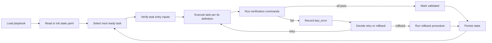

# Implementation Phase Runner

## When To Use
Use this skill when an AI tool (or a person) needs to advance, resume, or
verify execution of the phased plan defined in
[`doc/implementation/implementation-phases.md`](../../../doc/implementation/implementation-phases.md).

## Inputs
- [`doc/mission.md`](../../../doc/mission.md) (the charter; every
  task's verification serves the mission's required capabilities and
  reject criteria).
- [`doc/implementation/implementation-phases.md`](../../../doc/implementation/implementation-phases.md)
- The state file
  [`doc/implementation/state.yaml`](../../../doc/implementation/state.yaml)
  (created on first run).
- [`doc/library-catalog.md`](../../../doc/library-catalog.md)
  (validates library substitutions performed by phase tasks).
- [`doc/binding-architecture.md`](../../../doc/binding-architecture.md)
  (validates C-ABI / LLM / service plane tasks).
- The repository at `/home/rohit/src/eda_stl/`.

## Outputs
- Updated `state.yaml`.
- Execution log per task (verification command output, exit codes).
- Status report including the next executable task.

## State File Schema
```yaml
playbook_version: 1.0.0
phase_id: <phase-number-or-name>
tasks:
  <task-id>:
    status: notStarted | inProgress | validated | completed | failed
    last_verification:
      cmd: <string>
      cwd: <string>
      exit_code: <integer>
      timestamp: <iso-8601>
    last_error: <string or null>
```

## Execution Loop



## Required Behavior
- Read `state.yaml` before doing anything.
- Honor `depends_on` ordering.
- Validate entry by:
  - confirming inputs exist,
  - confirming depended-on tasks are `validated` or `completed`.
- Run verification commands exactly as specified (`cmd`, `cwd`,
  `expected_exit_code`).
- A task is `validated` only when every verification passes.
- A task is `completed` only when all phase exit gates allow it.
- On failure, follow the task's `rollback` and stop the phase.
- Persist state after every status change.

## Idempotency
- Re-runs of `validated` tasks must be no-ops unless explicitly re-triggered.
- Verification re-runs must reuse the same `cmd`/`cwd`.
- State updates are write-after-success only.

## Operator Commands
The skill accepts operator intents expressed in natural language. It maps
them to actions on the playbook:
- "run next phase" -> compute next ready phase, execute its task DAG.
- "resume" -> continue from the last `inProgress` or `failed` task.
- "status" -> emit phase + per-task status table.
- "rollback task X" -> run task X's rollback and reset its state.

## Reporting Template
```markdown
# Phase Run Report

## Current Phase
<phase id>

## Task Status
| Task | Status | Last Verification | Notes |
|---|---|---|---|

## Failures
| Task | Error |
|---|---|

## Next Action
<sentence describing the next ready task or required human input>
```

## Acceptance Criteria
- Mission cross-reference is present (`doc/mission.md`).
- Always loads `state.yaml`.
- Always emits a phase run report.
- Never mutates source without verification commands attached.
- Cross-references the playbook, the technical debt register, and
  (when binding/library/LLM tasks are touched) `library-catalog.md`
  and `binding-architecture.md`.
