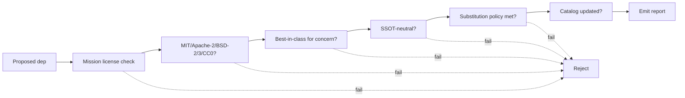

# Library Selection

## When To Use
Use this skill when:

- a new third-party dependency is proposed,
- an existing dependency is being swapped (the substitution policy
  in [`doc/library-catalog.md`](../../../doc/library-catalog.md)
  applies),
- a dependency in `vcpkg.json`, `cmake/cpm/Dependencies.cmake`, or a
  `FetchContent_Declare` block is added or modified,
- a license review is requested,
- the catalog itself is being modified.

Always cross-check against the **mission charter** at
[`doc/mission.md`](../../../doc/mission.md) - public-utility licensing
is a non-negotiable mission constraint.

## Inputs
- [`doc/mission.md`](../../../doc/mission.md)
- [`doc/library-catalog.md`](../../../doc/library-catalog.md)
- [`doc/code-quality-standards.md`](../../../doc/code-quality-standards.md)
  §"Library Catalog Mandate".
- [`doc/build-test-ci.md`](../../../doc/build-test-ci.md)
- [`/home/rohit/src/eda_stl/CMakeLists.txt`](../../../CMakeLists.txt)
- `/home/rohit/src/eda_stl/vcpkg.json` (when present, Phase 0+).

## Outputs
A library-selection review report containing:

1. The proposed library, version, license, and acquisition path
   (vcpkg / CPM / FetchContent).
2. License compatibility check (MIT / Apache-2 / BSD-2/3 / CC0
   only).
3. Best-in-class comparison vs alternatives for the same concern.
4. SSOT-neutrality check - the library's types must not appear in
   `binding/cabi/` or `binding/schemas/`.
5. Substitution policy compliance (when swapping).
6. Phase mapping in
   [`doc/implementation/implementation-phases.md`](../../../doc/implementation/implementation-phases.md).
7. Catalog update diff (rationale, version pin, license, replacement
   path, phase).

## Workflow



1. Read [`doc/mission.md`](../../../doc/mission.md) §"Mission-Aligned
   Reject Criteria" to confirm public-utility licensing.
2. Determine the **concern** the library addresses (allocator,
   threading, JSON, logging, ...).
3. Look up the catalog entry for that concern in
   [`doc/library-catalog.md`](../../../doc/library-catalog.md). If a
   library is already chosen, the proposal is a substitution and the
   substitution policy applies.
4. License check: only MIT, Apache-2, BSD-2, BSD-3, or CC0/dual.
   Reject any GPL- or LGPL-only library.
5. Best-in-class comparison: list at least two alternatives, cite
   public benchmarks or maintenance signals where possible, and
   justify the choice.
6. SSOT-neutrality: confirm the library's types do not appear in
   `binding/cabi/` or `binding/schemas/` directly. If they would
   appear, the proposal is rejected per
   [`doc/binding-architecture.md`](../../../doc/binding-architecture.md)
   §"Composite Reject Criteria".
7. If swapping, verify the substitution policy in
   [`doc/library-catalog.md`](../../../doc/library-catalog.md) is met:
   - C-ABI and schemas remain identical,
   - KPIs not regressed,
   - catalog updated,
   - this skill has reviewed.
8. Map to phase / task id (e.g., `p0-introduce-vcpkg-manifest`,
   `p1-adopt-spdlog-fmt-cli11`, `p4-nanobind-python`,
   `p5-flight-service`).
9. Produce the catalog update diff and the report.

## Reject Triggers
- License is GPL- or LGPL-only, or otherwise incompatible with the
  public-utility mandate.
- The library is already chosen for the same concern and the proposal
  does not satisfy the substitution policy.
- The library's types would leak across the C-ABI or any schema.
- The library is on the LLM critical path and introduces a foreign
  runtime (only native C++ is permitted there - see
  [`doc/binding-architecture.md`](../../../doc/binding-architecture.md)
  §7).
- The proposal lacks a phase mapping in
  [`doc/implementation/implementation-phases.md`](../../../doc/implementation/implementation-phases.md).

## Report Template
```markdown
# Library Selection Review

## Mission Alignment
<reference to doc/mission.md; license public-utility check>

## Concern
<concern, e.g., JSON ingest>

## Proposed Library
| Field | Value |
| Name | |
| Version | |
| License | |
| Acquisition | vcpkg | CPM | FetchContent |

## Alternatives Considered
| Name | License | Pro | Con |

## SSOT Neutrality
<status: types do not appear in binding/cabi or binding/schemas>

## Substitution Policy (if swap)
<status: C-ABI unchanged | schemas unchanged | KPIs unchanged | catalog updated>

## Phase Mapping
<task id>

## Catalog Diff
<patch to doc/library-catalog.md>

## Verdict
<approve | request changes | reject>
```

## Acceptance Criteria
- Mission alignment is referenced.
- License compatibility is verified.
- At least two alternatives are compared.
- SSOT neutrality is verified.
- Substitution policy is applied when swapping.
- Phase mapping is present.
- Catalog update diff is included.
