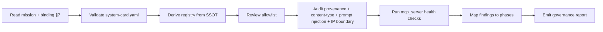

# LLM Interface Governance

## When To Use
Use this skill whenever a change touches:

- `binding/schemas/llm/system-card.yaml`,
- `binding/schemas/llm/capability-registry.yaml`,
- `binding/schemas/llm/allowlist.yaml`,
- `binding/schemas/llm/annotations.yaml`,
- `binding/llm/` (the native C++ `mcp_server`),
- [`AGENTS.md`](../../../AGENTS.md),
- the LLM section of
  [`doc/binding-architecture.md`](../../../doc/binding-architecture.md).

Always cross-check against the **mission charter** at
[`doc/mission.md`](../../../doc/mission.md).

## Inputs
- [`doc/mission.md`](../../../doc/mission.md)
- [`doc/binding-architecture.md`](../../../doc/binding-architecture.md)
  §7 (the LLM interface layer).
- [`doc/code-quality-standards.md`](../../../doc/code-quality-standards.md)
  §"LLM Surface Safety Rules".
- [`doc/quality-gaps-and-risks.md`](../../../doc/quality-gaps-and-risks.md)
  - especially R-24 (prompt injection), R-25 (IP-boundary leakage),
  R-26 (allowlist misconfiguration).
- [`AGENTS.md`](../../../AGENTS.md).
- The schemas under
  [`binding/schemas/llm/`](../../../binding/schemas/llm/) (when present).
- The C-ABI headers under `binding/cabi/include/` (when present).

## Outputs
A governance report containing:

1. System-card validation: schema conformance, mission tag, IP
   boundary, telemetry policy, capability index reference.
2. Capability-registry derivation check: each tool, resource, and
   prompt cites a C-ABI function or schema field.
3. Allowlist review: every tool that is exposed has an explicit
   allowlist entry per environment, with audit-tag fields populated.
4. Safety audit: provenance + content-type tagging, JSON Schema
   validation, prompt-injection mitigations, IP boundary checks.
5. Health check: mcp_server `initialize` returns the system card;
   `list_tools`, `list_resources`, `list_prompts` succeed; an
   allowlisted tool call succeeds; a non-allowlisted tool call is
   denied with reason.
6. Phase mapping in
   [`doc/implementation/implementation-phases.md`](../../../doc/implementation/implementation-phases.md).

## Workflow



1. Read [`doc/mission.md`](../../../doc/mission.md) and
   [`doc/binding-architecture.md`](../../../doc/binding-architecture.md)
   §7.
2. Validate `binding/schemas/llm/system-card.yaml`:
   - schema_version is set,
   - identity.mission_tag is `stl-for-eda`,
   - identity.mission_doc points at `doc/mission.md`,
   - identity.agents_md points at `AGENTS.md`,
   - capabilities.registry path exists and is consistent,
   - capabilities.derived_from enumerates the C-ABI headers and
     schemas,
   - safety.allowlist path exists,
   - safety.enforcement is `deny_by_default`,
   - safety.ip_boundary, safety.audit, safety.provenance, and
     safety.content_type are populated,
   - safety.prompt_injection_mitigations lists the four mitigations
     from `doc/binding-architecture.md` §7.4,
   - protocol.spec is the supported MCP version.
3. Derive `binding/schemas/llm/capability-registry.yaml` (or check the
   existing one) by walking the C-ABI plus schemas plus
   `annotations.yaml`. Fail if drift is detected.
4. Review `binding/schemas/llm/allowlist.yaml`:
   - every exposed tool has an entry,
   - per-environment scopes are consistent (dev, staging, prod,
     public),
   - audit-tag fields are populated.
5. Audit safety:
   - every response path emits `content_type` + `provenance` blocks,
   - every request and response is JSON-Schema validated using
     valijson,
   - resources are tagged with `source_class`,
   - tool descriptions never embed user-supplied content,
   - IP boundary is enforced at the response edge.
6. Health-check `mcp_server` (when running):
   - `initialize` returns the system card,
   - `list_tools` / `list_resources` / `list_prompts` succeed,
   - an allowlisted tool returns a valid response,
   - a non-allowlisted tool is denied with reason and audit-logged.
7. Map findings to phases / task ids: `p3-system-card-generator`,
   `p4-mcp-server-native`, `p4-allowlist-policy`, `p4-llm-card-lint`,
   `p7-allowlist-governance`, `p7-llm-compat-matrix`.
8. Emit the report.

## Risk Watchlist
Reference these risk IDs in every report:

- **R-24 prompt injection**: untrusted text inside design data
  attempts to manipulate the LLM. Mitigations: fence text, mark
  `source_class`, do not embed user-supplied content in tool
  descriptions.
- **R-25 IP-boundary leakage**: outputs reach destinations outside
  `safety.ip_boundary`. Mitigations: enforce at the response edge;
  default-deny on unknown destinations.
- **R-26 allowlist misconfiguration**: overly broad allowlist;
  missing audit-tags. Mitigations: per-environment scopes,
  default-deny on unknown env, mandatory audit-tags.
- **R-27 mission deviation**: the LLM surface erodes the
  public-utility premise (foreign runtime on the critical path,
  paid-runtime gating, vendor lock-in). Mitigations: native C++
  mcp_server only; mission-alignment-review on every change.

## Report Template
```markdown
# LLM Interface Governance Report

## Mission Alignment
<reference to doc/mission.md and any reject-criteria findings>

## System Card Validation
| Field | Status | Notes |

## Capability Registry Derivation
<table of registry entries -> SSOT source>

## Allowlist Review
| Tool | Env | Audit Tag | Status |

## Safety Audit
| Concern | Status | Evidence |

## mcp_server Health Check
| Probe | Result |

## Risk Watchlist
| ID | Status | Mitigations Applied |

## Phase Mapping
<task ids>

## Verdict
<approve | request changes | reject>
```

## Acceptance Criteria
- Mission charter is referenced; reject-criteria deviations flagged.
- System card is fully validated.
- Capability registry derivation is checked against SSOT.
- Allowlist scope and audit-tags are checked.
- Provenance, content-type, prompt-injection, IP boundary are
  audited.
- mcp_server health probes are reported.
- Risk watchlist (R-24, R-25, R-26, R-27) is updated in every report.
- Phase mapping is present.
