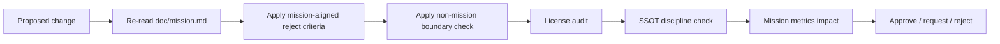

# Mission Alignment Review

## When To Use
Use this skill on any change that:

- modifies the public surface (`binding/cabi/`, `binding/schemas/`,
  `binding-wrapper`s),
- modifies governance (license, RFC process, deprecation policy,
  release lanes, security policy),
- modifies dependencies (`vcpkg.json`, `cmake/cpm/Dependencies.cmake`,
  `FetchContent_Declare` blocks, the catalog),
- modifies discovery (`AGENTS.md`,
  `binding/schemas/llm/system-card.yaml`),
- could conceivably turn `eda_stl` into a tool, a flow, a viewer, or
  a vendor product (i.e., crosses the non-mission boundary in
  [`doc/mission.md`](../../../doc/mission.md) §"Non-Mission").

The skill is **advisory in Phases 0-6** and a **soft gate in Phase 7**
per [`doc/implementation/implementation-phases.md`](../../../doc/implementation/implementation-phases.md)
(`p7-mission-governance-gate`).

## Inputs
- [`doc/mission.md`](../../../doc/mission.md) - the canonical charter.
- [`AGENTS.md`](../../../AGENTS.md).
- [`doc/binding-architecture.md`](../../../doc/binding-architecture.md).
- [`doc/library-catalog.md`](../../../doc/library-catalog.md).
- [`doc/extensibility-contract.md`](../../../doc/extensibility-contract.md).
- [`doc/code-quality-standards.md`](../../../doc/code-quality-standards.md).
- The proposed diff or pull request.

## Outputs
A mission-alignment review report containing:

1. A summary of the change against the mission charter.
2. A line-by-line check against the **Mission-Aligned Reject
   Criteria** in [`doc/mission.md`](../../../doc/mission.md) §"Mission-Aligned
   Reject Criteria".
3. A non-mission-boundary check against
   [`doc/mission.md`](../../../doc/mission.md) §"Non-Mission".
4. License audit (no GPL- or LGPL-only deps; no service-side
   relicensing).
5. SSOT discipline check (no model redefinition in a frontend; no
   foreign runtime on the LLM critical path).
6. Mission success-metrics impact summary (advisory).
7. Verdict: approve / request changes / reject, with explicit citations.

## Workflow



1. Re-read [`doc/mission.md`](../../../doc/mission.md) end to end -
   the charter is the only source.
2. For each affected file in the change, classify:
   - public surface (touches SSOT or wrappers),
   - governance (license, RFC, deprecation, release lanes),
   - dependencies (catalog, vcpkg, CPM),
   - discovery (AGENTS.md, system-card.yaml),
   - other.
3. Walk the **Mission-Aligned Reject Criteria** in
   [`doc/mission.md`](../../../doc/mission.md) §"Mission-Aligned
   Reject Criteria" line by line:
   - Does the change create a private-fork advantage?
   - Does it introduce a license incompatible with public use?
   - Does it couple the data model to a vendor-specific format?
   - Does it lock core functionality behind a paid runtime, paid
     LLM, or paid cloud?
   - Does it redefine the model in a frontend?
   - Does it cross the non-mission boundary?
4. Walk the **non-mission boundary** in
   [`doc/mission.md`](../../../doc/mission.md) §"Non-Mission":
   - Is `eda_stl` becoming a tool, a flow, a viewer, or a vendor
     product?
5. Run the license audit; cross-check against
   [`doc/library-catalog.md`](../../../doc/library-catalog.md).
6. Verify SSOT discipline using
   [`doc/binding-architecture.md`](../../../doc/binding-architecture.md):
   - The model is not redefined in any frontend.
   - There is no foreign runtime on the LLM critical path.
7. Summarize the impact on mission success metrics from
   [`doc/mission.md`](../../../doc/mission.md) §"Mission Success
   Metrics".
8. Issue the verdict.

## Reject Triggers (Hard)
A change is **rejected** under any of these conditions:

- The license audit fails.
- The change creates a private-fork advantage.
- The change couples the data model to a vendor format.
- The change locks core functionality behind a paid runtime.
- The change redefines the model in a frontend.
- The change crosses the non-mission boundary.
- The change adds a foreign runtime on the LLM critical path.

## Soft Findings
Issues that are not rejection triggers but should be noted:

- Erosion of mission success metrics (e.g., reduces
  `mission.public_runtime_share`).
- Documentation that paraphrases the charter rather than referencing
  [`doc/mission.md`](../../../doc/mission.md) directly.
- Public surface that lacks a SemVer commitment.

## Report Template
```markdown
# Mission Alignment Review

## Charter Reference
- doc/mission.md (charter)

## Affected Files
| File | Classification |

## Mission-Aligned Reject Criteria
| Criterion | Status | Evidence |

## Non-Mission Boundary
<status: not crossed | crossed: details>

## License Audit
<table of new/changed deps with licenses>

## SSOT Discipline
<status with references>

## Mission Success Metrics Impact
| Metric | Direction | Notes |

## Soft Findings
<bullets>

## Verdict
<approve | request changes | reject>

## Rationale
<one paragraph citing doc/mission.md and the criteria above>
```

## Acceptance Criteria
- The charter is referenced explicitly.
- Mission-Aligned Reject Criteria are walked line by line.
- The non-mission boundary check is included.
- License audit is included.
- SSOT discipline is verified.
- Mission success metrics impact is summarized.
- Verdict is justified with citations.
