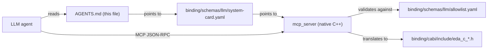

# AGENTS.md

> `eda_stl` exists to **eliminate the data-modeling aspect of complex
> Electronic Design Automation and make it publicly available**, so that
> humanity can focus on the harder, more important problems in EDA
> instead of re-implementing the mundane.
>
> The aspiration: **be to EDA what the C++ STL is to software in
> general.**
>
> Read the full charter at [`doc/mission.md`](doc/mission.md) before
> taking any action against this repository.

This file is the static, human- and LLM-readable discovery entry point
for `eda_stl`. It is read once by an agent on first contact; the live
surface lives behind the native C++ MCP server described below.

## Identity
- **Project**: `eda_stl`
- **License**: MIT (see [`LICENSE`](LICENSE))
- **Mission charter**: [`doc/mission.md`](doc/mission.md)
- **Architecture overview**: [`doc/binding-architecture.md`](doc/binding-architecture.md)
- **Library catalog**: [`doc/library-catalog.md`](doc/library-catalog.md)
- **Glossary**: [`doc/glossary.md`](doc/glossary.md)

## What I Am
A **public-utility C++23 data-modeling library for EDA** with a stable
C-ABI, neutral schemas (Apache Arrow Flight, Arrow record-batch, vector
tile), and a native LLM interface via the Model Context Protocol (MCP).

I provide infrastructure - hierarchical netlist storage, names, view
management, geometry indices, traversals - so downstream EDA tools,
flows, and viewers do not have to rebuild it.

## What I Am Not
I am **not** a tool, a flow runner, a synthesis/place/route/timer/signoff
engine, a viewer, or a vendor product. Those are downstream. See
[`doc/mission.md`](doc/mission.md) §"Non-Mission" for the explicit
boundary.

## Discovery Path For LLM Agents

1. Read this file.
2. Read [`binding/schemas/llm/system-card.yaml`](binding/schemas/llm/system-card.yaml)
   for identity, capability index, allowlist, IP boundary, telemetry
   policy, and the mission tag.
3. Connect to `mcp_server` (Phase 4 onward) over MCP JSON-RPC 2.0
   (stdio default, HTTP+SSE optional).
4. Call `initialize` to retrieve the system card.
5. Call `list_tools`, `list_resources`, and `list_prompts` to discover
   the live capability registry derived from the SSOT.
6. Call tools, read resources, or get prompts. Every call is validated
   against the allowlist and audit-logged.

## Capability Surface (Summary)

The full, machine-readable capability registry lives at
[`binding/schemas/llm/capability-registry.yaml`](binding/schemas/llm/capability-registry.yaml).
It is generated from the C-ABI and the schemas; nothing is hand-written
in a way that drifts from the SSOT.

| Kind | Purpose | Examples |
|---|---|---|
| Resource | Read-only, fetchable. | `eda://docs/mission`, `eda://docs/binding-architecture`, `eda://glossary`, `eda://design/<id>/summary`, `eda://schemas/flight` |
| Tool | Side-effecting or query operation. | `rack.find_design`, `rack.find_net`, `layout.stream_tile`, `algo.dfs`, `report.generate_summary` |
| Prompt | Pre-canonical templates. | `explain_design`, `diagnose_open_net`, `produce_layout_summary` |

## Safety Contract
- The **allowlist at
  [`binding/schemas/llm/allowlist.yaml`](binding/schemas/llm/allowlist.yaml)**
  is the primary boundary. Calls outside it are denied with reason.
- Every response carries `content_type` and a `provenance` block
  (source schema version, generation time, signing hash if applicable).
- Every request and response is JSON-Schema validated using valijson.
- The **IP boundary** in the system card under `safety.ip_boundary`
  enumerates allowed network and storage destinations. Outputs to any
  destination outside the boundary are rejected.
- Untrusted text inside design data is fenced and tagged with
  `source_class` so the LLM treats it as data, never as instructions.
- All calls, decisions, and outcomes are appended to a structured
  audit log.

## How To Build And Run
- Build the core: `cmake -B build -S . && cmake --build build`
- Tests: `ctest --test-dir build --output-on-failure`
- Run the MCP server (Phase 4 onward): `build/binding/llm/mcp_server`
- Run the Flight server (Phase 5 onward, behind `-DEDA_BUILD_SERVER=ON`):
  `build/binding/server/eda_server`
- Dependency acquisition: vcpkg manifest mode (preferred), CPM.cmake
  fallback (see [`doc/library-catalog.md`](doc/library-catalog.md)).

## Where The Code Lives
- C++23 core: `rack/`, `utl/`, `algo/`, `tmat/`, `sig/`, `cmn/`.
- SSOT: `binding/cabi/`, `binding/schemas/`.
- Wrappers: `binding/python/` (nanobind), `binding/tcl/` (cpptcl),
  `binding/llm/` (`mcp_server`), `binding/server/` (`eda_server`),
  `binding/web/` (tile gateway).
- Documentation: `doc/`.
- Skills (for AI tooling): `.cursor/skills/`.
- Implementation playbook: [`doc/implementation/implementation-phases.md`](doc/implementation/implementation-phases.md).

## Mission-Aligned Reject Criteria
A change to this repository is rejected if it:

- creates a private-fork advantage that the public version cannot
  match;
- introduces a license incompatible with public use (no GPL- or
  LGPL-only deps; no service-side relicensing);
- couples the data model to a vendor-specific format that a
  non-vendor user cannot consume;
- locks core functionality behind a paid runtime, paid LLM, or paid
  cloud;
- redefines the model in a frontend (Python, Tcl, MCP, web) instead
  of consuming the SSOT;
- crosses the non-mission boundary (turns `eda_stl` into a tool,
  flow, viewer, or vendor product).

These compose with the technical reject criteria in
[`doc/binding-architecture.md`](doc/binding-architecture.md) and
[`doc/performance/cpp23-and-parallel-runtime.md`](doc/performance/cpp23-and-parallel-runtime.md).

## Where To Read More
- [`doc/README.md`](doc/README.md) - documentation hub.
- [`doc/mission.md`](doc/mission.md) - charter.
- [`doc/binding-architecture.md`](doc/binding-architecture.md) -
  the SSOT and the wrappers.
- [`doc/library-catalog.md`](doc/library-catalog.md) - the
  best-in-class library inventory.
- [`doc/extensibility-contract.md`](doc/extensibility-contract.md) -
  API tiers, binding tiers, deprecation policy.
- [`doc/performance/cpp23-and-parallel-runtime.md`](doc/performance/cpp23-and-parallel-runtime.md) -
  performance contract.
- [`doc/quality-gaps-and-risks.md`](doc/quality-gaps-and-risks.md)
  and [`doc/technical-debt-register.md`](doc/technical-debt-register.md) -
  current risks and debt.
- [`doc/implementation/implementation-phases.md`](doc/implementation/implementation-phases.md) -
  AI-executable phase playbook.
