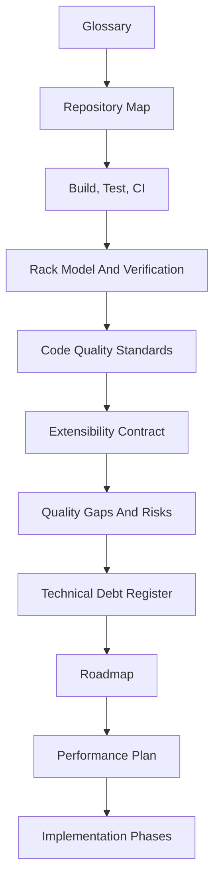

# eda_stl Documentation

## Purpose
Single navigation hub for the documentation set under `doc/`. Establishes the
recommended reading order, summarizes what each document owns, and links the
implementation phases playbook and skill pack.

## Audience
Anyone exploring or maintaining `eda_stl`, and AI tools generating or
modifying its documentation/code.

## In Scope
- Reading order for the documentation set under `doc/`.
- Inventory of companion skills under `.cursor/skills/`.
- Conventions enforced by every document in this tree.

## Out of Scope
- AI tooling (relocated outside this repository).
- Per-document content; see each document for its own purpose, scope, and
  acceptance criteria.

## Cross References
- [`glossary.md`](glossary.md)
- [`repository-map.md`](repository-map.md)
- [`implementation/implementation-phases.md`](implementation/implementation-phases.md)

## Reading Order

## Documents
- [`glossary.md`](glossary.md) — canonical terminology used by every doc and skill.
- [`repository-map.md`](repository-map.md) — top-level layout, modules, and entry points.
- [`build-test-ci.md`](build-test-ci.md) — build graph, CTest wiring, CI workflow, required gates.
- [`rack-model-and-verification.md`](rack-model-and-verification.md) — data model lifecycle and verification chain.
- [`code-quality-standards.md`](code-quality-standards.md) — best-in-class C++23 standards and forbidden patterns.
- [`extensibility-contract.md`](extensibility-contract.md) — API tiers, extension points, deprecation policy.
- [`quality-gaps-and-risks.md`](quality-gaps-and-risks.md) — risk register with severity, likelihood, and remediation phase.
- [`technical-debt-register.md`](technical-debt-register.md) — authoritative debt list with phase mapping.
- [`roadmap/eda-stl-library.md`](roadmap/eda-stl-library.md) — value proposition, productization roadmap, CMake export interface.
- [`performance/cpp23-and-parallel-runtime.md`](performance/cpp23-and-parallel-runtime.md) — C++23 and bounded-memory throughput plan.
- [`implementation/implementation-phases.md`](implementation/implementation-phases.md) — AI-executable phase playbook with task cards.

## Skills
The companion skills live under
[`/home/rohit/src/eda_stl/.cursor/skills/`](../.cursor/skills/).
- `eda-architecture-analysis`
- `cpp23-migration-planner`
- `performance-kpi-bounded-memory`
- `test-quality-review`
- `docs-generation-core`
- `release-packaging-governance`
- `ci-hardening-core`
- `api-stability-governance`
- `implementation-phase-runner`
- `code-quality-enforcement`
- `technical-debt-tracker`

## Mandatory Conventions
- Every document carries purpose, audience, scope, mermaid diagram(s), and
  cross-references.
- Every claim cites concrete file paths.
- Every recommendation maps to a phase in
  [`implementation/implementation-phases.md`](implementation/implementation-phases.md).

## Acceptance Criteria For This Document
- Reading order present.
- All documents and skills enumerated.
- Mermaid diagram present.
