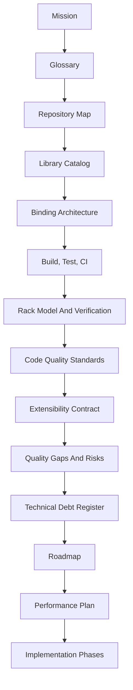

# eda_stl Documentation

> **Read [`mission.md`](mission.md) first.** It is the charter - the
> "STL for EDA" premise that every other document inherits.

## Purpose
Single navigation hub for the documentation set under `doc/`. Establishes
the recommended reading order, summarizes what each document owns, and
links the implementation phases playbook and skill pack.

## Audience
Anyone exploring or maintaining `eda_stl`, and AI tools generating or
modifying its documentation/code. LLM agents should also read
[`../AGENTS.md`](../AGENTS.md) to discover the live MCP surface.

## In Scope
- The mission charter as the foundational anchor for everything.
- Reading order for the documentation set under `doc/`.
- Inventory of companion skills under `.cursor/skills/`.
- Conventions enforced by every document in this tree.

## Out Of Scope
- AI tooling under `/home/rohit/src/ai/` (relocated outside this
  repository).
- Per-document content; see each document for its own purpose, scope,
  and acceptance criteria.
- Library implementation specifics (see
  [`library-catalog.md`](library-catalog.md)).

## Cross References
- [`mission.md`](mission.md)
- [`glossary.md`](glossary.md)
- [`repository-map.md`](repository-map.md)
- [`binding-architecture.md`](binding-architecture.md)
- [`library-catalog.md`](library-catalog.md)
- [`implementation/implementation-phases.md`](implementation/implementation-phases.md)
- [`../AGENTS.md`](../AGENTS.md)

## Reading Order

## Documents
- [`mission.md`](mission.md) - **the charter**. The "STL for EDA"
  premise; every other doc inherits from it.
- [`glossary.md`](glossary.md) - canonical terminology used by every
  doc and skill.
- [`repository-map.md`](repository-map.md) - top-level layout, modules,
  binding umbrella, and entry points.
- [`library-catalog.md`](library-catalog.md) - the best-in-class
  library inventory.
- [`binding-architecture.md`](binding-architecture.md) - the SSOT and
  the best-in-class wrappers (Python via nanobind, Tcl via cpptcl,
  native C++ MCP server, Arrow Flight service, tile protocol).
- [`build-test-ci.md`](build-test-ci.md) - build graph, CTest wiring,
  CI workflow, required gates including vcpkg, library-catalog drift,
  license audit, and the binding/service/tile/MCP gates.
- [`rack-model-and-verification.md`](rack-model-and-verification.md) -
  data model lifecycle and verification chain.
- [`code-quality-standards.md`](code-quality-standards.md) -
  best-in-class C++23 standards, library catalog mandate, binding-side
  rules, and LLM surface safety rules.
- [`extensibility-contract.md`](extensibility-contract.md) - API
  tiers, binding tiers, extension points, deprecation policy.
- [`quality-gaps-and-risks.md`](quality-gaps-and-risks.md) - risk
  register including binding, LLM, and mission-deviation risks.
- [`technical-debt-register.md`](technical-debt-register.md) -
  authoritative debt list with phase mapping.
- [`roadmap/eda-stl-library.md`](roadmap/eda-stl-library.md) - value
  proposition, productization roadmap, mission-aligned release lanes.
- [`performance/cpp23-and-parallel-runtime.md`](performance/cpp23-and-parallel-runtime.md) -
  C++23 + bounded-memory throughput plan with binding/service/tile/MCP
  KPIs.
- [`implementation/implementation-phases.md`](implementation/implementation-phases.md) -
  AI-executable phase playbook with task cards.

## Repository Root Companions
- [`../AGENTS.md`](../AGENTS.md) - LLM discovery entry; opens with the
  mission paragraph and points to the system card and `mcp_server`.
- [`../binding/schemas/llm/system-card.yaml`](../binding/schemas/llm/system-card.yaml) -
  machine-readable identity, capability index, allowlist, IP
  boundary, telemetry policy, and mission tag.

## Skills
The companion skills live under
[`/home/rohit/src/eda_stl/.cursor/skills/`](../.cursor/skills/).

- `mission-alignment-review` (new)
- `binding-architecture` (new)
- `llm-interface-governance` (new)
- `library-selection` (new)
- `eda-architecture-analysis`
- `cpp23-migration-planner`
- `performance-kpi-bounded-memory`
- `test-quality-review`
- `docs-generation-core`
- `release-packaging-governance`
- `ci-hardening-core`
- `api-stability-governance`
- `implementation-phase-runner`
- `code-quality-enforcement`
- `technical-debt-tracker`

## Mandatory Conventions
- **Mission cross-reference**: every document and skill cross-references
  [`mission.md`](mission.md). Nothing redefines the charter.
- **Universal template**: every document carries Purpose, Audience, In
  Scope, Out Of Scope, Cross References, body sections, and Acceptance
  Criteria.
- **Mermaid diagrams**: structural relationships are visualized.
- **File-path citations**: every claim about the codebase cites a
  concrete path.
- **Phase mapping**: every recommendation maps to a phase in
  [`implementation/implementation-phases.md`](implementation/implementation-phases.md).
- **Library catalog mandate**: every third-party dependency appears in
  [`library-catalog.md`](library-catalog.md) (see
  [`code-quality-standards.md`](code-quality-standards.md) §"Library
  Catalog Mandate").
- **SSOT discipline**: every interface (C-ABI, schemas, system card)
  is defined exactly once in `binding/`; wrappers consume it (see
  [`binding-architecture.md`](binding-architecture.md)).

## Acceptance Criteria For This Document
- Mission link is the lead.
- All documents and skills are enumerated, including the four new
  skills (`mission-alignment-review`, `binding-architecture`,
  `llm-interface-governance`, `library-selection`).
- Reading order present.
- Mermaid diagram present.
- Cross-references include `mission.md`, `binding-architecture.md`,
  `library-catalog.md`, and `../AGENTS.md`.
- Mandatory conventions enumerate the mission cross-reference, library
  catalog mandate, and SSOT discipline.
