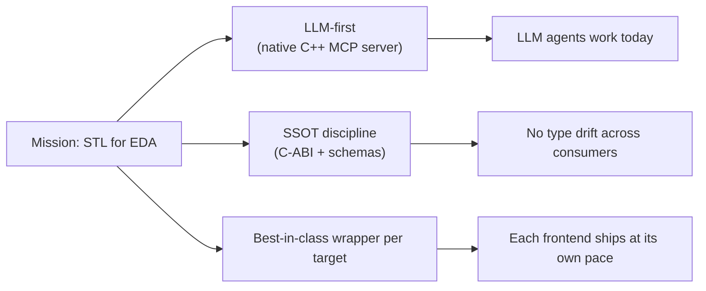
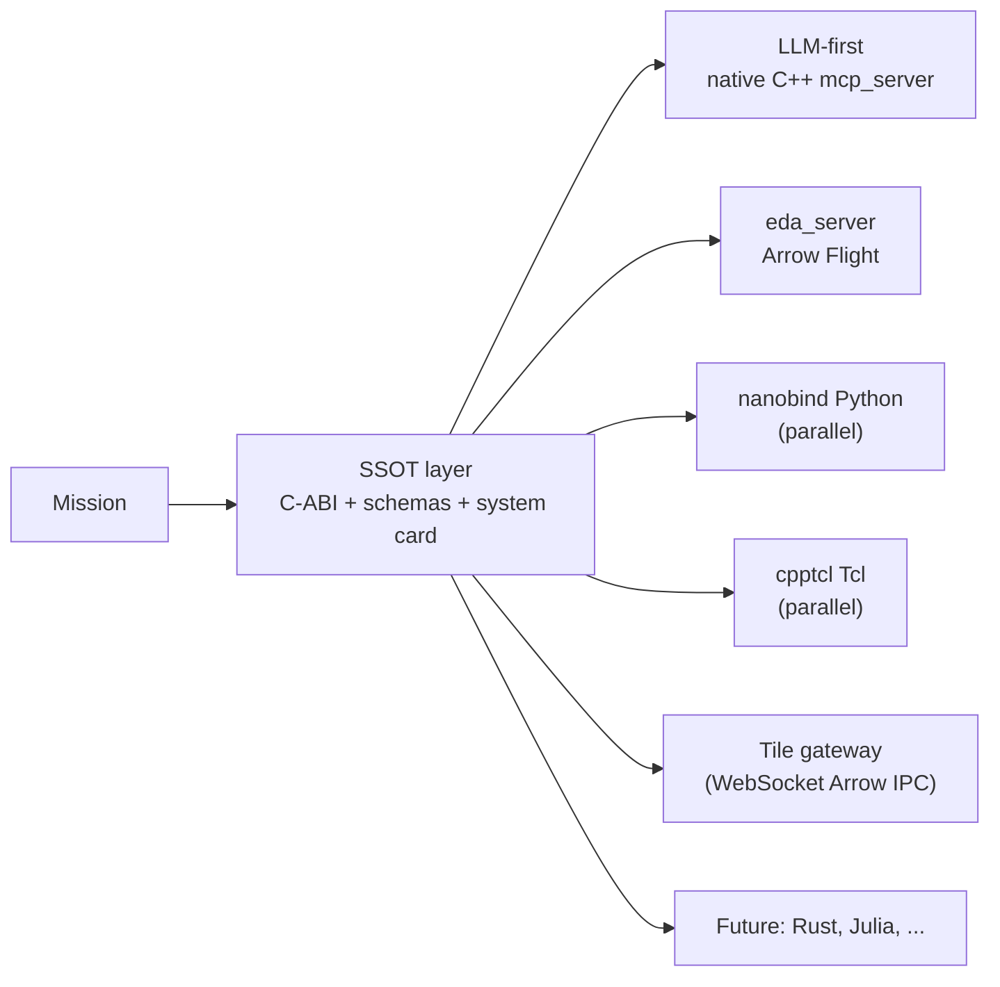
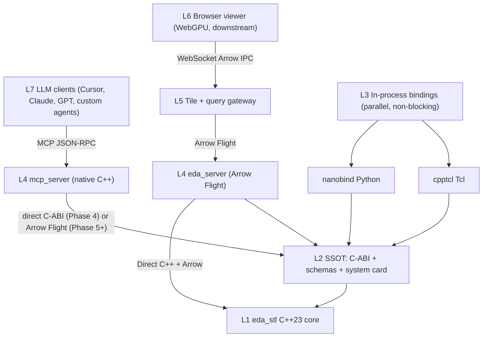
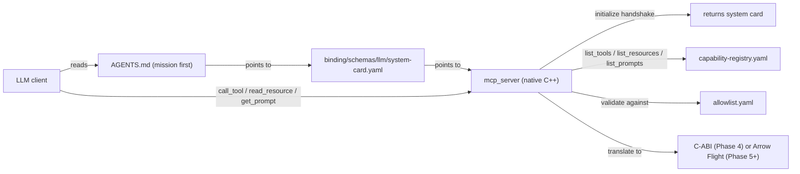
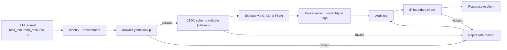
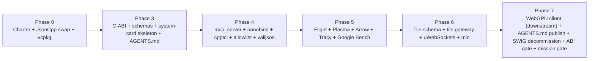

# Binding Architecture

## Purpose
Define the **single source of truth (SSOT) for every interface** that
`eda_stl` exposes - to native C/C++ consumers, Python and Tcl frontends,
the Arrow Flight service plane, web viewers, and LLM agents - and the
**best-in-class wrappers** that consume that SSOT. This is the only
document that defines interfacing; every wrapper, every code generator,
and every consumer is bound by what is written here.

## Audience
Library authors, frontend authors, LLM agent authors, web/server
engineers, security reviewers, and AI tools running the
`binding-architecture`, `llm-interface-governance`, and
`api-stability-governance` skills.

## In Scope
- Diagnosis of the current SWIG-based interfacing.
- Strategic focus: LLM-first, SSOT, best-in-class per target.
- The two-principle resolution: SSOT + best-in-class wrappers.
- Layered architecture (L1 core through L7 LLM clients).
- Decision matrices per target.
- The L7 LLM interface design (MCP server + system card + allowlist).
- Composite reject criteria for proposals that touch this surface.

## Out of Scope
- Mission charter (see [`mission.md`](mission.md)).
- Library implementation choices (see
  [`library-catalog.md`](library-catalog.md)).
- KPI methodology (see
  [`performance/cpp23-and-parallel-runtime.md`](performance/cpp23-and-parallel-runtime.md)).
- Phase mechanics (see
  [`implementation/implementation-phases.md`](implementation/implementation-phases.md)).

## Cross References
- [`mission.md`](mission.md)
- [`README.md`](README.md)
- [`glossary.md`](glossary.md)
- [`repository-map.md`](repository-map.md)
- [`library-catalog.md`](library-catalog.md)
- [`extensibility-contract.md`](extensibility-contract.md)
- [`code-quality-standards.md`](code-quality-standards.md)
- [`performance/cpp23-and-parallel-runtime.md`](performance/cpp23-and-parallel-runtime.md)
- [`quality-gaps-and-risks.md`](quality-gaps-and-risks.md)
- [`technical-debt-register.md`](technical-debt-register.md)
- [`roadmap/eda-stl-library.md`](roadmap/eda-stl-library.md)
- [`implementation/implementation-phases.md`](implementation/implementation-phases.md)
- [`../AGENTS.md`](../AGENTS.md)

## Diagnosis: Is SWIG The Right Foundation?

**Conclusion: No.** SWIG is acceptable as a transitional Python binding,
but it is not the right SSOT and it is not the best-in-class generator
for any target.

Evidence in this repository:

- [`/home/rohit/src/eda_stl/rack/swig/rack_int.i`](../rack/swig/rack_int.i)
  has 18 commented-out `%include` directives covering the entire physical
  device hierarchy (lines 129-148), several `%warnfilter`/`%ignore`
  directives (lines 64-73), and `funcadapter.i` / `navigator*.i` left
  commented out (lines 91-94). This is a generator fighting the model.
- [`/home/rohit/src/eda_stl/rack/include/rack.h`](../rack/include/rack.h)
  line 312 only aliases `Rack` and `WRack` because the full template
  surface cannot cleanly cross SWIG.
- [`/home/rohit/src/eda_stl/rack/swig/test.py`](../rack/swig/test.py)
  has partial parity with the C++ test
  ([`/home/rohit/src/eda_stl/rack/test/test.cpp`](../rack/test/test.cpp))
  - clone, dissolve, multi-pin iteration are missing.

Industry signal that points away from SWIG-as-SSOT:

- nanobind beats pybind11 by ~4x/5x/10x on common bindings
  microbenchmarks; both beat SWIG decisively.
- KLayout built a custom GSI bridge rather than rely on SWIG.
- OpenAccess uses hand-written Tcl bindings, not SWIG.
- MCP (Model Context Protocol) is host-language-neutral, JSON-RPC over
  stdio or HTTP+SSE; it does not require any binding generator at all.

The repository must therefore separate **what the interface is** (the
SSOT) from **how each consumer wraps it** (best-in-class wrappers per
target).

## Strategic Focus: LLM-First, SSOT, Best-In-Class Per Target



1. **LLM-first.** The native C++ `mcp_server` is the priority deliverable
   for L4 services (see Phase 4 in
   [`implementation/implementation-phases.md`](implementation/implementation-phases.md)).
   This is the most leveraged way for the public to consume `eda_stl`
   today.
2. **Native C++ MCP server.** No Python, no TypeScript, no other runtime
   on the LLM critical path - that critical path stays inside the C++
   process.
3. **Python and Tcl are parallel, non-blocking workstreams.** They ship
   when ready; they never block the LLM story. They consume the same
   SSOT.

These three points flow directly from the mission's required
capabilities (see [`mission.md`](mission.md)).

## The Two-Principle Resolution

### Principle 1: SSOT - Language- And Generator-Neutral
The SSOT lives under `binding/` at the repository root and is the only
place an interface is defined:

| SSOT artifact | Purpose | Path |
|---|---|---|
| C-stable ABI headers | Opaque-handle entry points for every wrapper. | `binding/cabi/include/eda_c_*.h` |
| Arrow Flight RPC | Method signatures (Protobuf) and record-batch schemas (Arrow IPC). | `binding/schemas/flight/*.proto`, `binding/schemas/arrow/*.fbs` |
| Tile schema | Vector-tile zero-copy frame format. | `binding/schemas/tile/*.fbs` |
| LLM system card | Identity + capability index + safety policy. | `binding/schemas/llm/system-card.yaml` |
| LLM capability registry | Tool/resource/prompt index, generated from C-ABI + schemas + annotations. | `binding/schemas/llm/capability-registry.yaml` |
| LLM allowlist | Per-environment safety boundary. | `binding/schemas/llm/allowlist.yaml` |

### Principle 2: Best-In-Class Wrappers Per Target
Each wrapper is the leader for its target and consumes the SSOT
directly:

| Target | Wrapper | Source path | Phase |
|---|---|---|---|
| LLMs | native C++ MCP server (`mcp_server`) | `binding/llm/` | 4 |
| Service plane | Apache Arrow Flight server (`eda_server`) | `binding/server/` | 5 |
| Python | nanobind | `binding/python/` | 4 |
| Tcl | cpptcl | `binding/tcl/` | 4 |
| Web viewer | tile streaming over WebSocket Arrow IPC | `binding/web/` (server side) | 6 |



Library implementations (see [`library-catalog.md`](library-catalog.md))
are also best-in-class but are **never** part of the SSOT - their types
do not appear in the C-ABI or schemas.

## Layered Architecture (End-State)



| Layer | Owner | What lives here |
|---|---|---|
| L1 | `eda_stl` core | Templated C++23 data model under `rack/`, `utl/`, `algo/`, `tmat/`, `sig/`, `cmn/`. |
| L2 | SSOT | C-ABI headers, Flight + Arrow + tile schemas, LLM system card, capability registry, allowlist. |
| L3 | In-process bindings | nanobind Python, cpptcl Tcl. Consume L2; never bypass to L1. |
| L4 | Service binaries | `eda_server` (Arrow Flight), `mcp_server` (native C++ MCP). Consume L2. |
| L5 | Tile + query gateway | Adapts Flight to WebSocket Arrow IPC for browsers. |
| L6 | Browser viewer | Downstream WebGPU client; consumes L5's tile protocol. |
| L7 | LLM clients | Talk to L4's `mcp_server` over MCP JSON-RPC. |

## C-ABI Contract

The C-ABI is the foundation of the SSOT. Its rules:

- **Header location**: `binding/cabi/include/eda_c_*.h`. Public-stable
  per [`extensibility-contract.md`](extensibility-contract.md).
- **C linkage**: every entry point is `extern "C"` and uses only
  C-compatible types.
- **Opaque handles**: each domain object exposes a forward-declared
  struct typedef'd to a pointer; consumers never dereference it.

  ```c
  typedef struct eda_rack_s* eda_rack_t;
  typedef struct eda_design_s* eda_design_t;
  typedef struct eda_module_s* eda_module_t;
  ```

- **Lifetime**: every `eda_*_create` has a matching `eda_*_destroy`.
  Ownership is documented per function.
- **Error model**: every fallible function returns an `int32_t` status
  code. Detailed errors are accessed through:

  ```c
  const eda_error_t* eda_last_error(void);
  const char* eda_error_message(const eda_error_t*);
  int32_t      eda_error_category(const eda_error_t*);
  ```

- **No exceptions across the boundary.** Internal exceptions are
  caught and translated to status codes.
- **No template signatures across the boundary.** All templates are
  instantiated inside `eda_stl` and exposed through concrete C-ABI
  functions.
- **No library types across the boundary.** No `simdjson::*`,
  `arrow::*`, `absl::*`, `glaze::*`, etc. appear in any C-ABI header.
- **Versioning**: every header carries `EDA_ABI_VERSION_MAJOR/MINOR`
  macros; SemVer is enforced from Phase 7.

The C-ABI lint check `p3-cabi-lint` (see Phase 3) enforces these rules
mechanically.

## Decision Matrices

### 5.1 Python Frontend

| Option | Pros | Cons | Decision |
|---|---|---|---|
| Continue SWIG | Already in tree. | 18 commented `%include`s, parity gaps, slow at scale, fragile templates. | Retire by Phase 7. |
| pybind11 | Mature, broad community. | 4-10x slower than nanobind on bindings microbenchmarks. | Fallback only. |
| **nanobind** | Fastest available, modern C++17/20, smaller binaries. | Newer, smaller community. | **Primary, Phase 4.** |

### 5.2 Tcl Frontend

| Option | Pros | Cons | Decision |
|---|---|---|---|
| Hand-rolled | Full control. | High maintenance cost. | Reject. |
| Tcl SWIG | In ecosystem. | Same SWIG fragility. | Reject. |
| **cpptcl (FlightAware)** | Modern C++17, maintained, ergonomic. | Smaller than nanobind community. | **Primary, Phase 4.** |

### 5.3 Layout Rendering

| Option | Pros | Cons | Decision |
|---|---|---|---|
| Server-side rasterized PNG | Simple. | Bandwidth, no interactivity. | Reject. |
| Canvas2D + JSON polygons | Simple. | Cannot scale to chip-class layouts. | Reject. |
| **WebGPU client + vector tile protocol** | 60 FPS for chip-scale layouts; protocol is reusable. | Newer browsers required. | **Primary, Phase 6 (server) + downstream client.** |

### 5.4 Web Data Transfer

| Option | Pros | Cons | Decision |
|---|---|---|---|
| Plain JSON | Universal. | Slow, large, no zero-copy. | Reject for hot paths. |
| Custom binary | Fast. | One-off, hard to maintain. | Reject. |
| **Apache Arrow Flight + WebSocket Arrow IPC** | Standard, columnar, zero-copy, gRPC backbone. | Heavier dep stack. | **Primary, Phase 5/6.** |

### 5.5 In-Process IPC

| Option | Pros | Cons | Decision |
|---|---|---|---|
| Shared file + mmap | Easy to implement. | Synchronization burden. | Use for tile blobs only. |
| POSIX shm + custom format | Fast. | Bespoke format tax. | Reject. |
| **Apache Arrow Plasma** | Standard, zero-copy, integrates with Flight. | Depends on Arrow. | **Primary, Phase 5.** |

### 5.6 LLM Protocol And Host

| Option | Pros | Cons | Decision |
|---|---|---|---|
| Custom HTTP API per LLM vendor | Full control. | Per-vendor lock-in; violates mission. | Reject. |
| Python MCP wrapper | Quick start. | Foreign runtime on LLM critical path; violates §"Strategic Focus". | Reject. |
| **Native C++ `mcp_server` over MCP** | Vendor-neutral, no foreign runtime, consumes SSOT. | More implementation work. | **Primary, Phase 4.** |

## L7: LLM Interface Layer

### Three Discovery Artifacts



1. [`AGENTS.md`](../AGENTS.md) at the repository root. Static, human-
   and LLM-readable. Opens with the mission paragraph and points to
   the system card.
2. `binding/schemas/llm/system-card.yaml` - identity, capability
   index, allowlist, IP boundary, telemetry policy, mission tag.
3. Native C++ `mcp_server` - implements MCP `initialize`, returns the
   system card, and exposes `list_tools` / `list_resources` /
   `list_prompts` over JSON-RPC.

### SSOT-Derived Capability Registry

The capability registry at `binding/schemas/llm/capability-registry.yaml`
is **generated** from:

- the C-ABI headers (`binding/cabi/include/eda_c_*.h`),
- the Flight + Arrow + tile schemas under `binding/schemas/`,
- a hand-curated `binding/schemas/llm/annotations.yaml` (descriptions,
  cost classes, side-effect tags).

A drift check `p4-llm-card-lint` (see Phase 4) fails the build if the
registry, the system card, or the allowlist diverge from the SSOT.

### Tool / Resource / Prompt Taxonomy

| MCP kind | Purpose | Examples |
|---|---|---|
| Resource | Read-only static or generated data the LLM may fetch. | `eda://glossary`, `eda://design/<id>/summary`, `eda://schemas/flight`, `eda://docs/binding-architecture`, `eda://docs/mission` |
| Tool | Side-effecting or query operation. | `rack.find_design`, `rack.find_net`, `layout.stream_tile`, `algo.dfs`, `report.generate_summary` |
| Prompt | Pre-canonical prompt template, parameterized. | `explain_design`, `diagnose_open_net`, `produce_layout_summary` |

Every tool, resource, and prompt MUST cite a C-ABI function or schema
field in the registry. No tool may invent capabilities that have no
SSOT counterpart.

### Safety And Governance - Allowlist Model



- The **allowlist at `binding/schemas/llm/allowlist.yaml`** is the
  primary safety boundary. It enumerates which tools may be invoked
  per environment (dev / staging / prod / public).
- **Mandatory regardless of allowlist**:
  - **Audit log**: every tool call, every resource fetch, every
    prompt rendering is appended to a structured audit log with
    timestamp, identity, request, decision, and outcome.
  - **Content-type and provenance tagging**: every payload returned
    to the LLM is tagged with `content_type` (e.g.,
    `application/eda+arrow`) and a `provenance` block (source schema
    version, generation time, signing hash if applicable).
  - **JSON Schema validation**: requests and responses are validated
    against the registry's schemas using valijson.
  - **Prompt-injection mitigations**: untrusted text inside design
    data is fenced and tagged so the LLM treats it as data, not
    instructions; tool descriptions never include user-supplied
    content; resources expose explicit `source_class` markers
    (`canonical`, `user_input`, `external`).
  - **IP boundary** declared in the system card under
    `safety.ip_boundary` enumerates allowed network and storage
    destinations. Any output destination outside the boundary is
    rejected before the response leaves the process.

The R-26 ("allowlist misconfiguration") and R-24 ("prompt injection")
risks in [`quality-gaps-and-risks.md`](quality-gaps-and-risks.md) are
the explicit bookkeeping for this safety layer.

### MCP Server Wire Format
- Transport: JSON-RPC 2.0 framed over stdio (default) or HTTP+SSE
  (when run as a service via Drogon - see
  [`library-catalog.md`](library-catalog.md)).
- Encoding: simdjson for ingest, glaze for typed serialization.
- Concurrency: cooperative `std::jthread` workers; one logical
  conversation per worker.
- Backpressure: bounded request queue; per-tool timeout from the
  registry.

## Service Plane Contract (Arrow Flight)

- `eda_server` is the Arrow Flight binary; built behind
  `-DEDA_BUILD_SERVER=ON` (default at Phase 5).
- Method definitions live under `binding/schemas/flight/*.proto`.
- Record-batch schemas live under `binding/schemas/arrow/*.fbs`.
- Co-located clients use Plasma for shared-memory zero-copy
  hand-off.
- TLS via OpenSSL 3.x; mTLS optional.

## Tile Protocol Contract

- Vector-tile schema lives at `binding/schemas/tile/*.fbs`
  (FlatBuffers).
- Quadtree layout with explicit LOD policy: each node carries a
  bounds box, an LOD index, and a child-pointer table.
- Frames are zero-copy; transport is WebSocket Arrow IPC over the
  tile gateway (L5).
- The browser viewer (L6) is **downstream** - this repository ships
  the protocol and the gateway, not the client.

## Composite Reject Criteria

A proposal touching this surface is rejected if it:

- violates any clause in [`mission.md`](mission.md) §"Mission-Aligned
  Reject Criteria";
- introduces a type in any wrapper or LLM tool that is not in the
  C-ABI or a schema;
- exposes raw template signatures across the C-ABI;
- forces a copy on the binding hot path that breaks the zero-copy
  KPI in
  [`performance/cpp23-and-parallel-runtime.md`](performance/cpp23-and-parallel-runtime.md);
- ties the service plane to a single transport (the model must work
  with at least Flight + stdio/MCP);
- violates the bounded-memory policy;
- introduces a hidden dependency on a single language runtime in the
  core or service tier;
- adds Python, TypeScript, or any other foreign runtime on the LLM
  critical path;
- adds an MCP tool without an explicit allowlist entry and audit-tag;
- emits LLM-facing content without content-type and provenance tags;
- exfiltrates design data outside the IP boundary declared in the
  system card;
- introduces a library not in [`library-catalog.md`](library-catalog.md)
  without a `library-selection` skill review;
- introduces a GPL- or LGPL-only library;
- lets a library type leak across the C-ABI or schemas.

## Phase Mapping



Concrete tasks live in
[`implementation/implementation-phases.md`](implementation/implementation-phases.md):

- Phase 3: `p3-cabi-define`, `p3-cabi-lint`, `p3-binding-export-targets`,
  `p3-schema-skeletons`, `p3-system-card-generator`,
  `p3-agents-md-skeleton`.
- Phase 4: `p4-mcp-server-native`, `p4-allowlist-policy`,
  `p4-llm-card-lint`, `p4-nanobind-python`, `p4-cpptcl-tcl`,
  `p4-binding-parity`.
- Phase 5: `p5-flight-service`, `p5-plasma-coloc`,
  `p5-mcp-flight-transport`, `p5-bench-baselines`.
- Phase 6: `p6-tile-index`, `p6-tile-protocol`, `p6-llm-tile-tools`.
- Phase 7: `p7-webgpu-viewer` (downstream pointer),
  `p7-swig-decommission`, `p7-cabi-abi-gate`, `p7-agents-md-publish`,
  `p7-allowlist-governance`, `p7-llm-compat-matrix`,
  `p7-mission-governance-gate`.

## Acceptance Criteria For This Document
- SSOT and best-in-class wrappers are explicitly separated.
- C-ABI rules are stated with paths and a complete error model.
- Decision matrices cover Python, Tcl, layout rendering, web data
  transfer, in-process IPC, and the LLM protocol.
- L7 LLM interface section covers the three discovery artifacts,
  registry derivation, taxonomy, and the allowlist-based safety model.
- Composite reject criteria fold mission, SSOT, library, and safety
  rules.
- Phase mapping diagram and explicit task IDs are present.
- All cross-references resolve.
