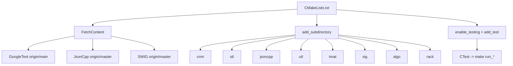
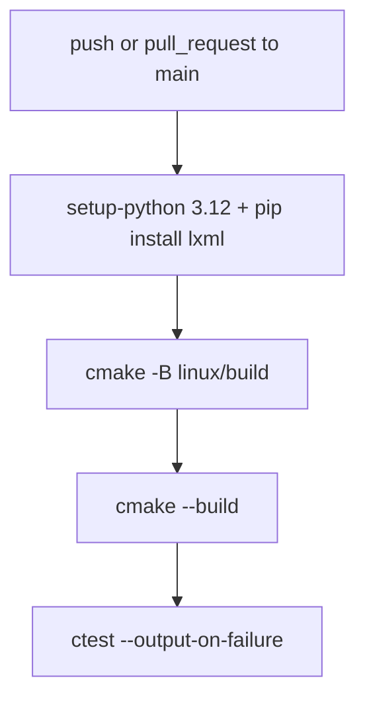

# Build, Test, And CI

## Purpose
Describe how the `eda_stl` core is configured, built, tested, and exercised in
CI today, identify the structural inconsistencies that exist, and define the
required CI quality gates moving forward.

## Audience
Build engineers, contributors fixing CI, and AI tools driving the
implementation playbook.

## In Scope
- Top-level CMake configuration and dependencies.
- CTest registration and module-level custom targets.
- Existing GitHub Actions workflow.
- Helper script in `scripts/build.sh`.
- Required CI gates aligned with code-quality and performance policies.

## Out of Scope
- AI tooling (relocated outside this repository).

## Cross References
- [`glossary.md`](glossary.md)
- [`repository-map.md`](repository-map.md)
- [`code-quality-standards.md`](code-quality-standards.md)
- [`performance/cpp23-and-parallel-runtime.md`](performance/cpp23-and-parallel-runtime.md)
- [`technical-debt-register.md`](technical-debt-register.md)
- [`implementation/implementation-phases.md`](implementation/implementation-phases.md)

## Current Build Architecture

## Configuration Constraints
- C++17 standard with `CMAKE_CXX_STANDARD_REQUIRED True`
  ([`CMakeLists.txt`](../CMakeLists.txt)).
- Hard floor on GCC `>= 9.2.0` enforced by a `FATAL_ERROR`
  ([`CMakeLists.txt`](../CMakeLists.txt)).
- Hard requirement on Python `3.12` for SWIG bindings
  ([`CMakeLists.txt`](../CMakeLists.txt)).
- Inline assembly probe gates `-DUSE_ASM_DIV`
  ([`CMakeLists.txt`](../CMakeLists.txt)).

## Dependency Acquisition
- GoogleTest, JsonCpp, and SWIG are obtained via `FetchContent` with floating
  branch tags (`origin/main`, `origin/master`)
  ([`CMakeLists.txt`](../CMakeLists.txt)).
- SWIG is built from source by an `execute_process` call wrapping a separate
  CMake configure/build under `${CMAKE_BINARY_DIR}/libs/swig`
  ([`CMakeLists.txt`](../CMakeLists.txt)).

## Test Registration
- `add_test(... COMMAND make run_*)` registers tests through Make-only custom
  targets, producing fragility on non-Make generators
  ([`CMakeLists.txt`](../CMakeLists.txt)).
- C++ test binaries live under `*/test/` (e.g., `racktest`, `utltest`).
- Python tests are launched via `python test.py` from SWIG module build
  directories
  ([`rack/swig/CMakeLists.txt`](../rack/swig/CMakeLists.txt)).

## CI Workflow

- Workflow file: [`.github/workflows/cmake-single-platform.yml`](../.github/workflows/cmake-single-platform.yml).
- Configures into `linux/build`, but the repository no longer keeps the
  legacy `linux/` directory; this is a known defect to fix in Phase 0.
- Only `lxml` is installed for Python; SWIG/Python runtime needs are not
  staged in CI.

## Helper Script
- [`scripts/build.sh`](../scripts/build.sh) is a legacy driver assuming
  `linux/`-rooted layouts and accepting subcommands beyond what the help
  message describes (`getdep`, `googletest`, `jsoncpp`, `swig`, `genscript`).
- It does not initialize `PARALLEL` before validating it; missing `-j` causes
  exit code `5`.
- It deletes the `libs/` directory unconditionally during `getdep`.

## Known Defects (Cross-Linked)
- `linux/` path drift across [`README.md`](../README.md),
  [`.gitignore`](../.gitignore), and the GitHub Actions workflow.
- Floating `FetchContent` tags compromise reproducibility.
- GCC and Python floors limit adopter base.
- CTest depends on Make targets; non-Make generators will fail to dispatch
  `run_*` commands.
- See [`technical-debt-register.md`](technical-debt-register.md) for full
  ownership and remediation phase mapping.

## Required CI Quality Gates
- Configure and build succeed on supported compilers (matrix to be defined
  in [`performance/cpp23-and-parallel-runtime.md`](performance/cpp23-and-parallel-runtime.md)).
- `ctest --output-on-failure` passes.
- `clang-format --dry-run --Werror` passes.
- `clang-tidy` clean for the configured check set.
- `cppcheck` clean for the configured rule set.
- ASan and UBSan test runs succeed on test suites.
- TSan run succeeds on parallel scenario tests once Phase 5 begins.
- Coverage threshold met for the active phase.
- Throughput regression check passes against the recorded baseline.
- Memory-ceiling regression check passes against the recorded baseline.
- ABI compatibility check passes when the API enters a stable tier.
- Doxygen documentation generation succeeds.

## CI Gating Flow

```mermaid
flowchart LR
    Source[Source change]
    Source --> Format[clang-format check]
    Format --> Lint[clang-tidy + cppcheck]
    Lint --> Compile[Build matrix]
    Compile --> Tests[ctest]
    Tests --> Sanitizers[ASan + UBSan + TSan]
    Sanitizers --> Coverage[Coverage threshold]
    Coverage --> Throughput[Throughput regression]
    Throughput --> Memory[Memory ceiling regression]
    Memory --> ABI[ABI compatibility]
    ABI --> Docs[Doxygen]
    Docs --> Merge[Eligible to merge]
```

## Acceptance Criteria For This Document
- Build graph documented with a mermaid diagram.
- CI workflow documented and inconsistencies listed.
- All required CI gates enumerated.
- Defect list cross-linked to the technical debt register.
- File-path citations present for every nontrivial claim.

## Implementation Phase Mapping
- Phase 0 fixes path drift, pinning, and CTest fragility.
- Phase 1 introduces the format/lint/sanitizer/coverage gates.
- Phase 2 enables full C++23 build matrix.
- Phase 5 onward enforces throughput and memory regression gates.
- Phase 7 enforces ABI gates once a stable API tier is declared.
