# Code Quality Standards

## Purpose
Define what "best-in-class" means for `eda_stl` source code: style, naming,
ownership, exception safety, API surface design, documentation, tooling, and
the patterns that are forbidden in this repository.

## Audience
All contributors and AI tools generating or modifying code in this repository.

## In Scope
- Mandatory C++23 idioms.
- Style and naming conventions.
- Ownership and exception safety.
- Public vs internal headers.
- Documentation requirements.
- Tooling, sanitizer, and coverage rules.
- Forbidden patterns.

## Out of Scope
- Performance methodology (see
  [`performance/cpp23-and-parallel-runtime.md`](performance/cpp23-and-parallel-runtime.md)).
- Extensibility contract (see
  [`extensibility-contract.md`](extensibility-contract.md)).

## Cross References
- [`mission.md`](mission.md)
- [`glossary.md`](glossary.md)
- [`build-test-ci.md`](build-test-ci.md)
- [`technical-debt-register.md`](technical-debt-register.md)
- [`extensibility-contract.md`](extensibility-contract.md)
- [`binding-architecture.md`](binding-architecture.md)
- [`library-catalog.md`](library-catalog.md)
- [`performance/cpp23-and-parallel-runtime.md`](performance/cpp23-and-parallel-runtime.md)
- [`implementation/implementation-phases.md`](implementation/implementation-phases.md)

## Quality Pipeline

```mermaid
flowchart LR
    Source[Source change]
    Source --> Format[clang-format]
    Format --> Lint[clang-tidy + cppcheck]
    Lint --> Build[Compile -Werror]
    Build --> Test[ctest]
    Test --> Sanitizers[ASan + UBSan + TSan]
    Sanitizers --> Coverage[Coverage threshold]
    Coverage --> Docs[Doxygen]
    Docs --> Approved[Approved for merge]
```

## Mandatory C++23 Idioms
- RAII for every resource; no raw owning pointers in public APIs.
- Smart pointers chosen by intent: `std::unique_ptr` for sole ownership,
  `std::shared_ptr` only when shared ownership is required.
- `const`-correctness is mandatory.
- Use `std::expected` for recoverable error returns where a value/error
  contract exists.
- Use ranges and views for sequence transformations where it improves
  readability.
- Use concepts to constrain templates; deprecate ad hoc SFINAE.
- Use `std::span` and `std::string_view` for non-owning views.
- Prefer `enum class`; explicit underlying types where stability matters.

## Naming Conventions
- Types: `UpperCamelCase`.
- Free functions: `lowerCamelCase`.
- Methods: `lowerCamelCase`.
- Variables: `lowerCamelCase`; private members may use a `m_` prefix in
  legacy modules but new code uses suffix `_` (e.g., `name_`).
- Macros: `UPPER_SNAKE_CASE`, used only when no C++ alternative exists.
- File names: `lowercase_with_underscores.h` / `.cpp`; SWIG `.i` files
  match module names.

## Header Discipline
- Public headers go under `*/include/`.
- Internal headers go under `*/internal/` (introduced in Phase 3) or live
  next to their `.cpp`.
- `#pragma once` is the standard guard; no manual `#ifndef ... #endif`
  guards in new code.
- No transitive include reliance: every file includes what it uses.
- No platform-conditional code in public headers without explicit
  documentation and a tested fallback.

## Ownership And Exception Safety
- Document ownership at every API boundary.
- Specify the exception guarantee for every public function:
  `noexcept`, `strong`, or `basic`.
- Move-only types are preferred for non-copyable resources.
- All destructors and move operations are `noexcept` unless deliberately
  documented otherwise.

## API Surface Rules
- Public headers expose stable types and functions documented with Doxygen.
- Internal types must not appear in public function signatures.
- Template-heavy APIs document the policy or trait points and provide
  defaults.
- Backward-incompatible changes follow the deprecation policy in
  [`extensibility-contract.md`](extensibility-contract.md).

## Documentation Requirements
- Every public type, function, and template parameter has a Doxygen block.
- Doxygen comments include: brief, parameters, returns, throws, complexity
  when nontrivial, ownership transfer, thread-safety.
- Examples are encouraged in headers when the API has nuance.

## Tooling Requirements
- `clang-format` enforced with the repository config (added in Phase 1).
- `clang-tidy` checks (selected baseline) clean.
- `cppcheck` clean for the configured rule set.
- ASan + UBSan clean across the test suite in CI.
- TSan clean for parallel scenarios from Phase 5 onward.
- Code coverage threshold defined per phase in
  [`performance/cpp23-and-parallel-runtime.md`](performance/cpp23-and-parallel-runtime.md).

## Forbidden Patterns
- Raw `new` or `delete`.
- Raw owning pointers in public APIs.
- C-style casts; use `static_cast`, `dynamic_cast`, `reinterpret_cast`,
  `const_cast` deliberately.
- `using namespace` in headers.
- `#if 0` blocks committed to source control.
- Unbounded queues/buffers in parallel paths.
- Silent error swallowing; every error path is explicit.
- Magic numbers without named constants.
- Mutable global state; use injected dependencies or singletons with clear
  initialization order.

## Test Code Standards
- Tests must use named GTest fixtures or parameterized tests; no
  `main()`-only test files.
- Each test asserts a specific behavior with a meaningful message.
- Tests must be deterministic and independent of order.
- Slow tests are tagged and run on a separate CI lane.

## Library Catalog Mandate

Use the canonical [`library-catalog.md`](library-catalog.md). New
third-party dependencies are forbidden unless they appear in the
catalog or have been added through the `library-selection` skill at
[`../.cursor/skills/library-selection/SKILL.md`](../.cursor/skills/library-selection/SKILL.md).

Required behavior:

- For every concern, use the catalog's chosen library. JSON ingest is
  simdjson; typed JSON serde is glaze; logging is spdlog; formatting
  is fmt then `std::format`; CLI parsing is CLI11; parallel runtime is
  oneTBB; allocator is mimalloc; hash maps are `absl::flat_hash_map`
  on hot paths; mmap is mio; compression is zstd or lz4; profiler is
  Tracy; metrics are prometheus-cpp; tracing is OpenTelemetry C++.
- Library types from `binding-impl` (per
  [`extensibility-contract.md`](extensibility-contract.md) §"Binding
  Tiers") **must never** appear in `binding-ssot` headers, schemas,
  or in any `public-stable` / `public-evolving` C++ header.
- Adding or substituting a dependency requires updating
  [`library-catalog.md`](library-catalog.md), satisfying the
  substitution policy there, and a `library-selection` skill review.

## Binding-Side Code Quality Rules

Every change that touches `binding/` (the SSOT and wrappers per
[`binding-architecture.md`](binding-architecture.md)) must additionally:

- Pass the `p3-cabi-lint` rules (no template signatures crossing the
  C-ABI; no `binding-impl` types crossing the C-ABI; consistent
  `extern "C"` and opaque-handle conventions).
- Carry stability annotations matching the binding tier the change
  affects (`binding-ssot`, `binding-wrapper`, or `binding-impl`).
- Document the lifetime of every handle returned to or consumed from
  a wrapper.
- Translate every internal exception into the C-ABI error model;
  exceptions never escape across `extern "C"`.
- Keep the binding hot path zero-copy: any new copy on the hot path
  must be justified against the `binding.zero_copy_violations` KPI in
  [`performance/cpp23-and-parallel-runtime.md`](performance/cpp23-and-parallel-runtime.md).

## LLM Surface Safety Rules

Every change that touches `binding/llm/` or `binding/schemas/llm/`
must:

- Update or regenerate the capability registry through the same
  generator path; no hand edits that drift from the SSOT.
- Add an explicit allowlist entry for any new tool, with environment
  scope and audit-tag fields populated.
- Tag every LLM-facing output with `content_type` and a `provenance`
  block (source schema version, generation time, signing hash if
  applicable).
- Validate every request and response against the registry's JSON
  Schema using valijson.
- Honor the IP boundary declared in the system card; outputs to
  destinations outside the boundary are rejected at the response
  edge.
- Apply the prompt-injection mitigations in
  [`binding-architecture.md`](binding-architecture.md) §7 (fence
  untrusted text, mark `source_class` on resources, do not embed
  user-supplied content in tool descriptions).

## Mission Cross-Reference

Every code-quality decision must satisfy the mission-aligned reject
criteria in [`mission.md`](mission.md) §"Mission-Aligned Reject
Criteria". A change that meets the technical bar but erodes the
public-utility premise is still rejected.

## Acceptance Criteria For This Document
- Mandatory idioms enumerated.
- Naming, header, and ownership rules explicit.
- Tooling baseline declared.
- Forbidden patterns listed.
- Library catalog mandate stated.
- Binding-side code quality rules stated.
- LLM surface safety rules stated.
- Mission cross-reference present.
- Cross-references present.
- At least one mermaid diagram present.
