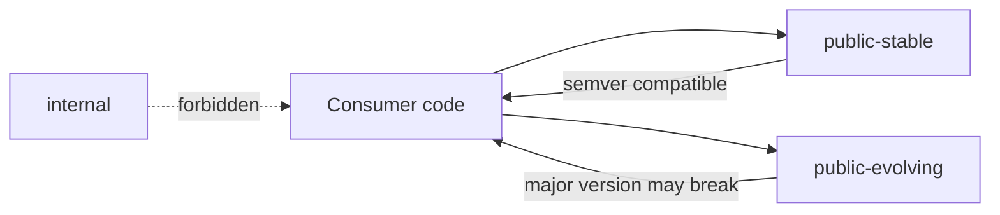
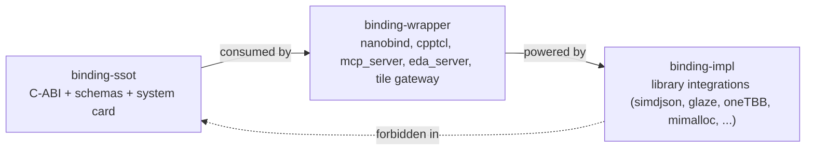

# Extensibility Contract

## Purpose
Define the API tiers, extension points, customization policies, stability
guarantees, and deprecation rules for `eda_stl`.

## Audience
Library maintainers, downstream consumers, integrators, and AI tools that
modify the public surface or customize behavior through extension points.

## In Scope
- API tier classification.
- Extension points and customization policies.
- Stability guarantees and ABI rules.
- Deprecation policy.

## Out of Scope
- Implementation phases (see
  [`implementation/implementation-phases.md`](implementation/implementation-phases.md)).
- Code quality enforcement (see
  [`code-quality-standards.md`](code-quality-standards.md)).

## Cross References
- [`mission.md`](mission.md)
- [`glossary.md`](glossary.md)
- [`code-quality-standards.md`](code-quality-standards.md)
- [`binding-architecture.md`](binding-architecture.md)
- [`library-catalog.md`](library-catalog.md)
- [`performance/cpp23-and-parallel-runtime.md`](performance/cpp23-and-parallel-runtime.md)
- [`roadmap/eda-stl-library.md`](roadmap/eda-stl-library.md)
- [`technical-debt-register.md`](technical-debt-register.md)
- [`implementation/implementation-phases.md`](implementation/implementation-phases.md)

## API Tiers

- `public-stable`: stable across minor versions. Breaking changes require a
  major version bump and follow the deprecation policy.
- `public-evolving`: usable but not stabilized. May change with minor
  releases until promoted to `public-stable`.
- `internal`: not part of the public surface. May change at any time. Must
  not appear in `public-*` headers.

Tier classification will be encoded in source via header location and a
header-level annotation comment in Phase 3.

## Extension Points
- Template policies on `Basic*` types in
  [`../rack/include/rack.h`](../rack/include/rack.h):
  character traits and allocator are policy parameters.
- Allocator categories declared in the performance plan; consumers may plug
  in custom allocators per category.
- Traversal func-adapters and navigator base classes in
  [`../algo/include/`](../algo/include) provide hook points (will be
  expanded in Phase 4).
- Dump/serialization writers (XML, JSON, Verilog) will move to a
  pluggable writer interface in Phase 4.

## Customization Policies
- Customization requires an explicit policy or trait type. Implicit
  customization through inheritance from internal classes is forbidden.
- Default policies are documented for every customization point.
- Policies are documented with required operations and complexity contracts.

## Stability Guarantees
- `public-stable` symbols are covered by:
  - source compatibility across the same major version,
  - documented complexity guarantees where applicable,
  - thread-safety annotations,
  - exception guarantees per
    [`code-quality-standards.md`](code-quality-standards.md).
- ABI compatibility is preserved across patch versions starting from
  Phase 7 release; ABI breaks require a major version bump.

## Deprecation Policy

- Mark with `[[deprecated("reason and migration target")]]`.
- Provide a one-major-version grace period before removal.
- Removed symbols are documented in the release notes.
- Grace periods are extended if active downstream consumers cannot migrate.

## ABI Rules
- Public-stable headers must avoid layout changes that break binary
  compatibility within a major version.
- Inline definitions in stable headers must be marked `inline` and remain
  ABI-stable.
- ABI checks are added in Phase 7 (e.g., abi-compliance-checker, libabigail).

## Binding Tiers

Every interface in `eda_stl` is classified into one of three binding
tiers. The tier determines what may change without an SSOT version
bump and which review path applies.

| Binding tier | Purpose | Stability | Where it lives |
|---|---|---|---|
| `binding-ssot` | C-stable ABI, Flight + Arrow + tile schemas, LLM system card and registry. | SemVer; major bump required for breaking changes; RFC mandatory. | `binding/cabi/`, `binding/schemas/` |
| `binding-wrapper` | Best-in-class wrapper per target (Python via nanobind, Tcl via cpptcl, native MCP server, Flight server, tile gateway). | Wrapper-side breaking changes follow per-wrapper SemVer; never break the SSOT they consume. | `binding/python/`, `binding/tcl/`, `binding/llm/`, `binding/server/`, `binding/web/` |
| `binding-impl` | Third-party library integrations beneath wrappers and core. | Freely substitutable per the substitution policy in [`library-catalog.md`](library-catalog.md). Never appears in the SSOT. | `third_party/`, internal headers under each module |

### Binding-Tier Rules

- A type from `binding-impl` (e.g., `simdjson::*`, `arrow::*`,
  `absl::*`, `glaze::*`, `mimalloc::*`) **must never** appear in a
  `binding-ssot` header or schema. Enforced by `p3-cabi-lint` (Phase 3).
- A `binding-wrapper` **must** consume `binding-ssot` directly. It may
  not reach into `binding-impl` or into core C++ headers under
  `rack/include`, `utl/include`, etc., except through the SSOT.
- A `binding-wrapper` may swap its underlying `binding-impl` library
  without an SSOT version bump, provided it satisfies the substitution
  policy in [`library-catalog.md`](library-catalog.md).
- A breaking change in `binding-ssot` requires:
  - a public RFC (see [`mission.md`](mission.md) §"Governance"),
  - a major-version bump,
  - a deprecation window per the policy above, and
  - a `mission-alignment-review` skill pass.

### Library Implementations Are Not Part Of The Public Surface
- All third-party libraries listed in
  [`library-catalog.md`](library-catalog.md) are `binding-impl`.
- Their types do not appear in any `public-stable` or
  `public-evolving` header, in any `binding-ssot` header, or in any
  schema.
- Substituting one `binding-impl` library for another is governed
  exclusively by the substitution policy in
  [`library-catalog.md`](library-catalog.md) and is reviewed by the
  `library-selection` skill at
  [`../.cursor/skills/library-selection/SKILL.md`](../.cursor/skills/library-selection/SKILL.md).

### LLM Surface Stability

The LLM-facing surface defined in
[`binding-architecture.md`](binding-architecture.md) §7 is governed
under `binding-ssot`:

- The `system-card.yaml` schema, the `capability-registry.yaml`
  schema, and the `allowlist.yaml` schema are SemVer'd.
- Tools, resources, and prompts inherit the underlying C-ABI / schema
  stability tier; renaming or removing a tool follows the deprecation
  policy above.
- Allowlist changes are governed by the
  `llm-interface-governance` skill at
  [`../.cursor/skills/llm-interface-governance/SKILL.md`](../.cursor/skills/llm-interface-governance/SKILL.md).

### Mission Cross-Reference

Every change to the public surface, including the binding tiers above,
must pass the mission-aligned reject criteria in
[`mission.md`](mission.md) §"Mission-Aligned Reject Criteria".

## Acceptance Criteria For This Document
- API tiers explicit with consumer rules.
- Binding tiers (`binding-ssot`, `binding-wrapper`, `binding-impl`)
  explicit, with the rule that `binding-impl` types never appear in
  `binding-ssot`.
- Extension points enumerated with citations.
- Customization policies stated.
- Deprecation policy with mermaid flow.
- Mission cross-reference present.
- Cross-references present.
