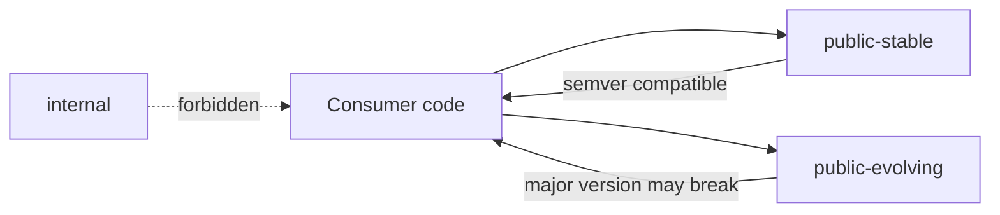
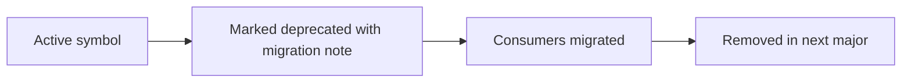

# Extensibility Contract

## Purpose
Define the API tiers, extension points, customization policies, stability
guarantees, and deprecation rules for `eda_stl`.

## Audience
Library maintainers, downstream consumers, integrators, and AI tools that
modify the public surface or customize behavior through extension points.

## In Scope
- API tier classification.
- Extension points and customization policies.
- Stability guarantees and ABI rules.
- Deprecation policy.

## Out of Scope
- Implementation phases (see
  [`implementation/implementation-phases.md`](implementation/implementation-phases.md)).
- Code quality enforcement (see
  [`code-quality-standards.md`](code-quality-standards.md)).

## Cross References
- [`glossary.md`](glossary.md)
- [`code-quality-standards.md`](code-quality-standards.md)
- [`performance/cpp23-and-parallel-runtime.md`](performance/cpp23-and-parallel-runtime.md)
- [`roadmap/eda-stl-library.md`](roadmap/eda-stl-library.md)
- [`technical-debt-register.md`](technical-debt-register.md)
- [`implementation/implementation-phases.md`](implementation/implementation-phases.md)

## API Tiers

- `public-stable`: stable across minor versions. Breaking changes require a
  major version bump and follow the deprecation policy.
- `public-evolving`: usable but not stabilized. May change with minor
  releases until promoted to `public-stable`.
- `internal`: not part of the public surface. May change at any time. Must
  not appear in `public-*` headers.

Tier classification will be encoded in source via header location and a
header-level annotation comment in Phase 3.

## Extension Points
- Template policies on `Basic*` types in
  [`../rack/include/rack.h`](../rack/include/rack.h):
  character traits and allocator are policy parameters.
- Allocator categories declared in the performance plan; consumers may plug
  in custom allocators per category.
- Traversal func-adapters and navigator base classes in
  [`../algo/include/`](../algo/include) provide hook points (will be
  expanded in Phase 4).
- Dump/serialization writers (XML, JSON, Verilog) will move to a
  pluggable writer interface in Phase 4.

## Customization Policies
- Customization requires an explicit policy or trait type. Implicit
  customization through inheritance from internal classes is forbidden.
- Default policies are documented for every customization point.
- Policies are documented with required operations and complexity contracts.

## Stability Guarantees
- `public-stable` symbols are covered by:
  - source compatibility across the same major version,
  - documented complexity guarantees where applicable,
  - thread-safety annotations,
  - exception guarantees per
    [`code-quality-standards.md`](code-quality-standards.md).
- ABI compatibility is preserved across patch versions starting from
  Phase 7 release; ABI breaks require a major version bump.

## Deprecation Policy

- Mark with `[[deprecated("reason and migration target")]]`.
- Provide a one-major-version grace period before removal.
- Removed symbols are documented in the release notes.
- Grace periods are extended if active downstream consumers cannot migrate.

## ABI Rules
- Public-stable headers must avoid layout changes that break binary
  compatibility within a major version.
- Inline definitions in stable headers must be marked `inline` and remain
  ABI-stable.
- ABI checks are added in Phase 7 (e.g., abi-compliance-checker, libabigail).

## Acceptance Criteria For This Document
- API tiers explicit with consumer rules.
- Extension points enumerated with citations.
- Customization policies stated.
- Deprecation policy with mermaid flow.
- Cross-references present.
