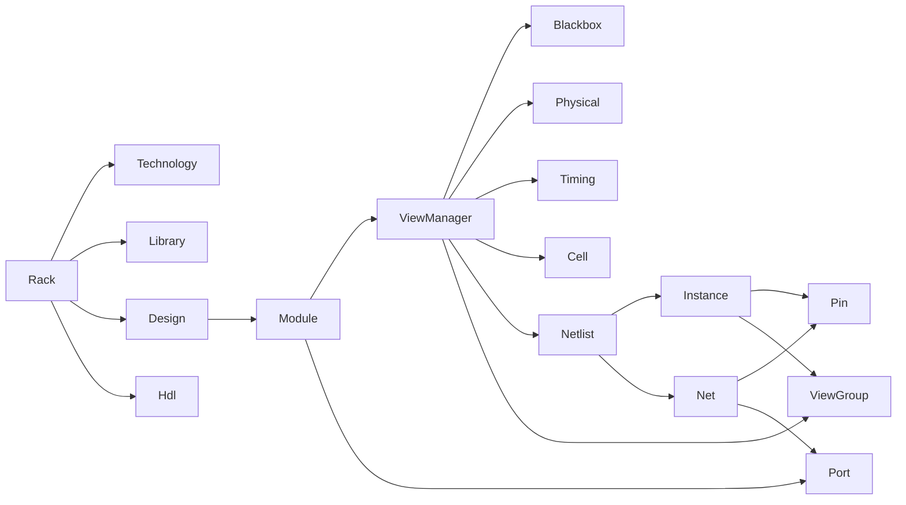

# EDA STL Glossary

## Purpose
Provide canonical, unambiguous definitions for the terminology used across the
`eda_stl` codebase, documentation, and skills. Every other document and skill
must use the terms defined here without reinterpretation.

## Audience
Library users, contributors, EDA tool integrators, and AI tools generating or
maintaining content for this repository.

## In Scope
- Core domain terms used by the C++ data model in `rack/`.
- Build, test, and bindings vocabulary used across `cmn/`, `utl/`, `tmat/`,
  `sig/`, `algo/`, and `rack/swig/`.
- Quality, performance, and governance terms referenced by the documentation
  and implementation playbook.

## Out of Scope
- AI/Quartus terminology (the `ai` tree is no longer in this repository).

## Cross References
- [`README.md`](README.md)
- [`repository-map.md`](repository-map.md)
- [`rack-model-and-verification.md`](rack-model-and-verification.md)
- [`code-quality-standards.md`](code-quality-standards.md)

## How To Read An Entry
Every entry includes:

- `term`: canonical name.
- `definition`: one-sentence operational definition.
- `evidence`: file path establishing the meaning.
- `aliases`: synonyms used in the codebase (if any).
- `related_terms`: cross-references inside this glossary.

## Glossary Term Relationships

## Core Domain Terms

### Rack
- term: `Rack`
- definition: Top-level aggregate container for an EDA database. Holds
  technology, library, design, and HDL collections.
- evidence: [`/home/rohit/src/eda_stl/rack/include/rack.h`](../rack/include/rack.h)
- aliases: none
- related_terms: `Technology`, `Library`, `Design`, `Hdl`

### Technology
- term: `Technology`
- definition: Process-related context container belonging to a `Rack`.
- evidence: [`/home/rohit/src/eda_stl/rack/include/technology.h`](../rack/include/technology.h)
- aliases: none
- related_terms: `Rack`, `Library`

### Library
- term: `Library`
- definition: Collection of reusable cells/modules attached to a `Rack`.
- evidence: [`/home/rohit/src/eda_stl/rack/include/library.h`](../rack/include/library.h)
- aliases: none
- related_terms: `Rack`, `Module`

### Design
- term: `Design`
- definition: Container of `Module` objects describing a user design.
- evidence: [`/home/rohit/src/eda_stl/rack/include/design.h`](../rack/include/design.h)
- aliases: none
- related_terms: `Rack`, `Module`

### Hdl
- term: `Hdl`
- definition: HDL-source-related container attached to a `Rack`.
- evidence: [`/home/rohit/src/eda_stl/rack/include/hdl.h`](../rack/include/hdl.h)
- aliases: none
- related_terms: `Rack`, `Module`

### Module
- term: `Module`
- definition: Reusable circuit unit owning ports and a `ViewManager`.
- evidence: [`/home/rohit/src/eda_stl/rack/include/module.h`](../rack/include/module.h)
- aliases: cell (informal)
- related_terms: `Port`, `ViewManager`, `Instance`

### ViewManager
- term: `ViewManager`
- definition: Per-`Module` registry of named views (blackbox, physical,
  timing, cell, netlist, hdl, viewgroup).
- evidence: [`/home/rohit/src/eda_stl/rack/include/viewmanager.h`](../rack/include/viewmanager.h)
- aliases: none
- related_terms: `Module`, `Netlist`, `ViewGroup`

### Netlist
- term: `Netlist`
- definition: View representing a `Module`'s structural connectivity through
  `Instance` and `Net` collections.
- evidence: [`/home/rohit/src/eda_stl/rack/include/netlist.h`](../rack/include/netlist.h)
- aliases: none
- related_terms: `Instance`, `Net`, `ViewGroup`

### ViewGroup
- term: `ViewGroup`
- definition: Named bundle of related views used to instantiate a `Module`.
- evidence: [`/home/rohit/src/eda_stl/rack/include/viewgroup.h`](../rack/include/viewgroup.h)
- aliases: none
- related_terms: `ViewManager`, `Instance`

### Instance
- term: `Instance`
- definition: A reference to a `Module` placed inside a parent `Netlist`,
  exposing per-instance pins.
- evidence: [`/home/rohit/src/eda_stl/rack/include/instance.h`](../rack/include/instance.h)
- aliases: none
- related_terms: `Pin`, `Module`, `Netlist`

### Port
- term: `Port`
- definition: A `Module`-level connection point.
- evidence: [`/home/rohit/src/eda_stl/rack/include/port.h`](../rack/include/port.h)
- aliases: none
- related_terms: `Net`, `Module`

### Pin
- term: `Pin`
- definition: An `Instance`-level connection point bound to a `Port`.
- evidence: [`/home/rohit/src/eda_stl/rack/include/pin.h`](../rack/include/pin.h)
- aliases: none
- related_terms: `Port`, `Instance`, `Net`

### Net
- term: `Net`
- definition: Logical wire connecting `Pin` and `Port` connectors inside a
  `Netlist`.
- evidence: [`/home/rohit/src/eda_stl/rack/include/net.h`](../rack/include/net.h)
- aliases: none
- related_terms: `Pin`, `Port`, `Netlist`

### Connector
- term: `Connector`
- definition: Common base for `Port` and `Pin` providing shared connection
  semantics.
- evidence: [`/home/rohit/src/eda_stl/rack/include/connectorbase.h`](../rack/include/connectorbase.h)
- aliases: none
- related_terms: `Port`, `Pin`

### Multistring
- term: `multistring`
- definition: Hierarchical name composed of multiple string segments,
  enabling flat names with structured comparison.
- evidence: [`/home/rohit/src/eda_stl/utl/include/multistring.h`](../utl/include/multistring.h)
- aliases: hierarchical name
- related_terms: `Instance`, `Net`

### Dissolve
- term: `dissolve`
- definition: Replace an `Instance` by inlining its referenced `Module`'s
  netlist into the parent, generating hierarchical names for inlined items.
- evidence: [`/home/rohit/src/eda_stl/rack/test/test.cpp`](../rack/test/test.cpp)
- aliases: flatten
- related_terms: `Instance`, `Netlist`, `Multistring`

### Flat Top
- term: `flat top`
- definition: State of a top-level `Module` after all child `Instance`
  objects have been dissolved.
- evidence: [`/home/rohit/src/eda_stl/rack/test/test.cpp`](../rack/test/test.cpp)
- aliases: flattened design
- related_terms: `Dissolve`, `Module`

## Build And Bindings Terms

### SWIG Module
- term: `SWIG module`
- definition: Python-loadable shared library generated from a SWIG `.i`
  interface (e.g., `pyrack`, `pyutl`, `pytmat`).
- evidence: [`/home/rohit/src/eda_stl/rack/swig/CMakeLists.txt`](../rack/swig/CMakeLists.txt)
- aliases: binding
- related_terms: `pyrack`, `pyutl`, `pytmat`

### pyrack
- term: `pyrack`
- definition: Python binding for the `rack` C++ data model.
- evidence: [`/home/rohit/src/eda_stl/rack/swig/rack_int.i`](../rack/swig/rack_int.i)
- aliases: none
- related_terms: `Rack`, `SWIG module`

### FetchContent
- term: `FetchContent`
- definition: CMake mechanism used in this repository to obtain GoogleTest,
  JsonCpp, and SWIG sources at configure time.
- evidence: [`/home/rohit/src/eda_stl/CMakeLists.txt`](../CMakeLists.txt)
- aliases: none
- related_terms: `CTest`

### CTest
- term: `CTest`
- definition: Test runner registered via `add_test` in
  [`CMakeLists.txt`](../CMakeLists.txt) and dispatched through
  `make run_*` custom targets.
- evidence: [`/home/rohit/src/eda_stl/CMakeLists.txt`](../CMakeLists.txt)
- aliases: none
- related_terms: `FetchContent`

## Quality, Performance, And Governance Terms

### KPI
- term: `KPI`
- definition: A measurable performance or quality indicator with units, a
  measurement method, a target, and a regression threshold.
- evidence: [`performance/cpp23-and-parallel-runtime.md`](performance/cpp23-and-parallel-runtime.md)
- aliases: metric
- related_terms: `Bounded Memory`, `Reject Criterion`

### Bounded Memory
- term: `bounded memory`
- definition: Hard policy that no parallel optimization may rely on
  unbounded memory growth; throughput goals are constrained by explicit
  per-design, per-thread, and per-work-unit budgets.
- evidence: [`performance/cpp23-and-parallel-runtime.md`](performance/cpp23-and-parallel-runtime.md)
- aliases: memory envelope
- related_terms: `KPI`, `Reject Criterion`

### Reject Criterion
- term: `reject criterion`
- definition: A condition under which an otherwise faster proposal must be
  refused (e.g., violates the memory budget).
- evidence: [`performance/cpp23-and-parallel-runtime.md`](performance/cpp23-and-parallel-runtime.md)
- aliases: none
- related_terms: `KPI`, `Bounded Memory`

### Phase
- term: `phase`
- definition: A gated unit of work in
  [`implementation/implementation-phases.md`](implementation/implementation-phases.md)
  with explicit entry, exit, deliverables, verification, and rollback rules.
- evidence: [`implementation/implementation-phases.md`](implementation/implementation-phases.md)
- aliases: implementation phase
- related_terms: `Task Card`, `Phase Runner`

### Task Card
- term: `task card`
- definition: A YAML-formatted unit of work inside a `phase`, conforming to
  the schema defined in
  [`implementation/implementation-phases.md`](implementation/implementation-phases.md).
- evidence: [`implementation/implementation-phases.md`](implementation/implementation-phases.md)
- aliases: none
- related_terms: `Phase`, `Phase Runner`

### Phase Runner
- term: `phase runner`
- definition: An AI-tool-driven executor that loads a phase, validates
  entry criteria, runs task cards in order, and persists state.
- evidence: [`/home/rohit/src/eda_stl/.cursor/skills/implementation-phase-runner/SKILL.md`](../.cursor/skills/implementation-phase-runner/SKILL.md)
- aliases: none
- related_terms: `Phase`, `Task Card`

### Technical Debt Item
- term: `technical debt item`
- definition: A logged, classified, and prioritized deficiency tracked in
  [`technical-debt-register.md`](technical-debt-register.md).
- evidence: [`technical-debt-register.md`](technical-debt-register.md)
- aliases: debt entry
- related_terms: `Severity`

### Severity
- term: `severity`
- definition: One of `critical`, `high`, `medium`, `low` applied to risks
  and technical debt items.
- evidence: [`quality-gaps-and-risks.md`](quality-gaps-and-risks.md)
- aliases: priority
- related_terms: `Technical Debt Item`

### API Tier
- term: `API tier`
- definition: One of `public-stable`, `public-evolving`, `internal` used to
  classify symbols and headers per the extensibility contract.
- evidence: [`extensibility-contract.md`](extensibility-contract.md)
- aliases: stability tier
- related_terms: `Deprecation Policy`

### Deprecation Policy
- term: `deprecation policy`
- definition: Rules governing how `public-stable` and `public-evolving`
  symbols may change, including grace periods and migration guidance.
- evidence: [`extensibility-contract.md`](extensibility-contract.md)
- aliases: none
- related_terms: `API Tier`

## Acceptance Criteria For This Document
- Every term has the entry schema (term, definition, evidence, aliases,
  related_terms).
- Every term has a file-path citation.
- Diagram of term relationships present.
- Cross-references to other documents present.
