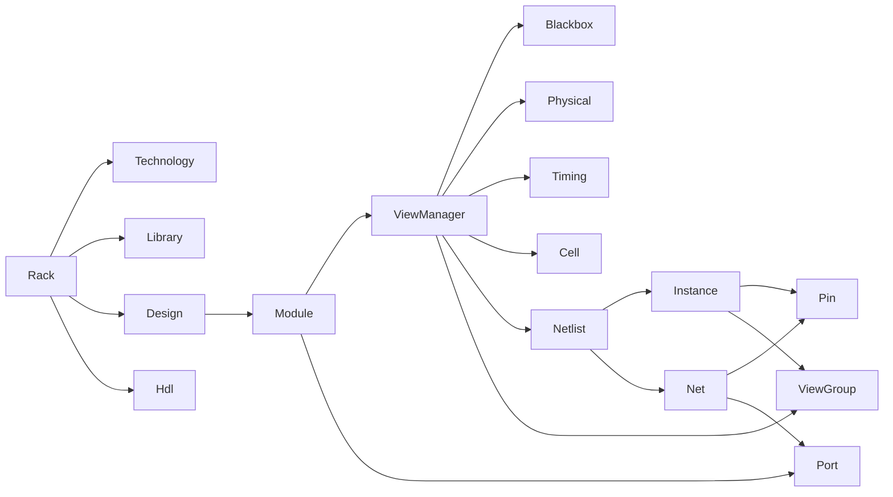

# EDA STL Glossary

## Purpose
Provide canonical, unambiguous definitions for the terminology used across the
`eda_stl` codebase, documentation, and skills. Every other document and skill
must use the terms defined here without reinterpretation.

## Audience
Library users, contributors, EDA tool integrators, and AI tools generating or
maintaining content for this repository.

## In Scope
- Core domain terms used by the C++ data model in `rack/`.
- Build, test, and bindings vocabulary used across `cmn/`, `utl/`, `tmat/`,
  `sig/`, `algo/`, and `rack/swig/`.
- Quality, performance, and governance terms referenced by the documentation
  and implementation playbook.

## Out of Scope
- AI/Quartus terminology (the `ai` tree is no longer in this repository).

## Cross References
- [`mission.md`](mission.md)
- [`README.md`](README.md)
- [`repository-map.md`](repository-map.md)
- [`rack-model-and-verification.md`](rack-model-and-verification.md)
- [`code-quality-standards.md`](code-quality-standards.md)
- [`binding-architecture.md`](binding-architecture.md)
- [`library-catalog.md`](library-catalog.md)

## How To Read An Entry
Every entry includes:

- `term`: canonical name.
- `definition`: one-sentence operational definition.
- `evidence`: file path establishing the meaning.
- `aliases`: synonyms used in the codebase (if any).
- `related_terms`: cross-references inside this glossary.

## Glossary Term Relationships

## Core Domain Terms

### Rack
- term: `Rack`
- definition: Top-level aggregate container for an EDA database. Holds
  technology, library, design, and HDL collections.
- evidence: [`/home/rohit/src/eda_stl/rack/include/rack.h`](../rack/include/rack.h)
- aliases: none
- related_terms: `Technology`, `Library`, `Design`, `Hdl`

### Technology
- term: `Technology`
- definition: Process-related context container belonging to a `Rack`.
- evidence: [`/home/rohit/src/eda_stl/rack/include/technology.h`](../rack/include/technology.h)
- aliases: none
- related_terms: `Rack`, `Library`

### Library
- term: `Library`
- definition: Collection of reusable cells/modules attached to a `Rack`.
- evidence: [`/home/rohit/src/eda_stl/rack/include/library.h`](../rack/include/library.h)
- aliases: none
- related_terms: `Rack`, `Module`

### Design
- term: `Design`
- definition: Container of `Module` objects describing a user design.
- evidence: [`/home/rohit/src/eda_stl/rack/include/design.h`](../rack/include/design.h)
- aliases: none
- related_terms: `Rack`, `Module`

### Hdl
- term: `Hdl`
- definition: HDL-source-related container attached to a `Rack`.
- evidence: [`/home/rohit/src/eda_stl/rack/include/hdl.h`](../rack/include/hdl.h)
- aliases: none
- related_terms: `Rack`, `Module`

### Module
- term: `Module`
- definition: Reusable circuit unit owning ports and a `ViewManager`.
- evidence: [`/home/rohit/src/eda_stl/rack/include/module.h`](../rack/include/module.h)
- aliases: cell (informal)
- related_terms: `Port`, `ViewManager`, `Instance`

### ViewManager
- term: `ViewManager`
- definition: Per-`Module` registry of named views (blackbox, physical,
  timing, cell, netlist, hdl, viewgroup).
- evidence: [`/home/rohit/src/eda_stl/rack/include/viewmanager.h`](../rack/include/viewmanager.h)
- aliases: none
- related_terms: `Module`, `Netlist`, `ViewGroup`

### Netlist
- term: `Netlist`
- definition: View representing a `Module`'s structural connectivity through
  `Instance` and `Net` collections.
- evidence: [`/home/rohit/src/eda_stl/rack/include/netlist.h`](../rack/include/netlist.h)
- aliases: none
- related_terms: `Instance`, `Net`, `ViewGroup`

### ViewGroup
- term: `ViewGroup`
- definition: Named bundle of related views used to instantiate a `Module`.
- evidence: [`/home/rohit/src/eda_stl/rack/include/viewgroup.h`](../rack/include/viewgroup.h)
- aliases: none
- related_terms: `ViewManager`, `Instance`

### Instance
- term: `Instance`
- definition: A reference to a `Module` placed inside a parent `Netlist`,
  exposing per-instance pins.
- evidence: [`/home/rohit/src/eda_stl/rack/include/instance.h`](../rack/include/instance.h)
- aliases: none
- related_terms: `Pin`, `Module`, `Netlist`

### Port
- term: `Port`
- definition: A `Module`-level connection point.
- evidence: [`/home/rohit/src/eda_stl/rack/include/port.h`](../rack/include/port.h)
- aliases: none
- related_terms: `Net`, `Module`

### Pin
- term: `Pin`
- definition: An `Instance`-level connection point bound to a `Port`.
- evidence: [`/home/rohit/src/eda_stl/rack/include/pin.h`](../rack/include/pin.h)
- aliases: none
- related_terms: `Port`, `Instance`, `Net`

### Net
- term: `Net`
- definition: Logical wire connecting `Pin` and `Port` connectors inside a
  `Netlist`.
- evidence: [`/home/rohit/src/eda_stl/rack/include/net.h`](../rack/include/net.h)
- aliases: none
- related_terms: `Pin`, `Port`, `Netlist`

### Connector
- term: `Connector`
- definition: Common base for `Port` and `Pin` providing shared connection
  semantics.
- evidence: [`/home/rohit/src/eda_stl/rack/include/connectorbase.h`](../rack/include/connectorbase.h)
- aliases: none
- related_terms: `Port`, `Pin`

### Multistring
- term: `multistring`
- definition: Hierarchical name composed of multiple string segments,
  enabling flat names with structured comparison.
- evidence: [`/home/rohit/src/eda_stl/utl/include/multistring.h`](../utl/include/multistring.h)
- aliases: hierarchical name
- related_terms: `Instance`, `Net`

### Dissolve
- term: `dissolve`
- definition: Replace an `Instance` by inlining its referenced `Module`'s
  netlist into the parent, generating hierarchical names for inlined items.
- evidence: [`/home/rohit/src/eda_stl/rack/test/test.cpp`](../rack/test/test.cpp)
- aliases: flatten
- related_terms: `Instance`, `Netlist`, `Multistring`

### Flat Top
- term: `flat top`
- definition: State of a top-level `Module` after all child `Instance`
  objects have been dissolved.
- evidence: [`/home/rohit/src/eda_stl/rack/test/test.cpp`](../rack/test/test.cpp)
- aliases: flattened design
- related_terms: `Dissolve`, `Module`

## Build And Bindings Terms

### SWIG Module
- term: `SWIG module`
- definition: Python-loadable shared library generated from a SWIG `.i`
  interface (e.g., `pyrack`, `pyutl`, `pytmat`).
- evidence: [`/home/rohit/src/eda_stl/rack/swig/CMakeLists.txt`](../rack/swig/CMakeLists.txt)
- aliases: binding
- related_terms: `pyrack`, `pyutl`, `pytmat`

### pyrack
- term: `pyrack`
- definition: Python binding for the `rack` C++ data model.
- evidence: [`/home/rohit/src/eda_stl/rack/swig/rack_int.i`](../rack/swig/rack_int.i)
- aliases: none
- related_terms: `Rack`, `SWIG module`

### FetchContent
- term: `FetchContent`
- definition: CMake mechanism used in this repository to obtain GoogleTest,
  JsonCpp, and SWIG sources at configure time.
- evidence: [`/home/rohit/src/eda_stl/CMakeLists.txt`](../CMakeLists.txt)
- aliases: none
- related_terms: `CTest`

### CTest
- term: `CTest`
- definition: Test runner registered via `add_test` in
  [`CMakeLists.txt`](../CMakeLists.txt) and dispatched through
  `make run_*` custom targets.
- evidence: [`/home/rohit/src/eda_stl/CMakeLists.txt`](../CMakeLists.txt)
- aliases: none
- related_terms: `FetchContent`

## Quality, Performance, And Governance Terms

### KPI
- term: `KPI`
- definition: A measurable performance or quality indicator with units, a
  measurement method, a target, and a regression threshold.
- evidence: [`performance/cpp23-and-parallel-runtime.md`](performance/cpp23-and-parallel-runtime.md)
- aliases: metric
- related_terms: `Bounded Memory`, `Reject Criterion`

### Bounded Memory
- term: `bounded memory`
- definition: Hard policy that no parallel optimization may rely on
  unbounded memory growth; throughput goals are constrained by explicit
  per-design, per-thread, and per-work-unit budgets.
- evidence: [`performance/cpp23-and-parallel-runtime.md`](performance/cpp23-and-parallel-runtime.md)
- aliases: memory envelope
- related_terms: `KPI`, `Reject Criterion`

### Reject Criterion
- term: `reject criterion`
- definition: A condition under which an otherwise faster proposal must be
  refused (e.g., violates the memory budget).
- evidence: [`performance/cpp23-and-parallel-runtime.md`](performance/cpp23-and-parallel-runtime.md)
- aliases: none
- related_terms: `KPI`, `Bounded Memory`

### Phase
- term: `phase`
- definition: A gated unit of work in
  [`implementation/implementation-phases.md`](implementation/implementation-phases.md)
  with explicit entry, exit, deliverables, verification, and rollback rules.
- evidence: [`implementation/implementation-phases.md`](implementation/implementation-phases.md)
- aliases: implementation phase
- related_terms: `Task Card`, `Phase Runner`

### Task Card
- term: `task card`
- definition: A YAML-formatted unit of work inside a `phase`, conforming to
  the schema defined in
  [`implementation/implementation-phases.md`](implementation/implementation-phases.md).
- evidence: [`implementation/implementation-phases.md`](implementation/implementation-phases.md)
- aliases: none
- related_terms: `Phase`, `Phase Runner`

### Phase Runner
- term: `phase runner`
- definition: An AI-tool-driven executor that loads a phase, validates
  entry criteria, runs task cards in order, and persists state.
- evidence: [`/home/rohit/src/eda_stl/.cursor/skills/implementation-phase-runner/SKILL.md`](../.cursor/skills/implementation-phase-runner/SKILL.md)
- aliases: none
- related_terms: `Phase`, `Task Card`

### Technical Debt Item
- term: `technical debt item`
- definition: A logged, classified, and prioritized deficiency tracked in
  [`technical-debt-register.md`](technical-debt-register.md).
- evidence: [`technical-debt-register.md`](technical-debt-register.md)
- aliases: debt entry
- related_terms: `Severity`

### Severity
- term: `severity`
- definition: One of `critical`, `high`, `medium`, `low` applied to risks
  and technical debt items.
- evidence: [`quality-gaps-and-risks.md`](quality-gaps-and-risks.md)
- aliases: priority
- related_terms: `Technical Debt Item`

### API Tier
- term: `API tier`
- definition: One of `public-stable`, `public-evolving`, `internal` used to
  classify symbols and headers per the extensibility contract.
- evidence: [`extensibility-contract.md`](extensibility-contract.md)
- aliases: stability tier
- related_terms: `Deprecation Policy`

### Deprecation Policy
- term: `deprecation policy`
- definition: Rules governing how `public-stable` and `public-evolving`
  symbols may change, including grace periods and migration guidance.
- evidence: [`extensibility-contract.md`](extensibility-contract.md)
- aliases: none
- related_terms: `API Tier`

## Mission Terms

### STL For EDA
- term: `STL for EDA`
- definition: The mission statement of `eda_stl`: be to Electronic
  Design Automation what the C++ Standard Template Library is to
  software in general - a free, public, best-in-class data-modeling
  foundation.
- evidence: [`mission.md`](mission.md)
- aliases: mission, charter
- related_terms: `Data-Modeling Burden`, `Public Utility`,
  `Mission Boundary`

### Data-Modeling Burden
- term: `data-modeling burden`
- definition: The duplicated industry-wide work of rebuilding
  hierarchical, name-resolved, view-managed, geometry-indexed netlist
  data models. `eda_stl` exists to eliminate this burden.
- evidence: [`mission.md`](mission.md)
- aliases: data-model duplication
- related_terms: `STL For EDA`, `Mission Boundary`

### Public Utility
- term: `public utility`
- definition: The licensing and governance posture of `eda_stl`:
  MIT-licensed, no private-fork advantage, no paid runtime, no vendor
  lock-in, infrastructure-grade availability.
- evidence: [`mission.md`](mission.md),
  [`/home/rohit/src/eda_stl/LICENSE`](../LICENSE)
- aliases: public infrastructure
- related_terms: `STL For EDA`, `Mission-Aligned Reject Criterion`

### Mission Boundary
- term: `mission boundary`
- definition: The boundary that excludes tools, flows, viewers, and
  vendor products from this repository. `eda_stl` is infrastructure;
  what is built on top is downstream.
- evidence: [`mission.md`](mission.md)
- aliases: non-mission boundary
- related_terms: `STL For EDA`, `Mission-Aligned Reject Criterion`

### Mission-Aligned Reject Criterion
- term: `mission-aligned reject criterion`
- definition: A reject rule applied to any proposed change that would
  erode the mission - private-fork advantages, GPL-only deps,
  vendor-format coupling, paid-runtime gating, redefining the model in a
  frontend, or crossing the mission boundary.
- evidence: [`mission.md`](mission.md)
- aliases: mission reject rule
- related_terms: `Reject Criterion`, `Mission Boundary`

## Binding And Interfacing Terms

### SSOT
- term: `SSOT`
- definition: Single Source Of Truth for all interfacing in `eda_stl`:
  the C-stable ABI headers under `binding/cabi/`, the schemas under
  `binding/schemas/`, and the LLM system card under
  `binding/schemas/llm/`. Every wrapper consumes this surface; nothing
  else may redefine it.
- evidence: [`binding-architecture.md`](binding-architecture.md)
- aliases: single source of truth
- related_terms: `C-ABI`, `System Card`, `Capability Registry`

### C-ABI
- term: `C-ABI`
- definition: The C-stable Application Binary Interface exposed by
  `eda_stl` through opaque handles, an explicit error model, and stable
  layout - the foundation of the SSOT.
- evidence: [`binding-architecture.md`](binding-architecture.md)
- aliases: C-stable ABI
- related_terms: `SSOT`, `Opaque Handle`, `Error Model`

### Opaque Handle
- term: `opaque handle`
- definition: A pointer/integer typedef whose layout is intentionally
  hidden; consumers may pass it across the C-ABI but never dereference
  it.
- evidence: [`binding-architecture.md`](binding-architecture.md)
- aliases: handle
- related_terms: `C-ABI`, `Lifetime`

### Error Model
- term: `error model`
- definition: The C-ABI convention for surfacing errors: an integer
  status code plus an optional `eda_error*` accessor returning the
  message and category.
- evidence: [`binding-architecture.md`](binding-architecture.md)
- aliases: status code model
- related_terms: `C-ABI`

### nanobind
- term: `nanobind`
- definition: The selected best-in-class C++ to Python binding generator
  for `eda_stl`. Replaces SWIG for the Python frontend.
- evidence: [`binding-architecture.md`](binding-architecture.md),
  [`library-catalog.md`](library-catalog.md)
- aliases: none
- related_terms: `pyrack`, `SWIG Module`

### cpptcl
- term: `cpptcl`
- definition: The selected best-in-class C++ to Tcl binding library
  (FlightAware) for `eda_stl`.
- evidence: [`binding-architecture.md`](binding-architecture.md),
  [`library-catalog.md`](library-catalog.md)
- aliases: none
- related_terms: `Tcl Frontend`

### Arrow Flight
- term: `Arrow Flight`
- definition: The Apache Arrow gRPC-based RPC layer used by `eda_server`
  to deliver high-throughput record-batched query results to clients.
- evidence: [`binding-architecture.md`](binding-architecture.md),
  [`library-catalog.md`](library-catalog.md)
- aliases: Flight
- related_terms: `eda_server`, `Plasma`

### Plasma
- term: `Plasma`
- definition: The Apache Arrow shared-memory in-process IPC layer used
  for zero-copy hand-off between `eda_server` and co-located clients.
- evidence: [`binding-architecture.md`](binding-architecture.md)
- aliases: shared-memory data plane
- related_terms: `Arrow Flight`, `eda_server`

### Tile Protocol
- term: `tile protocol`
- definition: The vector-tile streaming schema and frame format used to
  deliver chip-scale layouts to web viewers via WebSocket Arrow IPC.
  `eda_stl` ships the protocol; viewers are downstream.
- evidence: [`binding-architecture.md`](binding-architecture.md)
- aliases: vector tile protocol
- related_terms: `WebGPU Client`, `Mission Boundary`

### WebGPU Client
- term: `WebGPU client`
- definition: A downstream sibling project that consumes the tile
  protocol and renders chip-scale layouts at 60 FPS in a browser.
- evidence: [`binding-architecture.md`](binding-architecture.md)
- aliases: web viewer
- related_terms: `Tile Protocol`, `Mission Boundary`

### eda_server
- term: `eda_server`
- definition: The Apache Arrow Flight service binary that serves
  `eda_stl` query and tile traffic to off-process clients.
- evidence: [`binding-architecture.md`](binding-architecture.md)
- aliases: Flight service
- related_terms: `Arrow Flight`, `Plasma`

## LLM Interface Terms

### MCP
- term: `MCP`
- definition: Model Context Protocol - a vendor-neutral JSON-RPC-based
  protocol for LLM tool-use. `eda_stl` exposes its capabilities through
  a native C++ `mcp_server`.
- evidence: [`binding-architecture.md`](binding-architecture.md)
- aliases: Model Context Protocol
- related_terms: `mcp_server`, `System Card`

### mcp_server
- term: `mcp_server`
- definition: The native C++ binary that implements the MCP protocol
  for `eda_stl`, consumes the SSOT, and presents tools, resources, and
  prompts to LLM clients.
- evidence: [`binding-architecture.md`](binding-architecture.md)
- aliases: MCP server
- related_terms: `MCP`, `System Card`, `Allowlist`

### System Card
- term: `system card`
- definition: A machine-readable YAML at
  `binding/schemas/llm/system-card.yaml` declaring `eda_stl`'s identity,
  capability index, allowlist, IP boundary, telemetry policy, and
  mission tag. Returned by `mcp_server` on `initialize`.
- evidence: [`binding-architecture.md`](binding-architecture.md),
  [`/home/rohit/src/eda_stl/binding/schemas/llm/system-card.yaml`](../binding/schemas/llm/system-card.yaml)
- aliases: identity card
- related_terms: `MCP`, `Capability Registry`, `Allowlist`,
  `IP Boundary`

### Capability Registry
- term: `capability registry`
- definition: A YAML index, generated from the SSOT plus annotations,
  that enumerates every MCP tool, resource, and prompt offered by
  `mcp_server`.
- evidence: [`binding-architecture.md`](binding-architecture.md)
- aliases: registry
- related_terms: `System Card`, `MCP`

### Allowlist
- term: `allowlist`
- definition: The primary safety boundary for `mcp_server`: a YAML at
  `binding/schemas/llm/allowlist.yaml` enumerating the MCP tools that
  may be invoked, possibly per-environment.
- evidence: [`binding-architecture.md`](binding-architecture.md)
- aliases: allowlist policy
- related_terms: `MCP`, `mcp_server`, `IP Boundary`

### IP Boundary
- term: `IP boundary`
- definition: The set of network and storage destinations declared in
  the system card to which `mcp_server` may emit design data. Anything
  outside is exfiltration and is rejected.
- evidence: [`binding-architecture.md`](binding-architecture.md)
- aliases: data boundary
- related_terms: `System Card`, `Allowlist`

### AGENTS.md
- term: `AGENTS.md`
- definition: The repository-root, human-and-LLM-readable static
  discovery file. Opens with the mission paragraph from
  [`mission.md`](mission.md) and points to the system card and
  `mcp_server`.
- evidence: [`/home/rohit/src/eda_stl/AGENTS.md`](../AGENTS.md)
- aliases: agents file
- related_terms: `System Card`, `MCP`

### Prompt Injection
- term: `prompt injection`
- definition: An attack class where untrusted input embedded in design
  data attempts to manipulate the LLM controlling `mcp_server`.
  Mitigated by content-type tagging, provenance metadata, and resource
  isolation.
- evidence: [`binding-architecture.md`](binding-architecture.md)
- aliases: indirect prompt injection
- related_terms: `mcp_server`, `Allowlist`, `IP Boundary`

## Library Catalog Terms

### Library Catalog
- term: `library catalog`
- definition: The canonical inventory of best-in-class third-party
  libraries used by `eda_stl`, with rationale, version pin, license,
  replacement path, and phase mapping. Library implementations are
  never part of the public surface.
- evidence: [`library-catalog.md`](library-catalog.md)
- aliases: third-party catalog
- related_terms: `library-selection skill`, `SSOT`

### simdjson
- term: `simdjson`
- definition: The SIMD-accelerated JSON ingest library replacing
  JsonCpp on the read path.
- evidence: [`library-catalog.md`](library-catalog.md)
- aliases: none
- related_terms: `glaze`, `JsonCpp Replacement`

### glaze
- term: `glaze`
- definition: The header-only typed JSON serialization library
  replacing JsonCpp on the typed read/write path.
- evidence: [`library-catalog.md`](library-catalog.md)
- aliases: none
- related_terms: `simdjson`, `JsonCpp Replacement`

### oneTBB
- term: `oneTBB`
- definition: Intel oneAPI Threading Building Blocks. The selected
  parallel runtime for work-stealing schedulers and parallel STL.
- evidence: [`library-catalog.md`](library-catalog.md)
- aliases: TBB
- related_terms: `mimalloc`, `Bounded Memory`

### mimalloc
- term: `mimalloc`
- definition: The selected system-wide allocator for `eda_stl`,
  combined with arena allocators for transient/persistent/interned
  classes.
- evidence: [`library-catalog.md`](library-catalog.md)
- aliases: none
- related_terms: `oneTBB`, `Allocator Categories`

### Allocator Categories
- term: `allocator categories`
- definition: The three operational categories of allocator used by
  `eda_stl`: `transient` (per-unit arenas), `persistent` (lock-free
  pools), `interned` (deduplicated symbol/string store).
- evidence: [`performance/cpp23-and-parallel-runtime.md`](performance/cpp23-and-parallel-runtime.md)
- aliases: allocator classes
- related_terms: `mimalloc`, `Bounded Memory`

### vcpkg
- term: `vcpkg`
- definition: Microsoft's C++ package manager (manifest mode) - the
  default dependency acquisition mechanism for `eda_stl` from Phase 0
  onward.
- evidence: [`library-catalog.md`](library-catalog.md),
  [`build-test-ci.md`](build-test-ci.md)
- aliases: none
- related_terms: `CPM.cmake`, `FetchContent`

### CPM.cmake
- term: `CPM.cmake`
- definition: The fallback CMake-based dependency acquisition mechanism
  used when a dependency is unavailable through vcpkg.
- evidence: [`library-catalog.md`](library-catalog.md)
- aliases: none
- related_terms: `vcpkg`, `FetchContent`

### JsonCpp Replacement
- term: `JsonCpp replacement`
- definition: The Phase 0 task that removes JsonCpp from the build
  graph and the `rack/swig/rack_int.i` interface, replacing it with
  simdjson + glaze.
- evidence: [`library-catalog.md`](library-catalog.md),
  [`technical-debt-register.md`](technical-debt-register.md)
- aliases: D-19
- related_terms: `simdjson`, `glaze`

## Acceptance Criteria For This Document
- Every term has the entry schema (term, definition, evidence, aliases,
  related_terms).
- Every term has a file-path citation.
- Diagram of term relationships present.
- Cross-references to other documents present.
