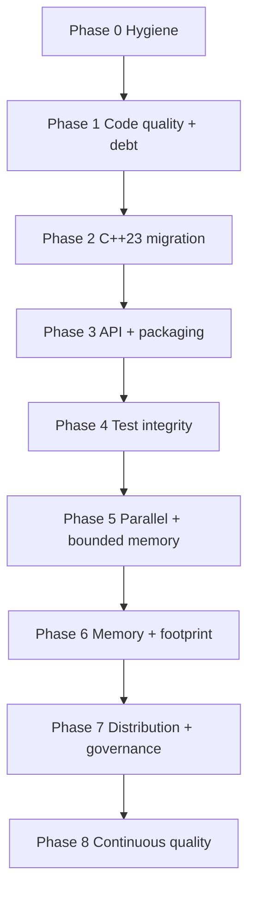
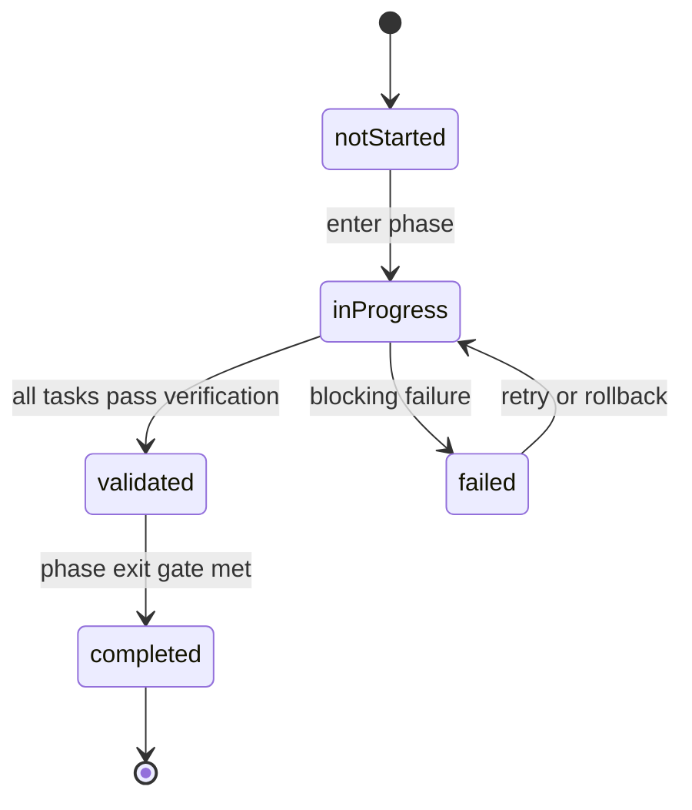
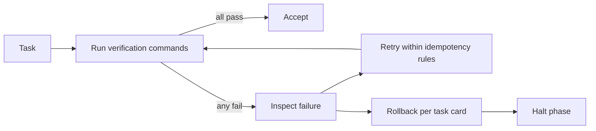

# Implementation Phases Playbook

playbook_version: 1.0.0

## Purpose
Provide an AI-executable, phase-gated implementation plan for evolving
`eda_stl` from its current state into a best-in-class, C++23, massively
parallel, bounded-memory library with stable APIs and zero high-severity
debt.

This document is the source of truth that any AI tool may load to drive
implementation work. Task cards conform to a strict YAML schema so they can
be parsed mechanically.

## Audience
AI tools executing phases (see `implementation-phase-runner` skill), human
maintainers reviewing or driving phases, and code reviewers gating phase
exits.

## In Scope
- Phase definitions with entry/exit gates.
- Machine-readable task cards.
- State persistence requirements.
- Verification and rollback semantics.

## Out of Scope
- Daily process or branching strategy.

## Cross References
- [`../glossary.md`](../glossary.md)
- [`../repository-map.md`](../repository-map.md)
- [`../build-test-ci.md`](../build-test-ci.md)
- [`../code-quality-standards.md`](../code-quality-standards.md)
- [`../technical-debt-register.md`](../technical-debt-register.md)
- [`../extensibility-contract.md`](../extensibility-contract.md)
- [`../performance/cpp23-and-parallel-runtime.md`](../performance/cpp23-and-parallel-runtime.md)
- [`../roadmap/eda-stl-library.md`](../roadmap/eda-stl-library.md)

## Vendor-Neutral Format
- This document is markdown plus fenced YAML blocks.
- No editor-specific or platform-specific syntax appears in task content.
- Any AI tool that can read markdown and parse YAML can drive this playbook.

## Phase Dependency DAG



## Phase Execution State Machine



## Verification Gating Flow



## Task Card Schema (Required)
Every task card is a fenced YAML block with these fields:

- `id`: stable kebab-case identifier.
- `phase`: phase number/name.
- `title`: short human label.
- `depends_on`: list of task ids.
- `inputs`: required files, configs, or prior outputs.
- `outputs`: exact expected artifacts/paths.
- `verification`: list of `{cmd, cwd, expected_exit_code, timeout_seconds, match}` entries.
- `acceptance`: human/AI-verifiable success criteria.
- `rollback`: explicit reversal procedure.
- `idempotency`: how re-runs behave safely.
- `risk`: notable failure modes.
- `mvp_cut`: minimum-viable subset still satisfying the phase exit gate.

## State Persistence (Required)
- Phase runner skills must read and update `doc/implementation/state.yaml`
  (or an equivalent path declared at runtime).
- The state file tracks:
  - `phase_id`,
  - `task_status` per task: one of `notStarted`, `inProgress`, `validated`,
    `completed`, `failed`,
  - `last_verification` per task,
  - `last_error` per failed task,
  - `playbook_version` snapshot.
- Phase execution must be safely resumable from this file.

## Phase Definitions

### Phase 0: Repository Hygiene And Reproducibility Baseline
- Entry: this document exists and is committed.
- Exit:
  - `linux/` references removed or aligned across docs/CI/gitignore.
  - `FetchContent` tags pinned to commits.
  - CTest dispatch is generator-agnostic.
  - `scripts/build.sh` defects fixed or script deprecated with a replacement.
- Deliverables:
  - updated [`../../CMakeLists.txt`](../../CMakeLists.txt),
  - updated [`../../.github/workflows/cmake-single-platform.yml`](../../.github/workflows/cmake-single-platform.yml),
  - updated [`../../README.md`](../../README.md),
  - updated [`../../.gitignore`](../../.gitignore).
- Mid-phase failure: revert to MVP cut (pin tags only) and proceed; log
  remaining items in [`../technical-debt-register.md`](../technical-debt-register.md).

```yaml
id: p0-pin-fetchcontent
phase: 0
title: Pin FetchContent to commit SHAs
depends_on: []
inputs:
  - /home/rohit/src/eda_stl/CMakeLists.txt
outputs:
  - /home/rohit/src/eda_stl/CMakeLists.txt
verification:
  - cmd: "rg -n 'GIT_TAG\\s+origin/(main|master)' CMakeLists.txt"
    cwd: /home/rohit/src/eda_stl
    expected_exit_code: 1
    timeout_seconds: 30
acceptance: No FetchContent_Declare uses a floating branch tag.
rollback: Revert the CMakeLists.txt edits.
idempotency: Re-run replaces tags only if floating tag is present.
risk: Pinned commit may not contain a feature; verify with build.
mvp_cut: Pin only googletest and jsoncpp; SWIG can be addressed later.
```

```yaml
id: p0-fix-linux-paths
phase: 0
title: Remove or align legacy linux/ references
depends_on: []
inputs:
  - /home/rohit/src/eda_stl/.github/workflows/cmake-single-platform.yml
  - /home/rohit/src/eda_stl/README.md
  - /home/rohit/src/eda_stl/.gitignore
outputs:
  - /home/rohit/src/eda_stl/.github/workflows/cmake-single-platform.yml
  - /home/rohit/src/eda_stl/README.md
  - /home/rohit/src/eda_stl/.gitignore
verification:
  - cmd: "rg -n '\\blinux/' .github/workflows/cmake-single-platform.yml"
    cwd: /home/rohit/src/eda_stl
    expected_exit_code: 1
acceptance: Workflow uses build/, README and .gitignore aligned.
rollback: Restore prior file contents from VCS.
idempotency: Edits are idempotent string replacements.
risk: Downstream automation may rely on linux/; check before changing.
mvp_cut: Update CI workflow only; defer README/.gitignore.
```

```yaml
id: p0-ctest-generator-agnostic
phase: 0
title: Replace make-based CTest dispatch with generator-agnostic commands
depends_on: []
inputs:
  - /home/rohit/src/eda_stl/CMakeLists.txt
outputs:
  - /home/rohit/src/eda_stl/CMakeLists.txt
verification:
  - cmd: "rg -n 'COMMAND\\s+make\\s+run_' CMakeLists.txt"
    cwd: /home/rohit/src/eda_stl
    expected_exit_code: 1
acceptance: CTest invokes binaries or cmake --build directly.
rollback: Revert CMakeLists.txt edits.
idempotency: Edit is a structural replacement; safe to re-apply.
risk: Tests may need additional working-directory setup.
mvp_cut: Convert C++ test commands; SWIG Python tests handled in Phase 4.
```

### Phase 1: Code Quality Baseline And Technical Debt Pass 1
- Entry: Phase 0 completed.
- Exit:
  - `clang-format`, `clang-tidy`, and `cppcheck` configurations committed.
  - All committed files pass `clang-format --dry-run --Werror`.
  - All `#if 0` blocks identified in
    [`../technical-debt-register.md`](../technical-debt-register.md) (D-08, D-09)
    are removed.
  - CI runs format and lint gates.
  - ASan + UBSan test runs are added to CI.

```yaml
id: p1-add-clang-format
phase: 1
title: Add clang-format configuration and apply
depends_on: [p0-pin-fetchcontent]
inputs:
  - /home/rohit/src/eda_stl
outputs:
  - /home/rohit/src/eda_stl/.clang-format
verification:
  - cmd: "clang-format --version"
    cwd: /home/rohit/src/eda_stl
    expected_exit_code: 0
  - cmd: "find . -type f \\( -name '*.h' -o -name '*.cpp' \\) -not -path './.git/*' -print0 | xargs -0 clang-format --dry-run --Werror"
    cwd: /home/rohit/src/eda_stl
    expected_exit_code: 0
acceptance: clang-format is configured and applied repository-wide.
rollback: Remove `.clang-format` and revert applied edits.
idempotency: Reapplying clang-format is idempotent.
risk: Style choices may invite churn; lock once accepted.
mvp_cut: Add config and apply to rack/ only.
```

```yaml
id: p1-add-clang-tidy
phase: 1
title: Add clang-tidy configuration with selected baseline checks
depends_on: [p1-add-clang-format]
inputs:
  - /home/rohit/src/eda_stl
outputs:
  - /home/rohit/src/eda_stl/.clang-tidy
verification:
  - cmd: "clang-tidy --version"
    cwd: /home/rohit/src/eda_stl
    expected_exit_code: 0
acceptance: clang-tidy config exists; baseline checks documented.
rollback: Remove `.clang-tidy`.
idempotency: Config edits are idempotent.
risk: Aggressive checks could blow up build time; tune carefully.
mvp_cut: Enable readability and modernize subsets only.
```

```yaml
id: p1-remove-if0-blocks
phase: 1
title: Remove dead #if 0 blocks
depends_on: [p1-add-clang-format]
inputs:
  - /home/rohit/src/eda_stl/rack/test/test.cpp
  - /home/rohit/src/eda_stl/rack/include/rackinc.h
outputs:
  - same files cleaned
verification:
  - cmd: "rg -n '#if 0' rack/test/test.cpp rack/include/rackinc.h"
    cwd: /home/rohit/src/eda_stl
    expected_exit_code: 1
acceptance: No `#if 0` blocks remain in those files.
rollback: Revert from VCS.
idempotency: Removal is final; re-runs are no-ops.
risk: Dead code may contain useful examples; preserve in commit history.
mvp_cut: Remove from rack/test/test.cpp first; rackinc.h next.
```

```yaml
id: p1-add-sanitizer-ci
phase: 1
title: Add ASan + UBSan job to CI
depends_on: [p0-fix-linux-paths]
inputs:
  - /home/rohit/src/eda_stl/.github/workflows/cmake-single-platform.yml
outputs:
  - /home/rohit/src/eda_stl/.github/workflows/cmake-single-platform.yml
verification:
  - cmd: "rg -n 'address|undefined' .github/workflows/cmake-single-platform.yml"
    cwd: /home/rohit/src/eda_stl
    expected_exit_code: 0
acceptance: CI runs ASan and UBSan on the test suite.
rollback: Remove the new job.
idempotency: Edits are structural; safe to re-apply.
risk: Sanitizer-only failures may surface; treat as bugs.
mvp_cut: Add ASan only; defer UBSan.
```

### Phase 2: C++23 Migration
- Entry: Phase 1 completed.
- Exit:
  - `CMAKE_CXX_STANDARD` set to 23 with documented compiler matrix.
  - GCC and Python floors revisited.
  - Pilot adoption of `std::expected`, ranges, and concepts in `algo` and
    `utl`.

```yaml
id: p2-set-cxx23
phase: 2
title: Set C++23 standard and update compiler matrix
depends_on: [p1-add-clang-format, p1-add-clang-tidy]
inputs:
  - /home/rohit/src/eda_stl/CMakeLists.txt
outputs:
  - /home/rohit/src/eda_stl/CMakeLists.txt
verification:
  - cmd: "rg -n 'set\\(CMAKE_CXX_STANDARD\\s+23\\)' CMakeLists.txt"
    cwd: /home/rohit/src/eda_stl
    expected_exit_code: 0
acceptance: Project compiles in C++23 on the documented matrix.
rollback: Revert standard to 17.
idempotency: Idempotent string replacement.
risk: Some toolchains may lack C++23 support; matrix must reflect this.
mvp_cut: Move to C++20 first; promote to C++23 when matrix is ready.
```

```yaml
id: p2-revisit-toolchain-floors
phase: 2
title: Revisit GCC and Python floors
depends_on: [p2-set-cxx23]
inputs:
  - /home/rohit/src/eda_stl/CMakeLists.txt
outputs:
  - /home/rohit/src/eda_stl/CMakeLists.txt
verification:
  - cmd: "rg -n 'VERSION_LESS\\s+9\\.2\\.0' CMakeLists.txt"
    cwd: /home/rohit/src/eda_stl
    expected_exit_code: 1
acceptance: GCC and Python floors documented and aligned with the C++23 matrix.
rollback: Restore prior version checks.
idempotency: Edits are structural.
risk: Increasing GCC floor breaks current consumers; coordinate.
mvp_cut: Document floors in build-test-ci.md and keep the minimum bump small.
```

### Phase 3: API Stabilization, Extensibility Contract, And Packaging
- Entry: Phase 2 completed.
- Exit:
  - Public-stable headers identified and annotated.
  - `install()` and `EXPORT` configured; `find_package(eda)` works for a
    consumer.
  - Header-only vs compiled-target boundaries declared per module.

```yaml
id: p3-add-install-exports
phase: 3
title: Add install rules and exported targets eda::*
depends_on: [p2-set-cxx23]
inputs:
  - /home/rohit/src/eda_stl/CMakeLists.txt
  - /home/rohit/src/eda_stl/rack/CMakeLists.txt
  - /home/rohit/src/eda_stl/utl/CMakeLists.txt
outputs:
  - install rules and `edaConfig.cmake`
verification:
  - cmd: "rg -n 'install\\(EXPORT' CMakeLists.txt rack/CMakeLists.txt utl/CMakeLists.txt"
    cwd: /home/rohit/src/eda_stl
    expected_exit_code: 0
acceptance: Downstream `find_package(eda CONFIG REQUIRED)` resolves the targets.
rollback: Remove install/export rules.
idempotency: Re-applying is structural.
risk: Header layout may need adjustment for installation.
mvp_cut: Provide `eda::rack` and `eda::utl` only.
```

### Phase 4: Test Integrity Uplift
- Entry: Phase 3 completed.
- Exit:
  - `algo` test suite has real cases.
  - `sig` test exposes GTest cases.
  - SWIG parity covers clone/dissolve/multi-pin iteration.
  - Coverage threshold defined and met.

```yaml
id: p4-algo-real-tests
phase: 4
title: Implement real GTest cases for algo
depends_on: [p3-add-install-exports]
inputs:
  - /home/rohit/src/eda_stl/algo/include
outputs:
  - /home/rohit/src/eda_stl/algo/test/test.cpp updated
verification:
  - cmd: "rg -n 'TEST\\(|TEST_F\\(' algo/test/test.cpp"
    cwd: /home/rohit/src/eda_stl
    expected_exit_code: 0
acceptance: ctest reports algo tests as real, not empty main.
rollback: Revert test.cpp.
idempotency: Tests are additive.
risk: Stub `dfs` must be replaced or feature-gated.
mvp_cut: Add at least three traversal tests.
```

```yaml
id: p4-swig-parity
phase: 4
title: Add clone/dissolve/multi-pin SWIG parity tests
depends_on: [p3-add-install-exports]
inputs:
  - /home/rohit/src/eda_stl/rack/swig/test.py
outputs:
  - /home/rohit/src/eda_stl/rack/swig/test.py updated
verification:
  - cmd: "python -c 'import importlib.util,sys; spec=importlib.util.find_spec(\"pyrack\"); sys.exit(0 if spec else 1)'"
    cwd: /home/rohit/src/eda_stl/rack/swig
    expected_exit_code: 0
acceptance: SWIG tests cover clone, dissolve, and multi-pin iteration.
rollback: Revert test.py.
idempotency: Tests are additive.
risk: SWIG bindings may need additional %include directives.
mvp_cut: Add clone parity only.
```

### Phase 5: Throughput-First Parallel Architecture Under Bounded Memory
- Entry: Phase 4 completed.
- Exit:
  - Threading model decisions documented per data structure.
  - Bounded queues and per-thread budgets implemented.
  - Throughput KPIs measured and recorded.

```yaml
id: p5-bench-baselines
phase: 5
title: Establish throughput and memory baselines
depends_on: [p4-algo-real-tests]
inputs:
  - /home/rohit/src/eda_stl/rack
outputs:
  - benchmark results JSON committed under doc/performance/baselines/
verification:
  - cmd: "test -d doc/performance/baselines && ls doc/performance/baselines | wc -l"
    cwd: /home/rohit/src/eda_stl
    expected_exit_code: 0
acceptance: Baseline JSON files exist and are referenced by CI gates.
rollback: Remove baseline files.
idempotency: New runs append/refresh baselines.
risk: Hardware variability; pin runners for benchmarks.
mvp_cut: Capture baselines for build_full_hierarchy and traverse_all_nets only.
```

### Phase 6: Memory And Footprint Optimization
- Entry: Phase 5 completed.
- Exit:
  - Allocator categories implemented and exposed for customization.
  - Memory KPIs improved without throughput regression.

```yaml
id: p6-allocator-categories
phase: 6
title: Implement transient/persistent/interned allocator categories
depends_on: [p5-bench-baselines]
inputs:
  - /home/rohit/src/eda_stl/utl/include
outputs:
  - new allocator headers under utl/include
verification:
  - cmd: "ctest -j --output-on-failure"
    cwd: /home/rohit/src/eda_stl/build
    expected_exit_code: 0
acceptance: New allocators integrate with rack and pass benchmarks under budget.
rollback: Revert new headers and integrations.
idempotency: Allocator types are additive.
risk: Memory savings may regress throughput; reject if so.
mvp_cut: Implement transient arena only; defer interned.
```

### Phase 7: Distribution And Governance
- Entry: Phase 6 completed.
- Exit:
  - Versioning scheme published.
  - Deprecation policy enforced in tooling.
  - ABI checks integrated into CI.

```yaml
id: p7-abi-check-ci
phase: 7
title: Integrate ABI compatibility check in CI
depends_on: [p6-allocator-categories]
inputs:
  - /home/rohit/src/eda_stl/.github/workflows/cmake-single-platform.yml
outputs:
  - new CI job that runs an ABI checker against the previous tag
verification:
  - cmd: "rg -n 'abi-compliance|libabigail' .github/workflows/cmake-single-platform.yml"
    cwd: /home/rohit/src/eda_stl
    expected_exit_code: 0
acceptance: CI runs ABI checks against the last released tag.
rollback: Remove the ABI job.
idempotency: Edits are structural.
risk: ABI tooling must be installed in CI runners.
mvp_cut: Run ABI checks on rack only.
```

### Phase 8: Continuous Quality Enforcement
- Entry: Phase 7 completed.
- Exit:
  - Debt SLO enforced (no high-severity items at phase close).
  - Regression budgets governed automatically.

```yaml
id: p8-debt-slo
phase: 8
title: Enforce debt SLO via CI
depends_on: [p7-abi-check-ci]
inputs:
  - /home/rohit/src/eda_stl/doc/technical-debt-register.md
outputs:
  - CI job that fails the build when high-severity debt exceeds SLO
verification:
  - cmd: "rg -n 'severity:\\s*(critical|high)' doc/technical-debt-register.md | wc -l"
    cwd: /home/rohit/src/eda_stl
    expected_exit_code: 0
acceptance: Build fails when active high-severity debt count exceeds the SLO threshold.
rollback: Remove the SLO check job.
idempotency: Idempotent gate.
risk: Misclassification can stall merges; require human review for SLO bumps.
mvp_cut: Track high-severity count only; no automated failure yet.
```

## Acceptance Criteria For This Document
- Phases enumerated with entry/exit gates.
- Task cards conform to the schema.
- Verification commands include `cmd`, `cwd`, and `expected_exit_code`.
- Mermaid DAG, state machine, and gating diagrams present.
- State persistence requirements declared.
- Document is loadable by any AI tool through markdown + YAML.
