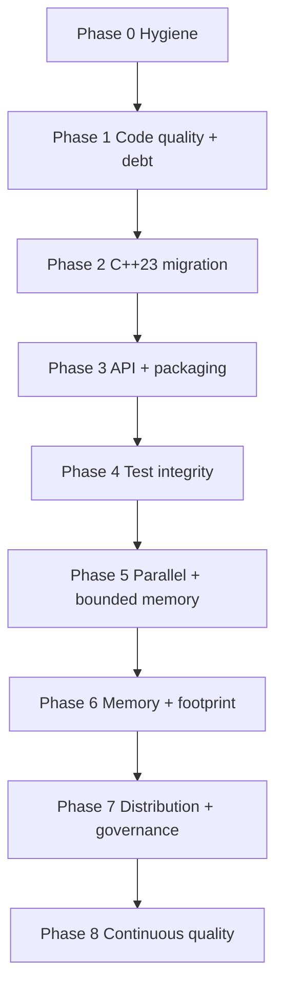
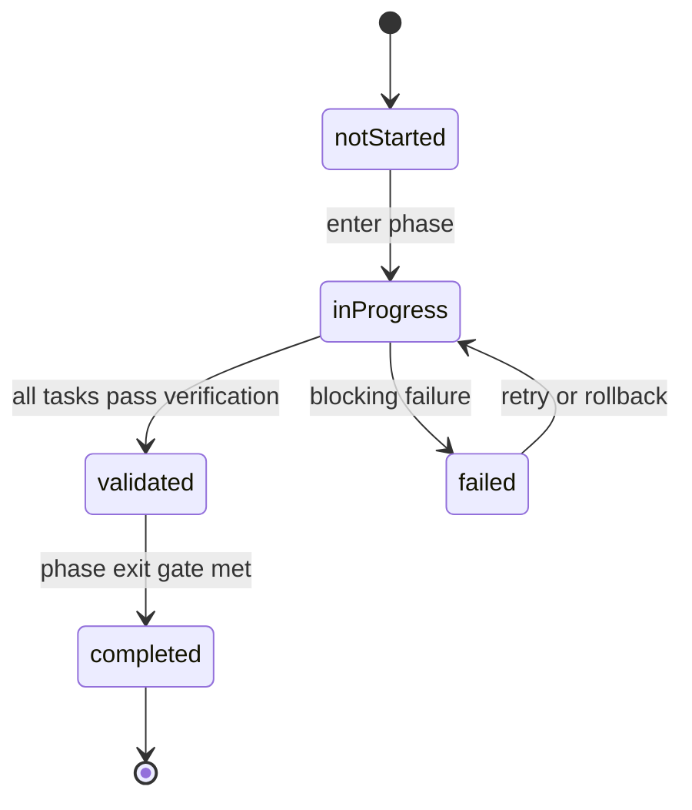
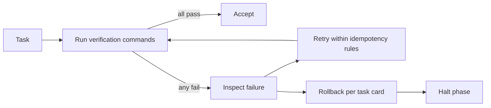

# Implementation Phases Playbook

playbook_version: 1.0.0

## Purpose
Provide an AI-executable, phase-gated implementation plan for evolving
`eda_stl` from its current state into a best-in-class, C++23, massively
parallel, bounded-memory library with stable APIs and zero high-severity
debt.

This document is the source of truth that any AI tool may load to drive
implementation work. Task cards conform to a strict YAML schema so they can
be parsed mechanically.

## Audience
AI tools executing phases (see `implementation-phase-runner` skill), human
maintainers reviewing or driving phases, and code reviewers gating phase
exits.

## In Scope
- Phase definitions with entry/exit gates.
- Machine-readable task cards.
- State persistence requirements.
- Verification and rollback semantics.

## Out of Scope
- Daily process or branching strategy.

## Cross References
- [`../mission.md`](../mission.md)
- [`../glossary.md`](../glossary.md)
- [`../repository-map.md`](../repository-map.md)
- [`../build-test-ci.md`](../build-test-ci.md)
- [`../code-quality-standards.md`](../code-quality-standards.md)
- [`../technical-debt-register.md`](../technical-debt-register.md)
- [`../extensibility-contract.md`](../extensibility-contract.md)
- [`../binding-architecture.md`](../binding-architecture.md)
- [`../library-catalog.md`](../library-catalog.md)
- [`../performance/cpp23-and-parallel-runtime.md`](../performance/cpp23-and-parallel-runtime.md)
- [`../roadmap/eda-stl-library.md`](../roadmap/eda-stl-library.md)
- [`../../AGENTS.md`](../../AGENTS.md)

## Mission Anchor

Every phase, every task card, and every verification command in this
playbook is checked against the mission charter at
[`../mission.md`](../mission.md). A change that meets the technical bar
but violates the mission-aligned reject criteria in
[`../mission.md`](../mission.md) §"Mission-Aligned Reject Criteria" is
rejected.

The mission charter is the only place the project's purpose is defined.
This playbook references it; nothing here may redefine it.

## Vendor-Neutral Format
- This document is markdown plus fenced YAML blocks.
- No editor-specific or platform-specific syntax appears in task content.
- Any AI tool that can read markdown and parse YAML can drive this playbook.

## Phase Dependency DAG



## Phase Execution State Machine



## Verification Gating Flow



## Task Card Schema (Required)
Every task card is a fenced YAML block with these fields:

- `id`: stable kebab-case identifier.
- `phase`: phase number/name.
- `title`: short human label.
- `depends_on`: list of task ids.
- `inputs`: required files, configs, or prior outputs.
- `outputs`: exact expected artifacts/paths.
- `verification`: list of `{cmd, cwd, expected_exit_code, timeout_seconds, match}` entries.
- `acceptance`: human/AI-verifiable success criteria.
- `rollback`: explicit reversal procedure.
- `idempotency`: how re-runs behave safely.
- `risk`: notable failure modes.
- `mvp_cut`: minimum-viable subset still satisfying the phase exit gate.

## State Persistence (Required)
- Phase runner skills must read and update `doc/implementation/state.yaml`
  (or an equivalent path declared at runtime).
- The state file tracks:
  - `phase_id`,
  - `task_status` per task: one of `notStarted`, `inProgress`, `validated`,
    `completed`, `failed`,
  - `last_verification` per task,
  - `last_error` per failed task,
  - `playbook_version` snapshot.
- Phase execution must be safely resumable from this file.

## Phase Definitions

### Phase 0: Mission Charter, Repository Hygiene, And First Library Swap
- Entry: this document exists and is committed.
- Exit:
  - The mission charter
    [`../mission.md`](../mission.md) is committed and referenced by
    every other doc.
  - `linux/` references removed or aligned across docs/CI/gitignore.
  - `FetchContent` tags pinned to commits.
  - CTest dispatch is generator-agnostic.
  - `scripts/build.sh` defects fixed or script deprecated with a
    replacement.
  - JsonCpp removed from the build graph and the SWIG interface;
    simdjson + glaze adopted (see [`../library-catalog.md`](../library-catalog.md)).
  - `vcpkg.json` manifest created at the repo root and used by the
    build (manifest mode preferred; CPM.cmake fallback documented).
- Deliverables:
  - new [`../mission.md`](../mission.md),
  - new [`../../AGENTS.md`](../../AGENTS.md) (skeleton; full payload in
    Phase 3),
  - updated [`../../CMakeLists.txt`](../../CMakeLists.txt),
  - updated [`../../.github/workflows/cmake-single-platform.yml`](../../.github/workflows/cmake-single-platform.yml),
  - updated [`../../README.md`](../../README.md),
  - updated [`../../.gitignore`](../../.gitignore),
  - new `vcpkg.json`.
- Mid-phase failure: revert to MVP cut (mission charter + pin tags only)
  and proceed; log remaining items in
  [`../technical-debt-register.md`](../technical-debt-register.md).

```yaml
id: p0-mission-charter
phase: 0
title: Land the mission charter and cross-reference it from every doc
depends_on: []
inputs:
  - /home/rohit/src/eda_stl/doc
outputs:
  - /home/rohit/src/eda_stl/doc/mission.md
  - cross-references added to every doc under doc/
verification:
  - cmd: "test -f doc/mission.md"
    cwd: /home/rohit/src/eda_stl
    expected_exit_code: 0
    timeout_seconds: 10
  - cmd: "rg -l 'mission.md' doc | wc -l"
    cwd: /home/rohit/src/eda_stl
    expected_exit_code: 0
    timeout_seconds: 30
acceptance: doc/mission.md exists; every primary doc cross-references it.
rollback: Revert doc/mission.md and the cross-reference edits.
idempotency: Edits are structural; safe to re-apply.
risk: Mission language could drift if multiple docs paraphrase it; the
  charter is the only place it is defined.
mvp_cut: Land doc/mission.md and update doc/README.md only; backfill
  cross-references in subsequent tasks.
```

```yaml
id: p0-pin-fetchcontent
phase: 0
title: Pin FetchContent to commit SHAs
depends_on: []
inputs:
  - /home/rohit/src/eda_stl/CMakeLists.txt
outputs:
  - /home/rohit/src/eda_stl/CMakeLists.txt
verification:
  - cmd: "rg -n 'GIT_TAG\\s+origin/(main|master)' CMakeLists.txt"
    cwd: /home/rohit/src/eda_stl
    expected_exit_code: 1
    timeout_seconds: 30
acceptance: No FetchContent_Declare uses a floating branch tag.
rollback: Revert the CMakeLists.txt edits.
idempotency: Re-run replaces tags only if floating tag is present.
risk: Pinned commit may not contain a feature; verify with build.
mvp_cut: Pin only googletest and jsoncpp; SWIG can be addressed later.
```

```yaml
id: p0-fix-linux-paths
phase: 0
title: Remove or align legacy linux/ references
depends_on: []
inputs:
  - /home/rohit/src/eda_stl/.github/workflows/cmake-single-platform.yml
  - /home/rohit/src/eda_stl/README.md
  - /home/rohit/src/eda_stl/.gitignore
outputs:
  - /home/rohit/src/eda_stl/.github/workflows/cmake-single-platform.yml
  - /home/rohit/src/eda_stl/README.md
  - /home/rohit/src/eda_stl/.gitignore
verification:
  - cmd: "rg -n '\\blinux/' .github/workflows/cmake-single-platform.yml"
    cwd: /home/rohit/src/eda_stl
    expected_exit_code: 1
acceptance: Workflow uses build/, README and .gitignore aligned.
rollback: Restore prior file contents from VCS.
idempotency: Edits are idempotent string replacements.
risk: Downstream automation may rely on linux/; check before changing.
mvp_cut: Update CI workflow only; defer README/.gitignore.
```

```yaml
id: p0-ctest-generator-agnostic
phase: 0
title: Replace make-based CTest dispatch with generator-agnostic commands
depends_on: []
inputs:
  - /home/rohit/src/eda_stl/CMakeLists.txt
outputs:
  - /home/rohit/src/eda_stl/CMakeLists.txt
verification:
  - cmd: "rg -n 'COMMAND\\s+make\\s+run_' CMakeLists.txt"
    cwd: /home/rohit/src/eda_stl
    expected_exit_code: 1
acceptance: CTest invokes binaries or cmake --build directly.
rollback: Revert CMakeLists.txt edits.
idempotency: Edit is a structural replacement; safe to re-apply.
risk: Tests may need additional working-directory setup.
mvp_cut: Convert C++ test commands; SWIG Python tests handled in Phase 4.
```

```yaml
id: p0-jsoncpp-to-simdjson-glaze
phase: 0
title: Replace JsonCpp with simdjson (ingest) and glaze (typed serde)
depends_on: [p0-pin-fetchcontent]
inputs:
  - /home/rohit/src/eda_stl/CMakeLists.txt
  - /home/rohit/src/eda_stl/jsoncpp
  - /home/rohit/src/eda_stl/rack/swig/rack_int.i
outputs:
  - /home/rohit/src/eda_stl/CMakeLists.txt
  - /home/rohit/src/eda_stl/rack/swig/rack_int.i
  - removal of /home/rohit/src/eda_stl/jsoncpp from the build graph
verification:
  - cmd: "rg -n 'jsoncpp|JsonCpp' CMakeLists.txt rack/swig/rack_int.i"
    cwd: /home/rohit/src/eda_stl
    expected_exit_code: 1
    timeout_seconds: 30
  - cmd: "rg -n 'simdjson|glaze' CMakeLists.txt"
    cwd: /home/rohit/src/eda_stl
    expected_exit_code: 0
    timeout_seconds: 30
acceptance: JsonCpp is no longer referenced; simdjson and glaze are
  acquired through vcpkg/CPM and used wherever JSON was previously
  parsed.
rollback: Revert CMakeLists.txt and rack_int.i; restore jsoncpp/.
idempotency: Edits are additive in the catalog and removal-only in
  legacy code; safe to re-apply.
risk: Call-site changes for JSON parsing may break downstream consumers.
mvp_cut: Land simdjson on the read path only; defer glaze typed paths
  to Phase 3 if necessary.
```

```yaml
id: p0-introduce-vcpkg-manifest
phase: 0
title: Introduce vcpkg manifest mode for dependency acquisition
depends_on: []
inputs:
  - /home/rohit/src/eda_stl/CMakeLists.txt
outputs:
  - /home/rohit/src/eda_stl/vcpkg.json
  - /home/rohit/src/eda_stl/CMakeLists.txt (toolchain wiring)
verification:
  - cmd: "test -f vcpkg.json"
    cwd: /home/rohit/src/eda_stl
    expected_exit_code: 0
  - cmd: "rg -n 'CMAKE_TOOLCHAIN_FILE|VCPKG_ROOT' CMakeLists.txt"
    cwd: /home/rohit/src/eda_stl
    expected_exit_code: 0
acceptance: vcpkg.json exists and lists every external library in
  doc/library-catalog.md; CMakeLists wires the toolchain when
  VCPKG_ROOT is set.
rollback: Remove vcpkg.json and the toolchain wiring.
idempotency: vcpkg.json is regenerable from doc/library-catalog.md.
risk: Some libraries may not be available in vcpkg; document CPM.cmake
  fallback in cmake/cpm/Dependencies.cmake.
mvp_cut: Manifest contains simdjson + glaze + spdlog + fmt + CLI11
  only; expand in Phase 1+.
```

### Phase 1: Code Quality Baseline And Technical Debt Pass 1
- Entry: Phase 0 completed.
- Exit:
  - `clang-format`, `clang-tidy`, and `cppcheck` configurations committed.
  - All committed files pass `clang-format --dry-run --Werror`.
  - All `#if 0` blocks identified in
    [`../technical-debt-register.md`](../technical-debt-register.md) (D-08, D-09)
    are removed.
  - CI runs format and lint gates.
  - ASan + UBSan test runs are added to CI.

```yaml
id: p1-add-clang-format
phase: 1
title: Add clang-format configuration and apply
depends_on: [p0-pin-fetchcontent]
inputs:
  - /home/rohit/src/eda_stl
outputs:
  - /home/rohit/src/eda_stl/.clang-format
verification:
  - cmd: "clang-format --version"
    cwd: /home/rohit/src/eda_stl
    expected_exit_code: 0
  - cmd: "find . -type f \\( -name '*.h' -o -name '*.cpp' \\) -not -path './.git/*' -print0 | xargs -0 clang-format --dry-run --Werror"
    cwd: /home/rohit/src/eda_stl
    expected_exit_code: 0
acceptance: clang-format is configured and applied repository-wide.
rollback: Remove `.clang-format` and revert applied edits.
idempotency: Reapplying clang-format is idempotent.
risk: Style choices may invite churn; lock once accepted.
mvp_cut: Add config and apply to rack/ only.
```

```yaml
id: p1-add-clang-tidy
phase: 1
title: Add clang-tidy configuration with selected baseline checks
depends_on: [p1-add-clang-format]
inputs:
  - /home/rohit/src/eda_stl
outputs:
  - /home/rohit/src/eda_stl/.clang-tidy
verification:
  - cmd: "clang-tidy --version"
    cwd: /home/rohit/src/eda_stl
    expected_exit_code: 0
acceptance: clang-tidy config exists; baseline checks documented.
rollback: Remove `.clang-tidy`.
idempotency: Config edits are idempotent.
risk: Aggressive checks could blow up build time; tune carefully.
mvp_cut: Enable readability and modernize subsets only.
```

```yaml
id: p1-remove-if0-blocks
phase: 1
title: Remove dead #if 0 blocks
depends_on: [p1-add-clang-format]
inputs:
  - /home/rohit/src/eda_stl/rack/test/test.cpp
  - /home/rohit/src/eda_stl/rack/include/rackinc.h
outputs:
  - same files cleaned
verification:
  - cmd: "rg -n '#if 0' rack/test/test.cpp rack/include/rackinc.h"
    cwd: /home/rohit/src/eda_stl
    expected_exit_code: 1
acceptance: No `#if 0` blocks remain in those files.
rollback: Revert from VCS.
idempotency: Removal is final; re-runs are no-ops.
risk: Dead code may contain useful examples; preserve in commit history.
mvp_cut: Remove from rack/test/test.cpp first; rackinc.h next.
```

```yaml
id: p1-add-sanitizer-ci
phase: 1
title: Add ASan + UBSan job to CI
depends_on: [p0-fix-linux-paths]
inputs:
  - /home/rohit/src/eda_stl/.github/workflows/cmake-single-platform.yml
outputs:
  - /home/rohit/src/eda_stl/.github/workflows/cmake-single-platform.yml
verification:
  - cmd: "rg -n 'address|undefined' .github/workflows/cmake-single-platform.yml"
    cwd: /home/rohit/src/eda_stl
    expected_exit_code: 0
acceptance: CI runs ASan and UBSan on the test suite.
rollback: Remove the new job.
idempotency: Edits are structural; safe to re-apply.
risk: Sanitizer-only failures may surface; treat as bugs.
mvp_cut: Add ASan only; defer UBSan.
```

```yaml
id: p1-adopt-spdlog-fmt-cli11
phase: 1
title: Adopt spdlog (logging), fmt (formatting), CLI11 (argv parsing)
depends_on: [p0-introduce-vcpkg-manifest]
inputs:
  - /home/rohit/src/eda_stl
outputs:
  - vcpkg.json updated
  - CMakeLists wiring for spdlog/fmt/CLI11
  - replacement of std::cout/std::cerr ad-hoc logging in selected modules
verification:
  - cmd: "rg -n 'spdlog|fmt::|CLI::' CMakeLists.txt utl algo rack | wc -l"
    cwd: /home/rohit/src/eda_stl
    expected_exit_code: 0
  - cmd: "rg -n 'spdlog|fmt|cli11' vcpkg.json"
    cwd: /home/rohit/src/eda_stl
    expected_exit_code: 0
acceptance: spdlog, fmt, and CLI11 are acquired through vcpkg and used
  in at least one module each.
rollback: Revert call-site changes; remove dependencies from vcpkg.json.
idempotency: Adoption is additive; existing call sites left untouched
  remain valid.
risk: spdlog default async behavior may surprise; pin sink config.
mvp_cut: Adopt spdlog only; fmt and CLI11 in subsequent passes.
```

```yaml
id: p1-library-catalog-drift-gate
phase: 1
title: Add library-catalog drift gate to CI
depends_on: [p0-introduce-vcpkg-manifest]
inputs:
  - /home/rohit/src/eda_stl/doc/library-catalog.md
  - /home/rohit/src/eda_stl/vcpkg.json
outputs:
  - new CI job that fails when vcpkg.json contains a library not in
    doc/library-catalog.md
verification:
  - cmd: "rg -n 'library-catalog-drift' .github/workflows/cmake-single-platform.yml"
    cwd: /home/rohit/src/eda_stl
    expected_exit_code: 0
acceptance: CI fails the build when a dependency is missing from
  doc/library-catalog.md.
rollback: Remove the gate.
idempotency: Gate is structural and idempotent.
risk: Newly added libraries must be cataloged before merging.
mvp_cut: Run as a soft warning until Phase 4; promote to hard gate
  thereafter.
```

```yaml
id: p1-license-audit
phase: 1
title: Add license audit gate (no GPL/LGPL-only deps)
depends_on: [p0-introduce-vcpkg-manifest]
inputs:
  - /home/rohit/src/eda_stl/vcpkg.json
  - /home/rohit/src/eda_stl/doc/library-catalog.md
outputs:
  - new CI job that fails when a dependency carries a forbidden license
verification:
  - cmd: "rg -n 'license-audit' .github/workflows/cmake-single-platform.yml"
    cwd: /home/rohit/src/eda_stl
    expected_exit_code: 0
acceptance: License audit runs in CI and fails on GPL/LGPL-only deps.
rollback: Remove the audit job.
idempotency: Idempotent gate.
risk: License metadata in vcpkg ports may be incomplete; cross-check
  doc/library-catalog.md.
mvp_cut: Audit direct deps only; expand to transitive in Phase 7.
```

### Phase 2: C++23 Migration
- Entry: Phase 1 completed.
- Exit:
  - `CMAKE_CXX_STANDARD` set to 23 with documented compiler matrix.
  - GCC and Python floors revisited.
  - Pilot adoption of `std::expected`, ranges, and concepts in `algo` and
    `utl`.

```yaml
id: p2-set-cxx23
phase: 2
title: Set C++23 standard and update compiler matrix
depends_on: [p1-add-clang-format, p1-add-clang-tidy]
inputs:
  - /home/rohit/src/eda_stl/CMakeLists.txt
outputs:
  - /home/rohit/src/eda_stl/CMakeLists.txt
verification:
  - cmd: "rg -n 'set\\(CMAKE_CXX_STANDARD\\s+23\\)' CMakeLists.txt"
    cwd: /home/rohit/src/eda_stl
    expected_exit_code: 0
acceptance: Project compiles in C++23 on the documented matrix.
rollback: Revert standard to 17.
idempotency: Idempotent string replacement.
risk: Some toolchains may lack C++23 support; matrix must reflect this.
mvp_cut: Move to C++20 first; promote to C++23 when matrix is ready.
```

```yaml
id: p2-revisit-toolchain-floors
phase: 2
title: Revisit GCC and Python floors
depends_on: [p2-set-cxx23]
inputs:
  - /home/rohit/src/eda_stl/CMakeLists.txt
outputs:
  - /home/rohit/src/eda_stl/CMakeLists.txt
verification:
  - cmd: "rg -n 'VERSION_LESS\\s+9\\.2\\.0' CMakeLists.txt"
    cwd: /home/rohit/src/eda_stl
    expected_exit_code: 1
acceptance: GCC and Python floors documented and aligned with the C++23 matrix.
rollback: Restore prior version checks.
idempotency: Edits are structural.
risk: Increasing GCC floor breaks current consumers; coordinate.
mvp_cut: Document floors in build-test-ci.md and keep the minimum bump small.
```

```yaml
id: p2-promote-fmt-to-stdformat
phase: 2
title: Promote fmt:: to std::format where toolchain supports it
depends_on: [p2-set-cxx23, p1-adopt-spdlog-fmt-cli11]
inputs:
  - /home/rohit/src/eda_stl
outputs:
  - call-site replacements of fmt:: -> std::format where supported
verification:
  - cmd: "rg -n 'std::format' utl algo rack | wc -l"
    cwd: /home/rohit/src/eda_stl
    expected_exit_code: 0
acceptance: At least one module uses std::format; fmt:: remains as the
  fallback for unsupported toolchains.
rollback: Revert std::format call sites.
idempotency: Replacements are mechanical and idempotent.
risk: Toolchain-specific gaps in std::format coverage; gate per
  compiler matrix.
mvp_cut: Promote in utl/ first; expand in Phase 3+.
```

### Phase 3: API Stabilization, Extensibility Contract, And Packaging
- Entry: Phase 2 completed.
- Exit:
  - Public-stable headers identified and annotated.
  - `install()` and `EXPORT` configured; `find_package(eda)` works for a
    consumer.
  - Header-only vs compiled-target boundaries declared per module.

```yaml
id: p3-add-install-exports
phase: 3
title: Add install rules and exported targets eda::*
depends_on: [p2-set-cxx23]
inputs:
  - /home/rohit/src/eda_stl/CMakeLists.txt
  - /home/rohit/src/eda_stl/rack/CMakeLists.txt
  - /home/rohit/src/eda_stl/utl/CMakeLists.txt
outputs:
  - install rules and `edaConfig.cmake`
verification:
  - cmd: "rg -n 'install\\(EXPORT' CMakeLists.txt rack/CMakeLists.txt utl/CMakeLists.txt"
    cwd: /home/rohit/src/eda_stl
    expected_exit_code: 0
acceptance: Downstream `find_package(eda CONFIG REQUIRED)` resolves the targets.
rollback: Remove install/export rules.
idempotency: Re-applying is structural.
risk: Header layout may need adjustment for installation.
mvp_cut: Provide `eda::rack` and `eda::utl` only.
```

```yaml
id: p3-cabi-define
phase: 3
title: Define the C-stable ABI under binding/cabi/
depends_on: [p3-add-install-exports]
inputs:
  - /home/rohit/src/eda_stl/rack/include
  - /home/rohit/src/eda_stl/utl/include
outputs:
  - /home/rohit/src/eda_stl/binding/cabi/include/eda_c_rack.h
  - /home/rohit/src/eda_stl/binding/cabi/include/eda_c_design.h
  - /home/rohit/src/eda_stl/binding/cabi/include/eda_c_module.h
  - /home/rohit/src/eda_stl/binding/cabi/include/eda_c_error.h
  - /home/rohit/src/eda_stl/binding/cabi/include/eda_c_version.h
verification:
  - cmd: "test -d binding/cabi/include"
    cwd: /home/rohit/src/eda_stl
    expected_exit_code: 0
  - cmd: "rg -n 'extern \"C\"' binding/cabi/include/*.h | wc -l"
    cwd: /home/rohit/src/eda_stl
    expected_exit_code: 0
acceptance: C-ABI headers define opaque handles, an integer status
  error model, and version macros consistent with
  doc/binding-architecture.md.
rollback: Remove binding/cabi/ headers.
idempotency: Re-runs regenerate skeletons safely.
risk: Header surface may evolve; freeze at Phase 7 ABI gate.
mvp_cut: Ship eda_c_rack.h + eda_c_error.h + eda_c_version.h.
```

```yaml
id: p3-cabi-lint
phase: 3
title: Add cabi-lint that rejects template signatures and library types
  crossing the C-ABI
depends_on: [p3-cabi-define]
inputs:
  - /home/rohit/src/eda_stl/binding/cabi/include
outputs:
  - new CI job that runs cabi-lint
  - linter script under scripts/cabi_lint.py or equivalent
verification:
  - cmd: "rg -n 'cabi-lint' .github/workflows/cmake-single-platform.yml"
    cwd: /home/rohit/src/eda_stl
    expected_exit_code: 0
acceptance: cabi-lint runs in CI and fails when a forbidden type
  crosses the C-ABI.
rollback: Remove the linter script and CI job.
idempotency: Idempotent gate.
risk: Initial false positives; tune the allowlist of permitted C types.
mvp_cut: Lint eda_c_rack.h + eda_c_error.h only.
```

```yaml
id: p3-binding-export-targets
phase: 3
title: Export eda::cabi as a CMake target
depends_on: [p3-cabi-define]
inputs:
  - /home/rohit/src/eda_stl/binding/cabi
outputs:
  - install/EXPORT rules for eda::cabi
verification:
  - cmd: "rg -n 'eda::cabi|add_library\\(cabi' binding/cabi/CMakeLists.txt"
    cwd: /home/rohit/src/eda_stl
    expected_exit_code: 0
acceptance: Downstream find_package(eda) resolves eda::cabi in
  addition to eda::rack and eda::utl.
rollback: Revert binding/cabi/CMakeLists.txt and the top-level
  install/EXPORT additions.
idempotency: Structural CMake edits.
risk: Header layout under binding/cabi/include must align with
  install paths.
mvp_cut: Header-only eda::cabi target.
```

```yaml
id: p3-schema-skeletons
phase: 3
title: Add Flight, Arrow, and tile schema skeletons under binding/schemas/
depends_on: [p3-cabi-define]
inputs:
  - /home/rohit/src/eda_stl/binding/cabi/include
outputs:
  - /home/rohit/src/eda_stl/binding/schemas/flight/eda_flight.proto
  - /home/rohit/src/eda_stl/binding/schemas/arrow/eda_records.fbs
  - /home/rohit/src/eda_stl/binding/schemas/tile/eda_tile.fbs
verification:
  - cmd: "test -d binding/schemas/flight && test -d binding/schemas/arrow && test -d binding/schemas/tile"
    cwd: /home/rohit/src/eda_stl
    expected_exit_code: 0
acceptance: Schema skeletons reference the C-ABI types and align with
  doc/binding-architecture.md.
rollback: Remove binding/schemas/.
idempotency: Skeletons are regenerable.
risk: Schema evolution requires SemVer discipline; record version in
  eda_c_version.h.
mvp_cut: Flight + Arrow only; defer tile schema to Phase 6.
```

```yaml
id: p3-system-card-generator
phase: 3
title: Generate binding/schemas/llm/system-card.yaml from C-ABI + schemas
depends_on: [p3-cabi-define, p3-schema-skeletons]
inputs:
  - /home/rohit/src/eda_stl/binding/cabi/include
  - /home/rohit/src/eda_stl/binding/schemas
outputs:
  - /home/rohit/src/eda_stl/binding/schemas/llm/system-card.yaml
  - /home/rohit/src/eda_stl/binding/schemas/llm/capability-registry.yaml
  - /home/rohit/src/eda_stl/binding/schemas/llm/allowlist.yaml
  - /home/rohit/src/eda_stl/binding/schemas/llm/annotations.yaml
  - generator script under scripts/llm_card_gen.py or equivalent
verification:
  - cmd: "test -f binding/schemas/llm/system-card.yaml"
    cwd: /home/rohit/src/eda_stl
    expected_exit_code: 0
  - cmd: "test -f binding/schemas/llm/capability-registry.yaml"
    cwd: /home/rohit/src/eda_stl
    expected_exit_code: 0
acceptance: System card carries identity, capability index, allowlist,
  IP boundary, telemetry, and a mission tag pointing at doc/mission.md.
rollback: Remove binding/schemas/llm/.
idempotency: Generator is repeatable from the SSOT.
risk: Drift between SSOT and registry; addressed by p4-llm-card-lint.
mvp_cut: Hand-author a minimal system-card.yaml and allowlist.yaml;
  generator follows.
```

```yaml
id: p3-agents-md-skeleton
phase: 3
title: Land AGENTS.md skeleton with the mission paragraph
depends_on: [p0-mission-charter, p3-system-card-generator]
inputs:
  - /home/rohit/src/eda_stl/doc/mission.md
  - /home/rohit/src/eda_stl/binding/schemas/llm/system-card.yaml
outputs:
  - /home/rohit/src/eda_stl/AGENTS.md
verification:
  - cmd: "test -f AGENTS.md"
    cwd: /home/rohit/src/eda_stl
    expected_exit_code: 0
  - cmd: "rg -n 'STL for EDA|mission.md' AGENTS.md"
    cwd: /home/rohit/src/eda_stl
    expected_exit_code: 0
acceptance: AGENTS.md opens with the mission paragraph and points to
  the system card and the future mcp_server.
rollback: Remove AGENTS.md.
idempotency: Regenerable from doc/mission.md.
risk: Mission language drift; the only canonical source is
  doc/mission.md.
mvp_cut: Static skeleton; full payload at p7-agents-md-publish.
```

### Phase 4: Test Integrity Uplift And LLM-First Interfaces
- Entry: Phase 3 completed.
- Exit:
  - `algo` test suite has real cases.
  - `sig` test exposes GTest cases.
  - SWIG parity covers clone/dissolve/multi-pin iteration.
  - Coverage threshold defined and met.

```yaml
id: p4-algo-real-tests
phase: 4
title: Implement real GTest cases for algo
depends_on: [p3-add-install-exports]
inputs:
  - /home/rohit/src/eda_stl/algo/include
outputs:
  - /home/rohit/src/eda_stl/algo/test/test.cpp updated
verification:
  - cmd: "rg -n 'TEST\\(|TEST_F\\(' algo/test/test.cpp"
    cwd: /home/rohit/src/eda_stl
    expected_exit_code: 0
acceptance: ctest reports algo tests as real, not empty main.
rollback: Revert test.cpp.
idempotency: Tests are additive.
risk: Stub `dfs` must be replaced or feature-gated.
mvp_cut: Add at least three traversal tests.
```

```yaml
id: p4-swig-parity
phase: 4
title: Add clone/dissolve/multi-pin SWIG parity tests
depends_on: [p3-add-install-exports]
inputs:
  - /home/rohit/src/eda_stl/rack/swig/test.py
outputs:
  - /home/rohit/src/eda_stl/rack/swig/test.py updated
verification:
  - cmd: "python -c 'import importlib.util,sys; spec=importlib.util.find_spec(\"pyrack\"); sys.exit(0 if spec else 1)'"
    cwd: /home/rohit/src/eda_stl/rack/swig
    expected_exit_code: 0
acceptance: SWIG tests cover clone, dissolve, and multi-pin iteration.
rollback: Revert test.py.
idempotency: Tests are additive.
risk: SWIG bindings may need additional %include directives.
mvp_cut: Add clone parity only.
```

```yaml
id: p4-mcp-server-native
phase: 4
title: Implement native C++ mcp_server consuming the C-ABI
depends_on: [p3-cabi-define, p3-system-card-generator]
inputs:
  - /home/rohit/src/eda_stl/binding/cabi/include
  - /home/rohit/src/eda_stl/binding/schemas/llm
outputs:
  - /home/rohit/src/eda_stl/binding/llm/mcp_server.cpp
  - /home/rohit/src/eda_stl/binding/llm/CMakeLists.txt
  - new eda::mcp_server target
verification:
  - cmd: "test -f binding/llm/mcp_server.cpp"
    cwd: /home/rohit/src/eda_stl
    expected_exit_code: 0
  - cmd: "ctest -R mcp_server --output-on-failure"
    cwd: /home/rohit/src/eda_stl/build
    expected_exit_code: 0
acceptance: mcp_server speaks MCP JSON-RPC 2.0 over stdio, returns
  the system card on initialize, lists tools/resources/prompts, and
  routes tool calls through the C-ABI.
rollback: Revert binding/llm/.
idempotency: Module is additive.
risk: MCP protocol evolution; pin the spec version in eda_c_version.h.
mvp_cut: stdio transport only; HTTP+SSE in Phase 5+.
```

```yaml
id: p4-allowlist-policy
phase: 4
title: Implement allowlist enforcement and audit logging in mcp_server
depends_on: [p4-mcp-server-native]
inputs:
  - /home/rohit/src/eda_stl/binding/schemas/llm/allowlist.yaml
  - /home/rohit/src/eda_stl/binding/llm/mcp_server.cpp
outputs:
  - mcp_server changes that load the allowlist and audit every call
verification:
  - cmd: "ctest -R mcp_allowlist --output-on-failure"
    cwd: /home/rohit/src/eda_stl/build
    expected_exit_code: 0
acceptance: Tool calls outside the allowlist are rejected; every call
  is appended to a structured audit log with timestamp, identity,
  request, decision, and outcome.
rollback: Revert allowlist enforcement.
idempotency: Re-runs reuse the same allowlist.yaml unless edited.
risk: Misconfigured allowlist (R-26); covered by p7-allowlist-governance.
mvp_cut: Implement enforcement; defer external audit-sink integration
  to Phase 7.
```

```yaml
id: p4-llm-card-lint
phase: 4
title: Add llm-card-lint that detects drift between SSOT and the
  capability registry / system card / allowlist
depends_on: [p3-system-card-generator, p4-mcp-server-native]
inputs:
  - /home/rohit/src/eda_stl/binding/cabi/include
  - /home/rohit/src/eda_stl/binding/schemas/llm
outputs:
  - new CI job running llm-card-lint
verification:
  - cmd: "rg -n 'llm-card-lint' .github/workflows/cmake-single-platform.yml"
    cwd: /home/rohit/src/eda_stl
    expected_exit_code: 0
acceptance: CI fails when system-card.yaml,
  capability-registry.yaml, or allowlist.yaml diverge from the SSOT.
rollback: Remove the gate.
idempotency: Idempotent gate.
risk: Initial false positives; refine annotations.yaml to suppress.
mvp_cut: Lint capability-registry only; promote to full set in Phase 7.
```

```yaml
id: p4-nanobind-python
phase: 4
title: Replace SWIG Python bindings with nanobind under binding/python/
depends_on: [p3-cabi-define]
inputs:
  - /home/rohit/src/eda_stl/binding/cabi/include
outputs:
  - /home/rohit/src/eda_stl/binding/python/CMakeLists.txt
  - /home/rohit/src/eda_stl/binding/python/eda_py.cpp
  - new eda_py wheel target
verification:
  - cmd: "test -f binding/python/eda_py.cpp"
    cwd: /home/rohit/src/eda_stl
    expected_exit_code: 0
  - cmd: "ctest -R eda_py --output-on-failure"
    cwd: /home/rohit/src/eda_stl/build
    expected_exit_code: 0
acceptance: nanobind module covers the C-ABI surface; parity tests
  match rack/test/test.cpp where applicable.
rollback: Remove binding/python/; SWIG remains as a transitional
  binding through Phase 6.
idempotency: Module is additive.
risk: Python tooling complexity; align with vcpkg-managed
  build-python.
mvp_cut: Cover Rack + Design + Module only.
```

```yaml
id: p4-cpptcl-tcl
phase: 4
title: Add Tcl bindings via cpptcl under binding/tcl/
depends_on: [p3-cabi-define]
inputs:
  - /home/rohit/src/eda_stl/binding/cabi/include
outputs:
  - /home/rohit/src/eda_stl/binding/tcl/CMakeLists.txt
  - /home/rohit/src/eda_stl/binding/tcl/eda_tcl.cpp
verification:
  - cmd: "ctest -R eda_tcl --output-on-failure"
    cwd: /home/rohit/src/eda_stl/build
    expected_exit_code: 0
acceptance: cpptcl module covers the C-ABI surface; tclsh script
  loads and exercises Rack creation and traversal.
rollback: Remove binding/tcl/.
idempotency: Module is additive.
risk: cpptcl is smaller-community; pin a known-good revision.
mvp_cut: Cover Rack creation and design lookup only.
```

```yaml
id: p4-binding-parity
phase: 4
title: Ensure mcp_server, nanobind, and cpptcl pass parity tests
  against the C++ rack/test
depends_on: [p4-mcp-server-native, p4-nanobind-python, p4-cpptcl-tcl]
inputs:
  - /home/rohit/src/eda_stl/rack/test/test.cpp
outputs:
  - parity test runners under binding/{python,tcl,llm}/test/
verification:
  - cmd: "ctest -R 'parity_(python|tcl|mcp)' --output-on-failure"
    cwd: /home/rohit/src/eda_stl/build
    expected_exit_code: 0
acceptance: Each wrapper reproduces the build, clone, dissolve,
  multi-pin iteration semantics validated by rack/test/test.cpp.
rollback: Revert parity test runners.
idempotency: Tests are additive.
risk: Subtle semantic drift across wrappers; gated by parity tests.
mvp_cut: Run parity for nanobind first; mcp_server and cpptcl follow.
```

### Phase 5: Throughput-First Parallel Architecture Under Bounded Memory
- Entry: Phase 4 completed.
- Exit:
  - Threading model decisions documented per data structure.
  - Bounded queues and per-thread budgets implemented.
  - Throughput KPIs measured and recorded.

```yaml
id: p5-bench-baselines
phase: 5
title: Establish throughput and memory baselines
depends_on: [p4-algo-real-tests]
inputs:
  - /home/rohit/src/eda_stl/rack
outputs:
  - benchmark results JSON committed under doc/performance/baselines/
verification:
  - cmd: "test -d doc/performance/baselines && ls doc/performance/baselines | wc -l"
    cwd: /home/rohit/src/eda_stl
    expected_exit_code: 0
acceptance: Baseline JSON files exist and are referenced by CI gates.
rollback: Remove baseline files.
idempotency: New runs append/refresh baselines.
risk: Hardware variability; pin runners for benchmarks.
mvp_cut: Capture baselines for build_full_hierarchy and traverse_all_nets only.
```

```yaml
id: p5-onetbb-jthread
phase: 5
title: Adopt oneTBB and std::jthread as the canonical parallel runtime
depends_on: [p2-set-cxx23, p1-adopt-spdlog-fmt-cli11]
inputs:
  - /home/rohit/src/eda_stl/algo
  - /home/rohit/src/eda_stl/rack
outputs:
  - oneTBB acquisition through vcpkg
  - std::jthread + oneTBB usage in algo/ traversal scaffolding
verification:
  - cmd: "rg -n 'tbb|jthread' algo rack | wc -l"
    cwd: /home/rohit/src/eda_stl
    expected_exit_code: 0
acceptance: Algo and rack hot paths use oneTBB and std::jthread
  according to doc/performance/cpp23-and-parallel-runtime.md.
rollback: Revert call-site changes; remove tbb from vcpkg.json.
idempotency: Adoption is additive in well-scoped paths.
risk: Misconfigured task arenas can deadlock; cover with TSan.
mvp_cut: Adopt oneTBB in algo only; defer rack adoption.
```

```yaml
id: p5-tracy-hooks
phase: 5
title: Add Tracy profiler hooks behind -DEDA_ENABLE_TRACY=ON
depends_on: [p5-onetbb-jthread]
inputs:
  - /home/rohit/src/eda_stl
outputs:
  - Tracy acquisition through vcpkg
  - instrumentation macros under utl/include
verification:
  - cmd: "rg -n 'EDA_ENABLE_TRACY' CMakeLists.txt"
    cwd: /home/rohit/src/eda_stl
    expected_exit_code: 0
acceptance: Tracy is opt-in via the build flag; no runtime cost when
  disabled.
rollback: Remove the flag and macros.
idempotency: Macros are additive.
risk: Tracy server requires a separate viewer; document it in
  doc/performance/.
mvp_cut: Instrument algo traversal entries only.
```

```yaml
id: p5-flight-service
phase: 5
title: Implement eda_server as an Apache Arrow Flight service
depends_on: [p3-schema-skeletons, p3-binding-export-targets]
inputs:
  - /home/rohit/src/eda_stl/binding/cabi/include
  - /home/rohit/src/eda_stl/binding/schemas/flight
  - /home/rohit/src/eda_stl/binding/schemas/arrow
outputs:
  - /home/rohit/src/eda_stl/binding/server/CMakeLists.txt
  - /home/rohit/src/eda_stl/binding/server/eda_server.cpp
  - new eda_server target behind -DEDA_BUILD_SERVER=ON
verification:
  - cmd: "test -f binding/server/eda_server.cpp"
    cwd: /home/rohit/src/eda_stl
    expected_exit_code: 0
  - cmd: "ctest -R eda_server --output-on-failure"
    cwd: /home/rohit/src/eda_stl/build
    expected_exit_code: 0
acceptance: eda_server serves a baseline Flight method (e.g.,
  list_designs); record-batched responses match the Arrow schema.
rollback: Remove binding/server/.
idempotency: Server module is additive.
risk: gRPC + Arrow stack is heavy; ensure the build flag works.
mvp_cut: One Flight method; expand in Phase 6.
```

```yaml
id: p5-plasma-coloc
phase: 5
title: Add Plasma shared-memory data plane for co-located clients
depends_on: [p5-flight-service]
inputs:
  - /home/rohit/src/eda_stl/binding/server
outputs:
  - Plasma integration under binding/server/
verification:
  - cmd: "rg -n 'plasma|arrow::plasma' binding/server"
    cwd: /home/rohit/src/eda_stl
    expected_exit_code: 0
acceptance: Co-located clients hand off zero-copy through Plasma at
  the service.plasma_handoff_throughput KPI target.
rollback: Revert Plasma integration; Flight-only path remains.
idempotency: Integration is additive.
risk: Plasma deprecation upstream; track and re-evaluate at Phase 7.
mvp_cut: Hand off one record-batch type through Plasma.
```

```yaml
id: p5-mcp-flight-transport
phase: 5
title: Add Flight-backed transport in mcp_server
depends_on: [p4-mcp-server-native, p5-flight-service]
inputs:
  - /home/rohit/src/eda_stl/binding/llm
  - /home/rohit/src/eda_stl/binding/server
outputs:
  - mcp_server option to dispatch tool calls through Flight instead of
    direct C-ABI
verification:
  - cmd: "ctest -R mcp_flight --output-on-failure"
    cwd: /home/rohit/src/eda_stl/build
    expected_exit_code: 0
acceptance: mcp_server can run in two modes: in-process C-ABI
  (default) or Flight client to eda_server.
rollback: Remove the Flight transport mode.
idempotency: Mode is additive; default unchanged.
risk: Cross-process error mapping; cover with parity tests.
mvp_cut: Expose only list_designs through Flight transport.
```

### Phase 6: Memory, Footprint, And Layout Streaming
- Entry: Phase 5 completed.
- Exit:
  - Allocator categories implemented and exposed for customization.
  - Memory KPIs improved without throughput regression.

```yaml
id: p6-allocator-categories
phase: 6
title: Implement transient/persistent/interned allocator categories on mimalloc
depends_on: [p5-bench-baselines]
inputs:
  - /home/rohit/src/eda_stl/utl/include
outputs:
  - new allocator headers under utl/include backed by mimalloc
verification:
  - cmd: "ctest -j --output-on-failure"
    cwd: /home/rohit/src/eda_stl/build
    expected_exit_code: 0
acceptance: New allocators integrate with rack and pass benchmarks under budget.
rollback: Revert new headers and integrations.
idempotency: Allocator types are additive.
risk: Memory savings may regress throughput; reject if so.
mvp_cut: Implement transient arena only; defer interned.
```

```yaml
id: p6-abseil-flat-hash
phase: 6
title: Replace hot-path std::unordered_map with absl::flat_hash_map
depends_on: [p6-allocator-categories]
inputs:
  - /home/rohit/src/eda_stl/rack
  - /home/rohit/src/eda_stl/utl
outputs:
  - hot-path call-site replacements under rack/ and utl/
verification:
  - cmd: "rg -n 'absl::flat_hash_map' rack utl | wc -l"
    cwd: /home/rohit/src/eda_stl
    expected_exit_code: 0
acceptance: Hot-path lookups use absl::flat_hash_map; KPIs improve or
  hold steady.
rollback: Revert call-site replacements.
idempotency: Replacements are mechanical.
risk: ABI implications under public-stable; restrict to internal paths.
mvp_cut: Replace in utl/dictionary first; expand to rack later.
```

```yaml
id: p6-mio-mmap
phase: 6
title: Adopt mio for cross-platform memory mapping
depends_on: [p6-allocator-categories]
inputs:
  - /home/rohit/src/eda_stl/utl
outputs:
  - new utl/include/mmap header backed by mio
verification:
  - cmd: "rg -n 'mio::|mmap' utl | wc -l"
    cwd: /home/rohit/src/eda_stl
    expected_exit_code: 0
acceptance: utl/ exposes a thin mmap helper; tile/quadtree paths use it.
rollback: Revert utl/ helper and call sites.
idempotency: Helper is additive.
risk: Platform-specific behavior on Windows; cover in CI matrix.
mvp_cut: Linux/macOS only; defer Windows.
```

```yaml
id: p6-zstd-lz4-codecs
phase: 6
title: Adopt zstd and lz4 codecs behind a unified codec interface
depends_on: [p6-allocator-categories]
inputs:
  - /home/rohit/src/eda_stl/utl
outputs:
  - codec interface under utl/include
  - vcpkg.json entries for zstd + lz4
verification:
  - cmd: "rg -n 'zstd|lz4' vcpkg.json"
    cwd: /home/rohit/src/eda_stl
    expected_exit_code: 0
acceptance: utl/ exposes a codec interface implemented by zstd and lz4.
rollback: Revert codec interface and vcpkg.json entries.
idempotency: Interface is additive.
risk: Choice of default codec may shift; document in
  doc/library-catalog.md.
mvp_cut: zstd only; defer lz4 to a follow-on.
```

```yaml
id: p6-tile-index
phase: 6
title: Implement quadtree tile index over the layout
depends_on: [p3-schema-skeletons, p6-mio-mmap, p6-zstd-lz4-codecs]
inputs:
  - /home/rohit/src/eda_stl/rack
  - /home/rohit/src/eda_stl/binding/schemas/tile
outputs:
  - quadtree builder/queryer under binding/web/
verification:
  - cmd: "ctest -R tile_index --output-on-failure"
    cwd: /home/rohit/src/eda_stl/build
    expected_exit_code: 0
acceptance: Tile index produces quadtree nodes with bounds, LOD index,
  and child-pointer tables.
rollback: Revert binding/web/ tile index.
idempotency: Builder is additive.
risk: Memory budget for chip-class indices; bounded per
  doc/performance/cpp23-and-parallel-runtime.md.
mvp_cut: Index a subset of polygons.
```

```yaml
id: p6-tile-protocol
phase: 6
title: Land the tile protocol (FlatBuffers schema + WebSocket gateway)
depends_on: [p6-tile-index]
inputs:
  - /home/rohit/src/eda_stl/binding/schemas/tile
outputs:
  - WebSocket gateway under binding/web/
  - finalized binding/schemas/tile/eda_tile.fbs
verification:
  - cmd: "ctest -R tile_gateway --output-on-failure"
    cwd: /home/rohit/src/eda_stl/build
    expected_exit_code: 0
acceptance: Gateway serves a deterministic LOD walk; frames satisfy
  tile.* KPIs.
rollback: Revert binding/web/ and tile schema.
idempotency: Gateway is additive.
risk: WebSocket library churn; pin uWebSockets per
  doc/library-catalog.md.
mvp_cut: Serve a static design; live update later.
```

```yaml
id: p6-llm-tile-tools
phase: 6
title: Expose tile streaming as MCP tools (layout.stream_tile, ...)
depends_on: [p4-mcp-server-native, p6-tile-protocol]
inputs:
  - /home/rohit/src/eda_stl/binding/llm
  - /home/rohit/src/eda_stl/binding/web
outputs:
  - new MCP tool definitions in capability-registry.yaml + allowlist
    entries
verification:
  - cmd: "rg -n 'layout.stream_tile' binding/schemas/llm/capability-registry.yaml"
    cwd: /home/rohit/src/eda_stl
    expected_exit_code: 0
acceptance: LLM agents can request a tile stream; allowlist entries
  enforce environment scope; audit log records each call.
rollback: Remove the tool definitions and allowlist entries.
idempotency: Definitions regenerable from SSOT.
risk: Tile payloads must respect IP boundary; covered by p7-allowlist-governance.
mvp_cut: Expose layout.stream_tile only.
```

### Phase 7: Distribution, Governance, And Mission Gate
- Entry: Phase 6 completed.
- Exit:
  - Versioning scheme published.
  - Deprecation policy enforced in tooling.
  - ABI checks integrated into CI.

```yaml
id: p7-abi-check-ci
phase: 7
title: Integrate ABI compatibility check in CI
depends_on: [p6-allocator-categories]
inputs:
  - /home/rohit/src/eda_stl/.github/workflows/cmake-single-platform.yml
outputs:
  - new CI job that runs an ABI checker against the previous tag
verification:
  - cmd: "rg -n 'abi-compliance|libabigail' .github/workflows/cmake-single-platform.yml"
    cwd: /home/rohit/src/eda_stl
    expected_exit_code: 0
acceptance: CI runs ABI checks against the last released tag.
rollback: Remove the ABI job.
idempotency: Edits are structural.
risk: ABI tooling must be installed in CI runners.
mvp_cut: Run ABI checks on rack only.
```

```yaml
id: p7-cabi-abi-gate
phase: 7
title: Apply the ABI gate specifically to binding/cabi/ public headers
depends_on: [p7-abi-check-ci, p3-cabi-define]
inputs:
  - /home/rohit/src/eda_stl/binding/cabi/include
outputs:
  - ABI gate scope updated to cover binding/cabi/
verification:
  - cmd: "rg -n 'binding/cabi' .github/workflows/cmake-single-platform.yml"
    cwd: /home/rohit/src/eda_stl
    expected_exit_code: 0
acceptance: ABI breaking changes to binding/cabi/ fail CI.
rollback: Remove the cabi-specific scope.
idempotency: Idempotent gate.
risk: ABI tooling false positives on inline definitions; audit before
  enforcing.
mvp_cut: Cover eda_c_rack.h only.
```

```yaml
id: p7-swig-decommission
phase: 7
title: Decommission SWIG bindings (Python + STL fragments)
depends_on: [p4-nanobind-python, p4-binding-parity]
inputs:
  - /home/rohit/src/eda_stl/rack/swig
  - /home/rohit/src/eda_stl/stl/interface
  - /home/rohit/src/eda_stl/CMakeLists.txt
outputs:
  - SWIG-related directories and CMake wiring removed
verification:
  - cmd: "rg -n 'SWIG|swig' CMakeLists.txt"
    cwd: /home/rohit/src/eda_stl
    expected_exit_code: 1
acceptance: SWIG is no longer in the build graph; nanobind module
  fully replaces the Python frontend.
rollback: Restore from VCS history.
idempotency: Removal is final; safe to re-apply.
risk: External consumers may still depend on pyrack; provide a
  migration guide tied to doc/binding-architecture.md.
mvp_cut: Stop building SWIG; archive sources before removal.
```

```yaml
id: p7-agents-md-publish
phase: 7
title: Finalize and publish AGENTS.md with the full payload
depends_on: [p3-agents-md-skeleton, p4-mcp-server-native, p6-llm-tile-tools]
inputs:
  - /home/rohit/src/eda_stl/AGENTS.md
  - /home/rohit/src/eda_stl/doc/mission.md
  - /home/rohit/src/eda_stl/binding/schemas/llm/system-card.yaml
outputs:
  - AGENTS.md updated to publish-ready content
verification:
  - cmd: "rg -n 'system-card.yaml|mcp_server' AGENTS.md"
    cwd: /home/rohit/src/eda_stl
    expected_exit_code: 0
acceptance: AGENTS.md is the canonical LLM discovery file with
  pointers to mission.md, system-card.yaml, mcp_server, and the
  capability registry.
rollback: Revert to skeleton.
idempotency: Regenerable from doc/mission.md and system-card.yaml.
risk: Mission language drift; doc/mission.md is the only source.
mvp_cut: Publish a static AGENTS.md without dynamic capability lists.
```

```yaml
id: p7-allowlist-governance
phase: 7
title: Promote allowlist enforcement and audit governance
depends_on: [p4-allowlist-policy, p6-llm-tile-tools]
inputs:
  - /home/rohit/src/eda_stl/binding/schemas/llm/allowlist.yaml
  - /home/rohit/src/eda_stl/binding/llm/mcp_server.cpp
outputs:
  - per-environment allowlists (dev/staging/prod/public)
  - external audit-sink integration (file or syslog) in mcp_server
verification:
  - cmd: "rg -n 'env: (dev|staging|prod|public)' binding/schemas/llm/allowlist.yaml"
    cwd: /home/rohit/src/eda_stl
    expected_exit_code: 0
acceptance: Allowlist supports environment scopes; audit sink is
  configurable via mcp_server flags; R-25 / R-26 mitigations active.
rollback: Revert allowlist scopes; keep flat allowlist.
idempotency: Configuration is additive.
risk: Misconfigured environment fall-through; default-deny on unknown
  env.
mvp_cut: dev + prod scopes only.
```

```yaml
id: p7-llm-compat-matrix
phase: 7
title: Document an LLM client compatibility matrix
depends_on: [p7-agents-md-publish]
inputs:
  - /home/rohit/src/eda_stl/AGENTS.md
  - /home/rohit/src/eda_stl/binding/schemas/llm/system-card.yaml
outputs:
  - doc/binding/llm-compat-matrix.md (or section in
    doc/binding-architecture.md)
verification:
  - cmd: "rg -n 'compat' doc/binding-architecture.md doc | head -n 1"
    cwd: /home/rohit/src/eda_stl
    expected_exit_code: 0
acceptance: Matrix lists tested LLM clients (Cursor, Claude, GPT,
  custom agents) and the MCP feature subset they support.
rollback: Remove the matrix entry.
idempotency: Matrix is additive.
risk: Matrix can age out; refresh on each minor release.
mvp_cut: List Cursor + one other agent.
```

```yaml
id: p7-otel-prom
phase: 7
title: Integrate OpenTelemetry C++ tracing and prometheus-cpp metrics
depends_on: [p5-tracy-hooks, p5-flight-service]
inputs:
  - /home/rohit/src/eda_stl/binding/server
  - /home/rohit/src/eda_stl/binding/llm
outputs:
  - OpenTelemetry exporters in eda_server and mcp_server
  - prometheus-cpp metrics endpoints
verification:
  - cmd: "rg -n 'opentelemetry|prometheus' binding/server binding/llm | wc -l"
    cwd: /home/rohit/src/eda_stl
    expected_exit_code: 0
acceptance: Both binaries emit traces and metrics in the standard
  formats.
rollback: Remove the integrations.
idempotency: Integrations are additive.
risk: Telemetry overhead; gate behind build flags by default.
mvp_cut: Metrics only; defer traces.
```

```yaml
id: p7-libfuzzer
phase: 7
title: Add libFuzzer harnesses for the C-ABI and mcp_server JSON-RPC
depends_on: [p3-cabi-define, p4-mcp-server-native]
inputs:
  - /home/rohit/src/eda_stl/binding/cabi
  - /home/rohit/src/eda_stl/binding/llm
outputs:
  - fuzz harnesses under binding/{cabi,llm}/fuzz/
verification:
  - cmd: "test -d binding/cabi/fuzz && test -d binding/llm/fuzz"
    cwd: /home/rohit/src/eda_stl
    expected_exit_code: 0
acceptance: Fuzz harnesses build cleanly under -fsanitize=fuzzer and
  produce a corpus.
rollback: Remove fuzz directories.
idempotency: Harnesses are additive.
risk: Crashes uncovered by fuzzing must be triaged; treat as bugs.
mvp_cut: cabi fuzz only; mcp_server in a follow-on.
```

```yaml
id: p7-webgpu-viewer
phase: 7
title: Document the downstream WebGPU viewer and the integration contract
depends_on: [p6-tile-protocol]
inputs:
  - /home/rohit/src/eda_stl/binding/web
outputs:
  - section in doc/binding-architecture.md (or
    doc/binding/web-viewer.md) describing the protocol stable surface
verification:
  - cmd: "rg -n 'WebGPU' doc/binding-architecture.md"
    cwd: /home/rohit/src/eda_stl
    expected_exit_code: 0
acceptance: The browser viewer is unambiguously documented as a
  downstream sibling repository consuming the tile protocol.
rollback: Remove the section.
idempotency: Documentation is additive.
risk: Mission-boundary compliance; reaffirm in the section.
mvp_cut: One paragraph + diagram.
```

```yaml
id: p7-mission-governance-gate
phase: 7
title: Promote mission-alignment-review from advisory to soft gate
depends_on: [p7-agents-md-publish, p7-cabi-abi-gate, p7-allowlist-governance]
inputs:
  - /home/rohit/src/eda_stl/doc/mission.md
  - /home/rohit/src/eda_stl/.cursor/skills/mission-alignment-review/SKILL.md
outputs:
  - new CI job that invokes the skill on pull requests touching the
    public surface
  - report under doc/performance/mission/ for each release
verification:
  - cmd: "rg -n 'mission-alignment' .github/workflows/cmake-single-platform.yml"
    cwd: /home/rohit/src/eda_stl
    expected_exit_code: 0
acceptance: Each release run includes a mission-alignment report;
  failures are soft gates that require an explicit override note.
rollback: Demote to advisory.
idempotency: Gate is structural.
risk: False positives slow merges; tune the skill rubric before
  promotion.
mvp_cut: Run as advisory in pull requests, soft gate on tag-based
  release branches.
```

### Phase 8: Continuous Quality Enforcement
- Entry: Phase 7 completed.
- Exit:
  - Debt SLO enforced (no high-severity items at phase close).
  - Regression budgets governed automatically.

```yaml
id: p8-debt-slo
phase: 8
title: Enforce debt SLO via CI
depends_on: [p7-abi-check-ci]
inputs:
  - /home/rohit/src/eda_stl/doc/technical-debt-register.md
outputs:
  - CI job that fails the build when high-severity debt exceeds SLO
verification:
  - cmd: "rg -n 'severity:\\s*(critical|high)' doc/technical-debt-register.md | wc -l"
    cwd: /home/rohit/src/eda_stl
    expected_exit_code: 0
acceptance: Build fails when active high-severity debt count exceeds the SLO threshold.
rollback: Remove the SLO check job.
idempotency: Idempotent gate.
risk: Misclassification can stall merges; require human review for SLO bumps.
mvp_cut: Track high-severity count only; no automated failure yet.
```

## Acceptance Criteria For This Document
- Phases enumerated with entry/exit gates.
- Phase 0 leads with `p0-mission-charter` and includes the JsonCpp
  swap and vcpkg manifest tasks.
- Phases 1-2 add library adoption and `std::format` promotion.
- Phase 3 lands the SSOT (C-ABI, schemas, system card,
  AGENTS.md skeleton).
- Phase 4 lands the LLM-first interfaces (mcp_server, allowlist,
  llm-card-lint, nanobind, cpptcl, parity).
- Phase 5 lands the service plane (Flight, Plasma, Tracy, oneTBB,
  MCP-Flight transport).
- Phase 6 lands memory/footprint optimizations and the tile protocol.
- Phase 7 lands ABI and mission gates, SWIG decommission,
  AGENTS.md publish, allowlist governance, OTel/prom, libFuzzer, and
  the downstream WebGPU pointer.
- Task cards conform to the schema.
- Verification commands include `cmd`, `cwd`, and `expected_exit_code`.
- Mermaid DAG, state machine, and gating diagrams present.
- State persistence requirements declared.
- Mission anchor present at the top.
- Document is loadable by any AI tool through markdown + YAML.
