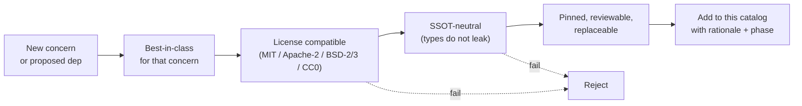
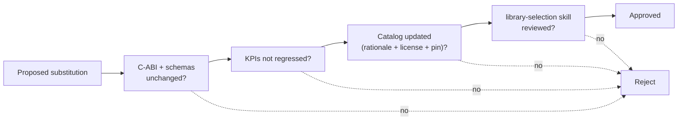
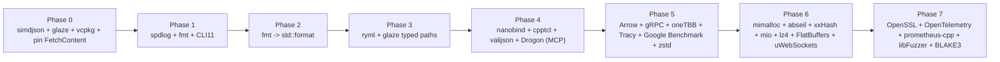

# Library Catalog

## Purpose
Define the **canonical inventory of best-in-class third-party libraries**
used by `eda_stl`. This is the single source of truth for library choices.
For every concern (allocator, threading, JSON, logging, networking, ...)
this document names the chosen library, its license, its rationale, its
version pin, the phase in which it lands, and its replacement path.

Library implementations are best-in-class but **never part of the public
surface**. They sit beneath the C-ABI and schemas described in
[`binding-architecture.md`](binding-architecture.md), and they are freely
substitutable so long as the SSOT does not change.

## Audience
Build engineers, performance engineers, security/license reviewers,
contributors proposing new dependencies, and AI tools running the
`library-selection` skill.

## In Scope
- Library selection principles.
- The full per-concern inventory of chosen libraries.
- Drop / replace plan for legacy dependencies.
- License audit summary.
- Library substitution policy.
- Phase mapping for adoption tasks.

## Out of Scope
- The C-ABI and schemas (see
  [`binding-architecture.md`](binding-architecture.md)).
- Mission charter (see [`mission.md`](mission.md)).
- KPI methodology (see
  [`performance/cpp23-and-parallel-runtime.md`](performance/cpp23-and-parallel-runtime.md)).

## Cross References
- [`mission.md`](mission.md)
- [`README.md`](README.md)
- [`glossary.md`](glossary.md)
- [`binding-architecture.md`](binding-architecture.md)
- [`build-test-ci.md`](build-test-ci.md)
- [`code-quality-standards.md`](code-quality-standards.md)
- [`extensibility-contract.md`](extensibility-contract.md)
- [`performance/cpp23-and-parallel-runtime.md`](performance/cpp23-and-parallel-runtime.md)
- [`technical-debt-register.md`](technical-debt-register.md)
- [`quality-gaps-and-risks.md`](quality-gaps-and-risks.md)
- [`implementation/implementation-phases.md`](implementation/implementation-phases.md)

## Selection Principles

- **Best-in-class per concern.** Pick the leader on the metric that
  matters (throughput, footprint, ergonomics, maintenance) for that
  concern; do not bundle one library across concerns.
- **License compatibility.** Only MIT, Apache-2, BSD-2, BSD-3, or CC0.
  No GPL- or LGPL-only dependencies. No service-side relicensing.
- **SSOT-neutral.** Types from a library never appear in the C-ABI
  headers, in the Flight schemas, in the tile schemas, or in the LLM
  system card. They live behind that interface.
- **Pinned.** Every entry has a pinned version (set during the Phase 0
  acquisition task) and a reproducible install path through vcpkg or
  CPM.cmake.
- **Reviewable.** Source must be readable, recently maintained, and
  shipped with tests.
- **Replaceable.** A drop-in replacement must be possible without
  changing the C-ABI or schemas; the policy in §"Library Substitution
  Policy" enforces this.

## Mission Alignment
Every entry in this catalog is checked against the mission-aligned
reject criteria in [`mission.md`](mission.md):

- license is compatible with public-utility distribution;
- no library is on the LLM critical path that introduces a foreign
  runtime (only native C++ on that path - see
  [`binding-architecture.md`](binding-architecture.md) §7);
- no library couples the data model to a vendor format;
- no library locks core functionality behind a paid runtime.

## JsonCpp Replacement (User-Specific Mandate)
JsonCpp is **retired** in Phase 0. It is replaced by:

- **simdjson** for high-throughput ingest (read path, ~3 GB/s SIMD).
- **glaze** for typed serialization (read/write where structs map
  directly to JSON).

The replacement lands in the Phase 0 task `p0-jsoncpp-to-simdjson-glaze`
in [`implementation/implementation-phases.md`](implementation/implementation-phases.md).
It removes JsonCpp from
[`/home/rohit/src/eda_stl/CMakeLists.txt`](../CMakeLists.txt) and from
[`/home/rohit/src/eda_stl/rack/swig/rack_int.i`](../rack/swig/rack_int.i)
(the SWIG interface no longer imports JsonCpp because SWIG itself is on
a deprecation path - see Phase 7).

## The Catalog

### Foundation

| Concern | Library | License | Pin (set Phase 0) | Rationale | Phase |
|---|---|---|---|---|---|
| System allocator | [mimalloc](https://github.com/microsoft/mimalloc) | MIT | TBD | Best-in-class throughput + low fragmentation; clean integration with arena allocators. | 6 |
| Parallel runtime | [oneTBB](https://github.com/oneapi-src/oneTBB) | Apache-2 | TBD | Mature work-stealing, parallel STL, scalable concurrent containers. | 5 |
| Cooperative threads | `std::jthread` + `std::stop_token` | (stdlib) | C++23 | Deterministic cooperative cancellation; pairs with oneTBB. | 5 |
| Optional task graphs | [Taskflow](https://github.com/taskflow/taskflow) | MIT | TBD | Header-only ad-hoc DAG execution. Used selectively. | 5 |
| Hash maps | [abseil-cpp](https://github.com/abseil/abseil-cpp) `absl::flat_hash_map` | Apache-2 | TBD | 2-3x faster than `std::unordered_map` on hot paths. | 6 |
| Hash functions | [xxHash](https://github.com/Cyan4973/xxHash) (BSD-2) + [BLAKE3](https://github.com/BLAKE3-team/BLAKE3) (CC0/Apache-2) | BSD-2 / dual | TBD | xxHash for hot identity hashing; BLAKE3 for content addressing. | 6/7 |
| Formatting | [fmt](https://github.com/fmtlib/fmt) -> `std::format` | BSD-2 / stdlib | TBD | Type-safe; `std::format` becomes canonical post-C++23 adoption. | 1 -> 2 |
| Logging | [spdlog](https://github.com/gabime/spdlog) | MIT | TBD | Structured, async, level-controlled; pairs with fmt. | 1 |
| In-process profiler | [Tracy](https://github.com/wolfpld/tracy) | BSD-3 | TBD | Sub-microsecond instrumentation, GPU + CPU view. | 5 |
| Distributed tracing | [OpenTelemetry C++](https://github.com/open-telemetry/opentelemetry-cpp) | Apache-2 | TBD | Vendor-neutral; integrates with `eda_server` and `mcp_server`. | 7 |
| Metrics | [prometheus-cpp](https://github.com/jupp0r/prometheus-cpp) | MIT | TBD | Standard exposition format. | 7 |
| Filesystem | `std::filesystem` | (stdlib) | C++17 | Already available. | n/a |
| mmap | [mio](https://github.com/vimpunk/mio) | MIT | TBD | Header-only cross-platform mmap; needed for tile/quadtree streaming. | 6 |
| Compression | [zstd](https://github.com/facebook/zstd) (BSD-3) + [lz4](https://github.com/lz4/lz4) (BSD-2) | BSD-3 / BSD-2 | TBD | zstd for high-ratio, lz4 for low-latency. | 5/6 |
| TLS / crypto | [OpenSSL 3.x](https://github.com/openssl/openssl) | Apache-2 | TBD | TLS for `eda_server` and `mcp_server`. | 7 |

### Serialization

| Concern | Library | License | Pin | Rationale | Phase |
|---|---|---|---|---|---|
| JSON ingest (SIMD) | [simdjson](https://github.com/simdjson/simdjson) | Apache-2 | TBD | ~3 GB/s parser; replaces JsonCpp on the read path. | 0 |
| JSON typed serde | [glaze](https://github.com/stephenberry/glaze) | MIT | TBD | Header-only, C++23-friendly; replaces JsonCpp on the typed path. | 0 / 3 |
| JSON Schema validation | [valijson](https://github.com/tristanpenman/valijson) | BSD-2 | TBD | Validates `mcp_server` request/response payloads. | 4 |
| YAML | [rapidyaml (ryml)](https://github.com/biojppm/rapidyaml) | MIT | TBD | Used by system card, allowlist, and config. | 3 |
| Columnar / Arrow | [Apache Arrow C++](https://github.com/apache/arrow) | Apache-2 | TBD | Record-batched data plane for `eda_server` and Plasma. | 5 |
| RPC method signatures | [Protocol Buffers](https://github.com/protocolbuffers/protobuf) | BSD-3 | TBD | Used only for Flight RPC method definitions. | 5 |
| Wire schemas | [FlatBuffers](https://github.com/google/flatbuffers) | Apache-2 | TBD | Tile streaming schema; zero-copy frames. | 6 |

### Network

| Concern | Library | License | Pin | Rationale | Phase |
|---|---|---|---|---|---|
| gRPC | [official C++ gRPC](https://github.com/grpc/grpc) | Apache-2 | TBD | Required by Arrow Flight. | 5 |
| HTTP / SSE | [Drogon](https://github.com/drogonframework/drogon) | MIT | TBD | High-perf HTTP and SSE; serves `mcp_server` HTTP transport. Fallback: `boost.beast`. | 4 |
| WebSocket | [uWebSockets](https://github.com/uNetworking/uWebSockets) | Apache-2 | TBD | Lowest-overhead WebSocket; serves the tile gateway. Fallback: `boost.beast`. | 6 |

### CLI / Process

| Concern | Library | License | Pin | Rationale | Phase |
|---|---|---|---|---|---|
| Argument parsing | [CLI11](https://github.com/CLIUtils/CLI11) | BSD-3 | TBD | Header-only, modern, well-tested. | 1 |

### Bindings

| Concern | Library | License | Pin | Rationale | Phase |
|---|---|---|---|---|---|
| Python | [nanobind](https://github.com/wjakob/nanobind) | BSD-3 | TBD | 4-10x faster bindings than pybind11; replaces SWIG for Python. | 4 |
| Tcl | [cpptcl](https://github.com/flightaware/cpptcl) | BSD | TBD | Modern C++17 Tcl binding (FlightAware fork). | 4 |
| MCP server | native C++ in this repo | MIT | n/a | JSON-RPC framed via simdjson/glaze; transport via Drogon/stdio. No foreign runtime on LLM critical path. | 4 |

### Testing / Benchmarks / Fuzzing

| Concern | Library | License | Pin | Rationale | Phase |
|---|---|---|---|---|---|
| Unit tests | [GoogleTest](https://github.com/google/googletest) | BSD-3 | TBD (Phase 0) | Already in tree; pin in Phase 0. | kept |
| Microbenchmarks | [Google Benchmark](https://github.com/google/benchmark) | Apache-2 | TBD | KPI baselines for Phase 5 onward. | 5 |
| Fuzzing | libFuzzer (LLVM) | NCSA / MIT | toolchain | Fuzz the C-ABI, schemas, and `mcp_server`. | 7 |
| Coverage | llvm-cov / gcov | (toolchain) | n/a | Measured per phase. | 1 |

### Build / Dependency Management

| Concern | Library | License | Pin | Rationale | Phase |
|---|---|---|---|---|---|
| Default | [vcpkg manifest mode](https://github.com/microsoft/vcpkg) | MIT | toolchain | Reproducible deps; manifest-mode pinning. | 0 |
| Fallback | [CPM.cmake](https://github.com/cpm-cmake/CPM.cmake) | MIT | TBD | When a dep is unavailable through vcpkg. | 0+ |
| FetchContent | (CMake builtin) | (CMake) | n/a | Only with pinned commit SHAs (Phase 0 fix). | 0 |

## Drop / Replace Plan

| Current | Replacement | Phase | Reason | Tracked As |
|---|---|---|---|---|
| JsonCpp | simdjson + glaze | 0 | Performance, modern API, Arrow-friendly | `p0-jsoncpp-to-simdjson-glaze`, D-19 |
| Hand-rolled `<fstream>` for large files | mio mmap | 6 | Tile/quadtree memory mapping | D-22 |
| `std::map` / `std::unordered_map` on hot paths | `absl::flat_hash_map` | 6 | 2-3x hot-path speedup | D-23 |
| `std::cout` / `std::cerr` ad-hoc logging | spdlog | 1 | Structured, async, level-controlled | D-24 |
| Raw `printf` / manual stringification | fmt -> `std::format` | 1 / 2 | Type-safe, fast | D-24 |
| `std::mutex` only | `std::jthread` + oneTBB | 5 | Cooperative cancel + work stealing | D-25 |
| `std::allocator` on hot containers | mimalloc + arenas | 6 | Bounded, faster | D-26 |
| Floating `FetchContent` tags for new deps | vcpkg / CPM | 0 onward | Reproducibility | D-01 |
| SWIG (Python binding) | nanobind | 4 | 4-10x faster bindings, no SWIG fragility | D-20 |

## Library Substitution Policy

- A library may be swapped if **and only if**:
  1. the C-ABI under `binding/cabi/` and the schemas under
     `binding/schemas/` remain byte-identical;
  2. KPIs in
     [`performance/cpp23-and-parallel-runtime.md`](performance/cpp23-and-parallel-runtime.md)
     are not regressed beyond their thresholds;
  3. this catalog is updated with rationale, license, pin, and phase;
  4. the `library-selection` skill at
     [`.cursor/skills/library-selection/SKILL.md`](../.cursor/skills/library-selection/SKILL.md)
     reviews the change.

- Substitutions that fail any rule above are rejected per the composite
  reject criteria in
  [`binding-architecture.md`](binding-architecture.md) §"Reject
  Criteria".

## License Audit Summary
All entries above are MIT, Apache-2, BSD-2, BSD-3, or CC0/dual. This is
consistent with the mission-aligned reject criteria in
[`mission.md`](mission.md). No GPL- or LGPL-only dependency is present
or permitted.

## Phase Mapping

## Acceptance Criteria For This Document
- Every concern lists exactly one chosen library, license, and phase.
- License audit is explicit (MIT / Apache-2 / BSD-2/3 / CC0 only).
- Drop / replace plan covers JsonCpp, ad-hoc logging, hash maps, mmap,
  threading, allocators, dependency acquisition, and SWIG (Python).
- Library substitution policy is stated with a flow diagram and a
  cross-reference to the composite reject criteria.
- Phase mapping is present as a diagram.
- Cross-references to mission, binding architecture, performance,
  build/test/CI, code quality, and the implementation phases playbook
  are present.
