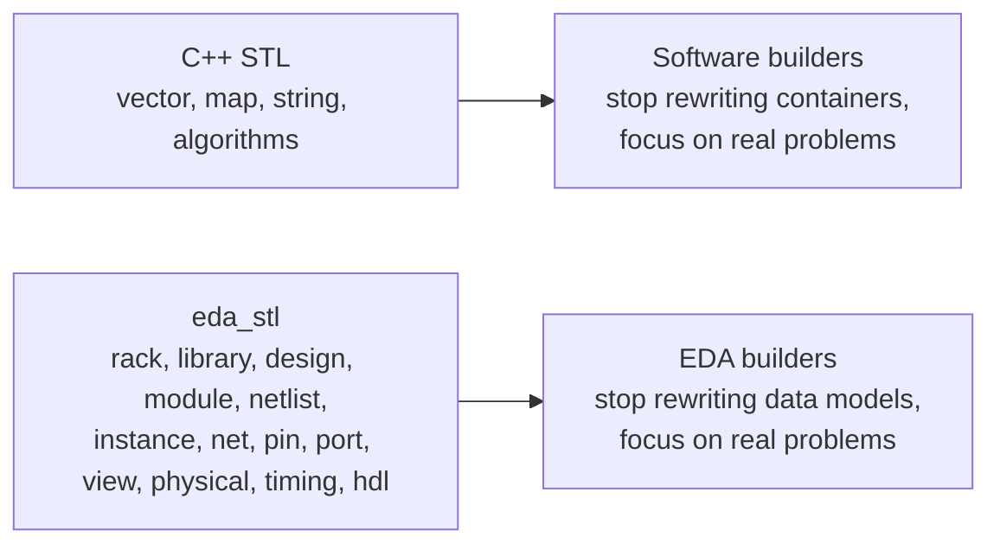
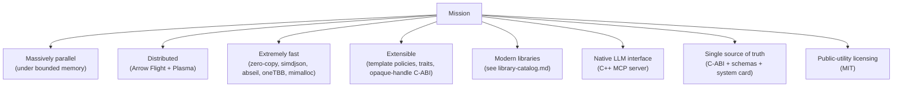
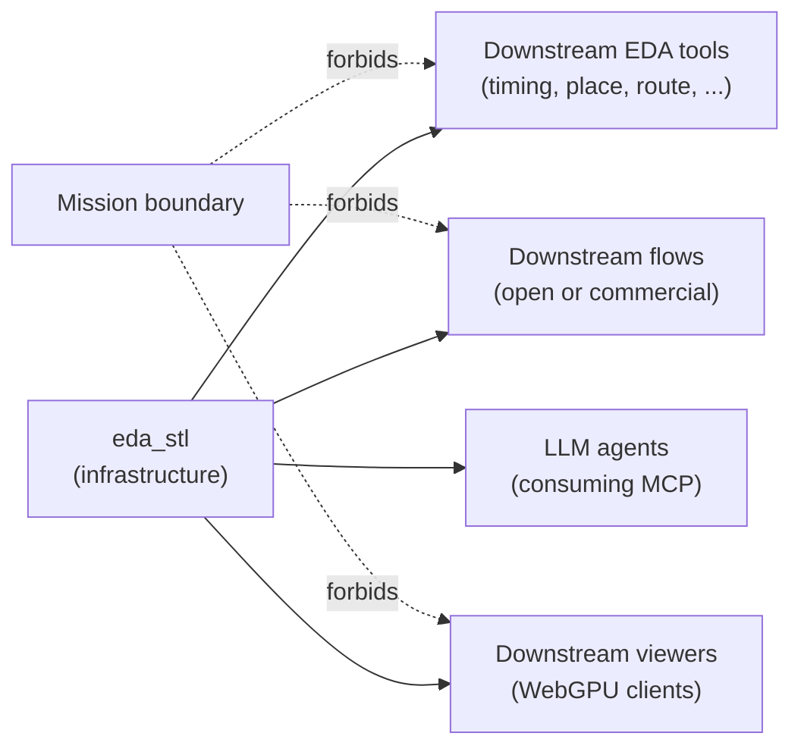
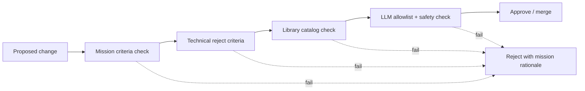

# Mission: STL For EDA

## Purpose
Establish, in a single canonical document, **why `eda_stl` exists**, what it
must always be, what it must never become, and how every other document,
skill, library choice, interface, and code change in this repository is
checked against that purpose.

This document is the **charter**. It is the only place the mission is
defined. Every other file in `doc/`, every skill under `.cursor/skills/`,
every task card under `doc/implementation/`, every entry in
[`AGENTS.md`](../AGENTS.md), and every line of source code in this
repository inherits the rules below.

## Audience
Library authors, EDA tool teams, academics, open-source flow integrators,
LLM agent authors, downstream wheel/package consumers, and AI tools that
generate or maintain content for this repository.

## In Scope
- The premise: be to EDA what the C++ STL is to software in general.
- Required capabilities to fulfill the premise.
- Non-mission boundaries (what `eda_stl` must never become).
- Mission-aligned reject criteria for proposals and changes.
- Mission success metrics and governance.
- The rule that this is the single place the mission is defined.

## Out of Scope
- Concrete API design (see
  [`extensibility-contract.md`](extensibility-contract.md) and
  [`binding-architecture.md`](binding-architecture.md)).
- Library implementations (see [`library-catalog.md`](library-catalog.md)).
- Phase mechanics (see
  [`implementation/implementation-phases.md`](implementation/implementation-phases.md)).

## Cross References
- [`README.md`](README.md)
- [`glossary.md`](glossary.md)
- [`repository-map.md`](repository-map.md)
- [`extensibility-contract.md`](extensibility-contract.md)
- [`code-quality-standards.md`](code-quality-standards.md)
- [`library-catalog.md`](library-catalog.md)
- [`binding-architecture.md`](binding-architecture.md)
- [`performance/cpp23-and-parallel-runtime.md`](performance/cpp23-and-parallel-runtime.md)
- [`quality-gaps-and-risks.md`](quality-gaps-and-risks.md)
- [`technical-debt-register.md`](technical-debt-register.md)
- [`roadmap/eda-stl-library.md`](roadmap/eda-stl-library.md)
- [`implementation/implementation-phases.md`](implementation/implementation-phases.md)
- [`../AGENTS.md`](../AGENTS.md)

## Charter

> The fundamental premise of `eda_stl` is to **eliminate the data-modeling
> aspect of complex Electronic Design Automation and make it publicly
> available**, so that humanity can focus on the harder, more important
> problems in EDA instead of re-implementing the mundane.
>
> The aspiration: **be to EDA what the C++ STL is to software in general.**

## Why This Project Exists

Every EDA company, every academic group, every open-source toolchain
rebuilds the same hierarchical, name-resolved, view-managed,
geometry-indexed netlist data model. That work is duplicated across the
industry, locked behind incompatible private formats, and maintained at
massive cost.

It distracts from the hard problems: physical design, static and dynamic
timing, signal integrity, signoff, formal verification, ML-driven
optimization, novel architectures, full-chip flows, and the AI agents
that will increasingly act on EDA data.

`eda_stl` exists to remove that distraction by making the data model
**free, public, best-in-class, and infrastructure-grade** — the way
`std::vector`, `std::map`, and `std::string` removed the distraction of
rebuilding containers in software.

## The STL Parallel

| C++ STL | eda_stl |
|---|---|
| `std::vector`, `std::map`, `std::string`, ... | `Rack`, `Library`, `Design`, `Module`, `Netlist`, `Instance`, `Net`, `Port`, `Pin`, `ViewManager`, `Cell`, `Physical`, `Timing`, `Hdl`, ... |
| Generic, allocator-aware, policy-based templates | Generic `BasicRack<_CharT, _Traits, _Alloc>` and the entire `Basic*` family in [`rack/include/rack.h`](../rack/include/rack.h) |
| Header-only zero-cost abstractions | Header-first; allocator categories; bounded memory ([`performance/cpp23-and-parallel-runtime.md`](performance/cpp23-and-parallel-runtime.md)) |
| Free, public-domain-grade availability | MIT license; public ownership ([`/home/rohit/src/eda_stl/LICENSE`](../LICENSE)) |
| Standardized so every compiler ships it | Stable C-ABI + schemas so every language and tool can consume it ([`binding-architecture.md`](binding-architecture.md)) |

## What `eda_stl` Eliminates

- Rebuilding hierarchical netlist storage, name resolution, ports, nets,
  pins, instances.
- Rebuilding view management (blackbox, physical, timing, hdl, cell,
  netlist, viewgroup) — see
  [`rack/include/viewmanager.h`](../rack/include/viewmanager.h).
- Rebuilding geometry indices and tile streaming.
- Rebuilding LEF/DEF/GDS/OASIS lifters and writers (delivered through the
  schemas, not as a tool).
- Designing yet another cross-language ABI from scratch.
- Designing yet another LLM tool surface from scratch.

## What `eda_stl` Enables

- Timing analysis tools that don't carry their own database.
- Placement and routing engines that don't fight a model.
- ML-for-EDA pipelines that share one canonical representation.
- LLM agents that introspect and operate on real designs through a
  discoverable interface (see [`binding-architecture.md`](binding-architecture.md) §7).
- Academic experiments that reproduce other people's results without
  reimplementing the boilerplate.
- Open-source full-chip flows assembled from independent best-in-class
  components.

## Capabilities Required To Fulfill The Mission

- **Massively parallel** under a strict, bounded-memory policy
  ([`performance/cpp23-and-parallel-runtime.md`](performance/cpp23-and-parallel-runtime.md)).
- **Distributed** through Arrow Flight + Plasma so the model scales
  beyond one machine ([`binding-architecture.md`](binding-architecture.md) §5.4).
- **Extremely fast** through zero-copy data paths, allocator categories,
  simdjson, glaze, abseil flat hash, oneTBB, mimalloc
  ([`library-catalog.md`](library-catalog.md)).
- **Extensible** through template policies, traits, an opaque-handle
  C-ABI, and stable schemas ([`extensibility-contract.md`](extensibility-contract.md),
  [`binding-architecture.md`](binding-architecture.md)).
- **Modern libraries** chosen as best-in-class per concern, never as part
  of the public surface
  ([`library-catalog.md`](library-catalog.md)).
- **Native LLM interface** through a C++ `mcp_server` consuming the same
  SSOT every other client uses
  ([`binding-architecture.md`](binding-architecture.md) §7).
- **Single source of truth** for all interfaces (C-ABI + schemas +
  system card).
- **Public-utility licensing** (MIT) and a governance model that
  protects that.

## Non-Mission (Deliberate Boundaries)

`eda_stl` is **not**, and must never become:

- a full EDA tool;
- a flow runner;
- a synthesis, placer, router, timer, or signoff engine;
- a viewer (we ship the tile *protocol*; viewers are downstream);
- a vendor product or a closed-source service.

We provide the **infrastructure**. Tools and flows are built on top by the
community.

The **mission boundary** in the diagram above means: code that turns
`eda_stl` into a tool, a flow, or a viewer must live downstream, not in
this repository.

## Mission-Aligned Reject Criteria

A proposal that otherwise looks fine is **rejected** if it:

- creates a private-fork advantage that the public version cannot match;
- introduces a license incompatible with public use (no GPL- or
  LGPL-only dependencies, no service-side relicensing requirement);
- couples the data model to a specific vendor's proprietary format such
  that a non-vendor user cannot consume it;
- locks core functionality behind a paid runtime, a paid LLM, a paid
  cloud, or a closed binary;
- redefines the model in a frontend (Python, Tcl, MCP, web) instead of
  consuming the SSOT defined in
  [`binding-architecture.md`](binding-architecture.md);
- crosses the non-mission boundary (turns `eda_stl` into a tool, flow,
  viewer, or vendor product).

These criteria compose with the technical reject criteria in
[`performance/cpp23-and-parallel-runtime.md`](performance/cpp23-and-parallel-runtime.md)
and [`binding-architecture.md`](binding-architecture.md). A change must
pass **all** of them.

## Mission Success Metrics

These metrics are **advisory** in Phases 0–6 and become a **soft
governance gate** in Phase 7 (see
[`implementation/implementation-phases.md`](implementation/implementation-phases.md)).

| Metric | Definition | Source |
|---|---|---|
| `mission.downstream_tools` | Count of independent downstream tools/flows depending on `eda_stl`. | community registry, `AGENTS.md` referrers |
| `mission.academic_citations` | Citations of `eda_stl` in academic publications. | bibliographic feed |
| `mission.language_frontends` | Count of supported language frontends (current targets: Python, Tcl; future: Rust, Julia, ...). | [`binding-architecture.md`](binding-architecture.md) §4 |
| `mission.llm_ecosystem_size` | Count of LLM agents/products listing `eda_stl` MCP capabilities. | MCP `list_clients` telemetry |
| `mission.time_to_first_design` | Wallclock for a new contributor to load a non-trivial design through any frontend. Target: under one hour. | onboarding playbook |
| `mission.public_runtime_share` | Share of all measured `eda_stl` invocations running in MIT-licensed pipelines. | telemetry opt-in |
| `mission.kpi_envelope` | Composite of throughput, peak RSS, and parallel-efficiency KPIs. | [`performance/cpp23-and-parallel-runtime.md`](performance/cpp23-and-parallel-runtime.md) |

## Governance Of The Mission

- **License**: MIT, repository-wide. See
  [`/home/rohit/src/eda_stl/LICENSE`](../LICENSE).
- **RFC process**: any change that touches the C-ABI, the schemas under
  `binding/schemas/`, or the mission boundary must be raised as a public
  RFC.
- **`mission-alignment-review` skill**:
  [`.cursor/skills/mission-alignment-review/SKILL.md`](../.cursor/skills/mission-alignment-review/SKILL.md)
  is invoked on every change that touches the public surface or
  governance.
- **Single canonical home**: this document is the only place the mission
  is defined. Every other document references it; nothing else may
  redefine, narrow, or expand the charter.
- **Phase mapping**: governance enforcement is advisory in Phases 0–6
  and becomes a soft gate in Phase 7
  (`p7-mission-governance-gate` in
  [`implementation/implementation-phases.md`](implementation/implementation-phases.md)).

## Operational Implications

- Every new doc opens with a Cross References section that links back
  here.
- Every new skill opens with a "When To Use" line that, where relevant,
  cites this charter.
- Every task card with public-surface impact lists this document under
  `inputs`.
- The repository-root [`AGENTS.md`](../AGENTS.md) opens with a paragraph
  derived directly from the charter above.

## Acceptance Criteria For This Document
- The charter is stated verbatim and is the only place it lives.
- "Why this project exists" is explicit and concrete.
- The STL parallel is given as a diagram and a table.
- "What `eda_stl` eliminates" and "what it enables" are enumerated.
- Required capabilities are enumerated and cross-referenced.
- Non-mission boundaries are explicit, with a diagram.
- Mission-aligned reject criteria are listed.
- Success metrics are tabulated with definitions and sources.
- Governance is described with a flow diagram.
- Cross-references to every primary doc are present.
