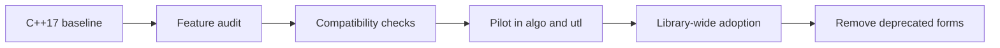
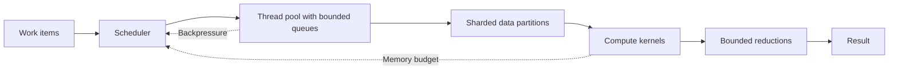
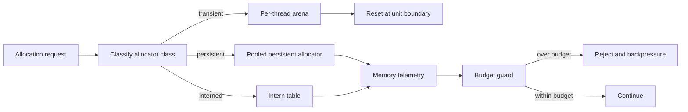
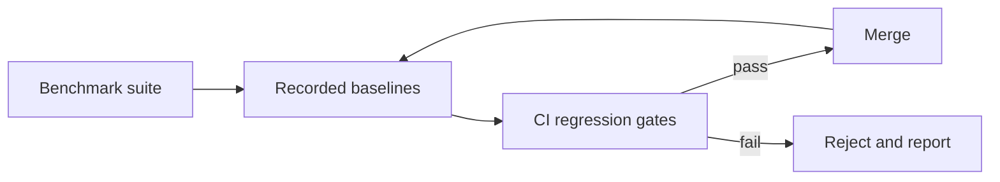

# C++23 And Parallel Runtime Plan

## Purpose
Define the migration to a C++23 baseline and the throughput-first parallel
execution architecture for `eda_stl`, with explicit memory constraints,
quantitative KPIs, and reject criteria.

## Audience
Performance engineers, compiler/toolchain owners, and AI tools driving
performance-related phases of the implementation playbook.

## In Scope
- C++23 migration approach and compiler matrix.
- Throughput-first parallel architecture under bounded memory.
- KPI schema and benchmark methodology.
- Threading model decision points and reject criteria.
- CI gating for performance regressions.

## Out of Scope
- Code style and ownership rules (see
  [`../code-quality-standards.md`](../code-quality-standards.md)).

## Cross References
- [`../mission.md`](../mission.md)
- [`../glossary.md`](../glossary.md)
- [`../build-test-ci.md`](../build-test-ci.md)
- [`../rack-model-and-verification.md`](../rack-model-and-verification.md)
- [`../code-quality-standards.md`](../code-quality-standards.md)
- [`../extensibility-contract.md`](../extensibility-contract.md)
- [`../binding-architecture.md`](../binding-architecture.md)
- [`../library-catalog.md`](../library-catalog.md)
- [`../technical-debt-register.md`](../technical-debt-register.md)
- [`../implementation/implementation-phases.md`](../implementation/implementation-phases.md)

## Performance Charter
- Throughput-first under hard memory constraints.
- No optimization is acceptable if it improves throughput at the cost of
  unbounded memory growth.
- Every optimization candidate must include:
  - a memory cost model,
  - a contention model,
  - and a bounded-footprint implementation path.

The performance charter is itself in service of the mission charter
([`../mission.md`](../mission.md)): throughput and footprint must be
strong enough to make `eda_stl` usable as public infrastructure for
chip-class designs (Nvidia-class scale is the design target).

## Canonical Performance Stack

The following library choices, drawn from
[`../library-catalog.md`](../library-catalog.md), are the canonical
stack against which all KPIs are measured. Substitutes are evaluated
under the substitution policy in
[`../library-catalog.md`](../library-catalog.md).

| Concern | Canonical choice | Rationale |
|---|---|---|
| Parallel runtime | oneTBB + `std::jthread` | Work-stealing + cooperative cancel; saturates many-core under bounded queues. |
| System allocator | mimalloc | Best-in-class throughput and fragmentation; pairs cleanly with arenas. |
| Allocator categories | transient (per-thread arena) + persistent (lock-free pool) + interned (dedup string store) | Bounds working set per work unit; supports zero-copy reuse. |
| Hash maps | `absl::flat_hash_map` | 2-3x hot-path speedup vs `std::unordered_map`. |
| JSON ingest | simdjson | ~3 GB/s SIMD; replaces JsonCpp. |
| JSON typed serde | glaze | Header-only, C++23-friendly. |
| In-process profiling | Tracy | Sub-microsecond instrumentation; CI-friendly. |
| Distributed tracing | OpenTelemetry C++ | Vendor-neutral; covers `eda_server` + `mcp_server`. |
| Metrics | prometheus-cpp | Standard exposition format. |
| mmap | mio | Tile/quadtree streaming. |
| Compression | zstd + lz4 | High-ratio (zstd) and low-latency (lz4). |

## C++23 Migration

- Current baseline: `CMAKE_CXX_STANDARD 17` with GCC `>= 9.2.0` floor in
  [`../../CMakeLists.txt`](../../CMakeLists.txt).
- Target: `CMAKE_CXX_STANDARD 23` with a matrix that includes at least
  GCC 13, Clang 17, and a recent MSVC.
- Adopt incrementally:
  - Phase A: enable `-std=c++23`, replace deprecated forms.
  - Phase B: introduce concepts, ranges, `std::expected`, `std::flat_map`
    where they reduce code or improve clarity.
  - Phase C: lift template-heavy headers into modules where modules are
    available (gated on toolchain support).
- Compatibility matrix recorded as a table in CI artifacts and reflected in
  [`../build-test-ci.md`](../build-test-ci.md).

## Threading Model Decision Points
- Work-stealing vs fork-join vs structured task graphs vs actor model.
- Lock-based vs lock-free containers, justified per data structure.
- Sharding strategy for hierarchy traversal under bounded memory.
- Interaction between SWIG/Python GIL and the core threading model.
- Decision per data structure documented in
  [`../extensibility-contract.md`](../extensibility-contract.md).

## Throughput-First Architecture

- Bounded queues to keep the working set bounded under load.
- Sharded data layouts so worker threads operate on disjoint partitions.
- Backpressure from queue and memory signals to halt new work.
- Reductions are bounded in memory (streaming where possible).

## Memory Budget Categories
- Per-design memory envelope: total RSS for a workload, capped to a
  configurable budget (e.g., target placeholder `MEM_TOTAL_MIB`).
- Per-thread working-set cap: maximum bytes a worker may hold at once.
- Per-work-unit allocation budget: maximum bytes consumed by a unit of
  work.
- Allocator-class breakdown:
  - `transient`: arena/bump for short-lived per-unit data.
  - `persistent`: long-lived, lock-free where possible.
  - `interned`: deduplicated symbol/string store.

## Memory Allocation Flow

## KPI Schema (Required)
Every KPI in this section must have:
- `name`,
- `units`,
- `measurement_method`,
- `target` (placeholder allowed if not yet measured),
- `regression_threshold`,
- `benchmark_scenario`.

### Throughput KPIs
- `throughput.hierarchy_build` (M ops/sec): rate of inserts during
  benchmark `build_full_hierarchy`. Target: TBD baseline. Regression: -5%.
- `throughput.flatten` (M ops/sec): rate of dissolve operations on
  `verifyFlatTop`-equivalent benchmark. Regression: -5%.
- `throughput.traversal` (M ops/sec): rate of pin/net traversal in
  `traverse_all_nets`. Regression: -5%.
- `parallel.efficiency_at_n_threads` (percent): observed speedup divided by
  `n`. Target: >= 0.7 at 8 threads after Phase 5; >= 0.6 at 32 threads.
  Regression: -10 percentage points.

### Memory KPIs
- `memory.peak_rss` (MiB): peak RSS during scenario. Regression: +5%.
- `memory.bytes_per_work_unit` (bytes): bytes allocated per primitive
  operation. Regression: +5%.
- `memory.fixed_envelope_speedup` (percent): speedup measured under a
  fixed RSS budget. Regression: -10 percentage points.

### Latency KPIs
- `latency.p50_traversal` (ns/op): median per-op latency.
- `latency.p99_traversal` (ns/op): tail latency.
- Regression: +10%.

### Binding KPIs

These KPIs cover the SSOT and best-in-class wrappers defined in
[`../binding-architecture.md`](../binding-architecture.md).

- `binding.cabi_call_overhead` (ns/call): mean overhead of a no-op
  C-ABI call (`eda_rack_create` + immediate `eda_rack_destroy`).
  Target: < 200 ns. Regression: +20 ns.
- `binding.python_traversal_overhead` (ns/op): per-op overhead of
  nanobind-wrapped traversal vs the equivalent C++ traversal. Target:
  < 50 ns. Regression: +10 ns.
- `binding.tcl_traversal_overhead` (ns/op): same as above for cpptcl.
  Target: < 200 ns. Regression: +50 ns.
- `binding.zero_copy_violations` (count): count of binding hot-path
  copies detected by the allocator-instrumented test harness. Target:
  0. **Reject** any change that increases this count above zero.

### Service Plane KPIs (Arrow Flight)

- `service.flight_query_throughput` (records/sec): record-batched
  rows per second served by `eda_server` for a fixed traversal query.
  Regression: -5%.
- `service.flight_p99_latency` (ms): Flight RPC tail latency for a
  reference query under load. Regression: +10%.
- `service.plasma_handoff_throughput` (GB/sec): co-located zero-copy
  hand-off rate. Target: ~7 GB/sec on the reference workload.
  Regression: -5%.

### Tile / Frame KPIs

- `tile.frame_render_time` (ms/frame): server-side time to assemble
  one tile frame at the reference LOD. Regression: +10%.
- `tile.compressed_frame_size` (KiB): zstd-compressed frame size for
  the reference LOD. Regression: +5%.
- `tile.lod_walk_efficiency` (percent): ratio of useful payload bytes
  to total frame bytes during a deterministic LOD walk. Target: >=
  85%. Regression: -3 percentage points.

### MCP KPIs

- `mcp.tool_call_overhead` (ms/call): mean wall-clock of a no-op MCP
  tool call (`eda://noop`) on local stdio transport. Target: < 5 ms.
  Regression: +1 ms.
- `mcp.list_tools_latency` (ms): time to serve `list_tools` over
  stdio. Target: < 10 ms. Regression: +2 ms.
- `mcp.audit_log_overhead` (percent): per-call overhead added by
  audit logging vs. a no-audit run. Target: <= 5%. Regression: +2
  percentage points.

## Benchmark Classes
- Microbenchmarks: container, allocator, traversal primitives.
- Scenario benchmarks: full hierarchy build, clone, dissolve, verify.
- Stress benchmarks: large hierarchies, many threads, memory-bounded runs.

## Reject Criteria
- Reject any change that:
  - reduces `parallel.efficiency_at_n_threads` below threshold,
  - increases `memory.peak_rss` beyond threshold,
  - increases `memory.bytes_per_work_unit` beyond threshold,
  - violates the per-thread or per-design budgets,
  - introduces unbounded queues or buffers,
  - increases `binding.zero_copy_violations` above zero,
  - degrades any binding/service/tile/MCP KPI beyond its regression
    threshold,
  - replaces a canonical-stack library without satisfying the
    substitution policy in [`../library-catalog.md`](../library-catalog.md),
  - violates the mission-aligned reject criteria in
    [`../mission.md`](../mission.md) §"Mission-Aligned Reject Criteria",
  - violates the composite reject criteria in
    [`../binding-architecture.md`](../binding-architecture.md)
    §"Composite Reject Criteria".

## Performance Governance Loop

## Acceptance Criteria For This Document
- C++23 migration plan present with toolchain matrix expectations.
- Memory budget categories enumerated.
- Canonical performance stack declared with cross-reference to the
  library catalog.
- KPI schema defined with units and measurement method placeholders.
- Binding, service-plane, tile/frame, and MCP KPIs declared.
- Threading model decision points enumerated.
- Reject criteria explicit, including binding zero-copy and
  composite reject criteria from
  [`../binding-architecture.md`](../binding-architecture.md).
- Mission cross-reference present.
- At least one mermaid diagram (this document has multiple).
- Cross-references present.
