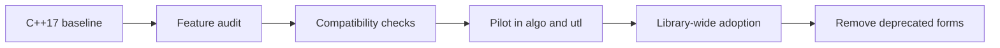
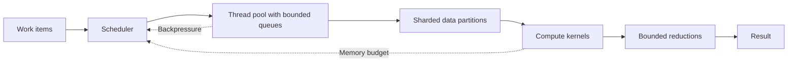
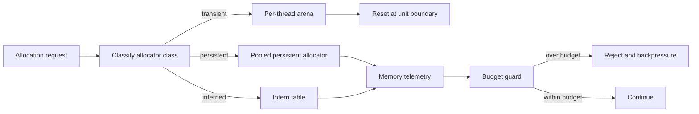
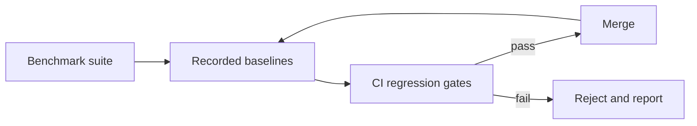

# C++23 And Parallel Runtime Plan

## Purpose
Define the migration to a C++23 baseline and the throughput-first parallel
execution architecture for `eda_stl`, with explicit memory constraints,
quantitative KPIs, and reject criteria.

## Audience
Performance engineers, compiler/toolchain owners, and AI tools driving
performance-related phases of the implementation playbook.

## In Scope
- C++23 migration approach and compiler matrix.
- Throughput-first parallel architecture under bounded memory.
- KPI schema and benchmark methodology.
- Threading model decision points and reject criteria.
- CI gating for performance regressions.

## Out of Scope
- Code style and ownership rules (see
  [`../code-quality-standards.md`](../code-quality-standards.md)).

## Cross References
- [`../glossary.md`](../glossary.md)
- [`../build-test-ci.md`](../build-test-ci.md)
- [`../rack-model-and-verification.md`](../rack-model-and-verification.md)
- [`../code-quality-standards.md`](../code-quality-standards.md)
- [`../extensibility-contract.md`](../extensibility-contract.md)
- [`../technical-debt-register.md`](../technical-debt-register.md)
- [`../implementation/implementation-phases.md`](../implementation/implementation-phases.md)

## Performance Charter
- Throughput-first under hard memory constraints.
- No optimization is acceptable if it improves throughput at the cost of
  unbounded memory growth.
- Every optimization candidate must include:
  - a memory cost model,
  - a contention model,
  - and a bounded-footprint implementation path.

## C++23 Migration

- Current baseline: `CMAKE_CXX_STANDARD 17` with GCC `>= 9.2.0` floor in
  [`../../CMakeLists.txt`](../../CMakeLists.txt).
- Target: `CMAKE_CXX_STANDARD 23` with a matrix that includes at least
  GCC 13, Clang 17, and a recent MSVC.
- Adopt incrementally:
  - Phase A: enable `-std=c++23`, replace deprecated forms.
  - Phase B: introduce concepts, ranges, `std::expected`, `std::flat_map`
    where they reduce code or improve clarity.
  - Phase C: lift template-heavy headers into modules where modules are
    available (gated on toolchain support).
- Compatibility matrix recorded as a table in CI artifacts and reflected in
  [`../build-test-ci.md`](../build-test-ci.md).

## Threading Model Decision Points
- Work-stealing vs fork-join vs structured task graphs vs actor model.
- Lock-based vs lock-free containers, justified per data structure.
- Sharding strategy for hierarchy traversal under bounded memory.
- Interaction between SWIG/Python GIL and the core threading model.
- Decision per data structure documented in
  [`../extensibility-contract.md`](../extensibility-contract.md).

## Throughput-First Architecture

- Bounded queues to keep the working set bounded under load.
- Sharded data layouts so worker threads operate on disjoint partitions.
- Backpressure from queue and memory signals to halt new work.
- Reductions are bounded in memory (streaming where possible).

## Memory Budget Categories
- Per-design memory envelope: total RSS for a workload, capped to a
  configurable budget (e.g., target placeholder `MEM_TOTAL_MIB`).
- Per-thread working-set cap: maximum bytes a worker may hold at once.
- Per-work-unit allocation budget: maximum bytes consumed by a unit of
  work.
- Allocator-class breakdown:
  - `transient`: arena/bump for short-lived per-unit data.
  - `persistent`: long-lived, lock-free where possible.
  - `interned`: deduplicated symbol/string store.

## Memory Allocation Flow

## KPI Schema (Required)
Every KPI in this section must have:
- `name`,
- `units`,
- `measurement_method`,
- `target` (placeholder allowed if not yet measured),
- `regression_threshold`,
- `benchmark_scenario`.

### Throughput KPIs
- `throughput.hierarchy_build` (M ops/sec): rate of inserts during
  benchmark `build_full_hierarchy`. Target: TBD baseline. Regression: -5%.
- `throughput.flatten` (M ops/sec): rate of dissolve operations on
  `verifyFlatTop`-equivalent benchmark. Regression: -5%.
- `throughput.traversal` (M ops/sec): rate of pin/net traversal in
  `traverse_all_nets`. Regression: -5%.
- `parallel.efficiency_at_n_threads` (percent): observed speedup divided by
  `n`. Target: >= 0.7 at 8 threads after Phase 5; >= 0.6 at 32 threads.
  Regression: -10 percentage points.

### Memory KPIs
- `memory.peak_rss` (MiB): peak RSS during scenario. Regression: +5%.
- `memory.bytes_per_work_unit` (bytes): bytes allocated per primitive
  operation. Regression: +5%.
- `memory.fixed_envelope_speedup` (percent): speedup measured under a
  fixed RSS budget. Regression: -10 percentage points.

### Latency KPIs
- `latency.p50_traversal` (ns/op): median per-op latency.
- `latency.p99_traversal` (ns/op): tail latency.
- Regression: +10%.

## Benchmark Classes
- Microbenchmarks: container, allocator, traversal primitives.
- Scenario benchmarks: full hierarchy build, clone, dissolve, verify.
- Stress benchmarks: large hierarchies, many threads, memory-bounded runs.

## Reject Criteria
- Reject any change that:
  - reduces `parallel.efficiency_at_n_threads` below threshold,
  - increases `memory.peak_rss` beyond threshold,
  - increases `memory.bytes_per_work_unit` beyond threshold,
  - violates the per-thread or per-design budgets,
  - or introduces unbounded queues or buffers.

## Performance Governance Loop

## Acceptance Criteria For This Document
- C++23 migration plan present with toolchain matrix expectations.
- Memory budget categories enumerated.
- KPI schema defined with units and measurement method placeholders.
- Threading model decision points enumerated.
- Reject criteria explicit.
- At least one mermaid diagram (this document has multiple).
- Cross-references present.
