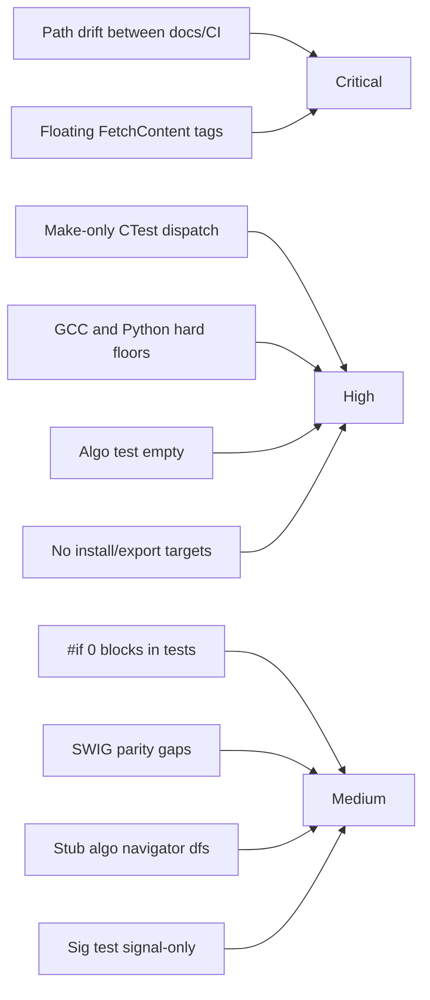

# Quality Gaps And Risk Register

## Purpose
Catalog the most important quality, reliability, and operational risks of the
core repository as it stands today, with an explicit severity scale and a
remediation phase pointer for every entry.

## Audience
Maintainers prioritizing remediation work, reviewers gating changes, and AI
tools driving phase execution.

## In Scope
- Build, test, and CI risks visible in the repository.
- Code/test quality gaps.
- API/extensibility risks.
- Reproducibility and operational risks.

## Out of Scope
- Detailed code quality enforcement rules (see
  [`code-quality-standards.md`](code-quality-standards.md)).
- Per-item debt remediation specifics (see
  [`technical-debt-register.md`](technical-debt-register.md)).

## Cross References
- [`mission.md`](mission.md)
- [`glossary.md`](glossary.md)
- [`build-test-ci.md`](build-test-ci.md)
- [`code-quality-standards.md`](code-quality-standards.md)
- [`technical-debt-register.md`](technical-debt-register.md)
- [`extensibility-contract.md`](extensibility-contract.md)
- [`binding-architecture.md`](binding-architecture.md)
- [`library-catalog.md`](library-catalog.md)
- [`implementation/implementation-phases.md`](implementation/implementation-phases.md)

## Severity Scale
- `critical`: actively breaks reproducibility, correctness, or release.
- `high`: directly degrades reliability, security, or maintainability.
- `medium`: notable degradation; remediation strongly recommended.
- `low`: cosmetic or minor; remediation when convenient.

## Likelihood Scale
- `certain`: occurs on every relevant action.
- `likely`: occurs in most relevant runs.
- `possible`: can occur under realistic conditions.
- `rare`: requires unusual conditions.

## Risk Heatmap (Conceptual)

## Risk Register

| ID | Description | Severity | Likelihood | Evidence | Remediation Phase |
|---|---|---|---|---|---|
| R-01 | `linux/` path drift between README, gitignore, CI workflow | critical | certain | [`/home/rohit/src/eda_stl/.github/workflows/cmake-single-platform.yml`](../.github/workflows/cmake-single-platform.yml), [`/home/rohit/src/eda_stl/README.md`](../README.md), [`/home/rohit/src/eda_stl/.gitignore`](../.gitignore) | Phase 0 |
| R-02 | Floating `FetchContent` tags break reproducibility | critical | certain | [`/home/rohit/src/eda_stl/CMakeLists.txt`](../CMakeLists.txt) | Phase 0 |
| R-03 | CTest dispatch via `make run_*` fails on non-Make generators | high | likely | [`/home/rohit/src/eda_stl/CMakeLists.txt`](../CMakeLists.txt) | Phase 0 |
| R-04 | GCC `>= 9.2.0` hard floor narrows adopters | high | possible | [`/home/rohit/src/eda_stl/CMakeLists.txt`](../CMakeLists.txt) | Phase 2 |
| R-05 | Python `3.12` hard floor narrows adopters | high | possible | [`/home/rohit/src/eda_stl/CMakeLists.txt`](../CMakeLists.txt) | Phase 2 |
| R-06 | `algo` test is an empty `main` | high | certain | [`/home/rohit/src/eda_stl/algo/test/test.cpp`](../algo/test/test.cpp) | Phase 4 |
| R-07 | `sig` test is signal-only and lacks GTest cases | medium | certain | [`/home/rohit/src/eda_stl/sig/test/test.cpp`](../sig/test/test.cpp) | Phase 4 |
| R-08 | Large `#if 0` blocks in `rack/test/test.cpp` and `rackinc.h` | medium | certain | [`/home/rohit/src/eda_stl/rack/test/test.cpp`](../rack/test/test.cpp), [`/home/rohit/src/eda_stl/rack/include/rackinc.h`](../rack/include/rackinc.h) | Phase 1 |
| R-09 | SWIG parity gaps in `pyrack` (clone/dissolve/multi-pin) | medium | certain | [`/home/rohit/src/eda_stl/rack/swig/test.py`](../rack/swig/test.py) | Phase 4 |
| R-10 | No `install()` / `EXPORT` / `find_package` story | high | certain | [`/home/rohit/src/eda_stl/CMakeLists.txt`](../CMakeLists.txt) | Phase 3 |
| R-11 | `BasicNavigatorBase::dfs` is a stub | medium | possible | [`/home/rohit/src/eda_stl/algo/include/navigatorbase.h`](../algo/include/navigatorbase.h) | Phase 4 |
| R-12 | Symlink-based SWIG post-build steps brittle on some FS | low | possible | [`/home/rohit/src/eda_stl/rack/swig/CMakeLists.txt`](../rack/swig/CMakeLists.txt) | Phase 3 |
| R-13 | `scripts/build.sh` undefined `PARALLEL` validation, destructive `libs` removal | medium | likely | [`/home/rohit/src/eda_stl/scripts/build.sh`](../scripts/build.sh) | Phase 0 |
| R-14 | No clang-format / clang-tidy / cppcheck baseline | high | certain | repository-wide | Phase 1 |
| R-15 | No sanitizer or coverage gates in CI | high | certain | [`/home/rohit/src/eda_stl/.github/workflows/cmake-single-platform.yml`](../.github/workflows/cmake-single-platform.yml) | Phase 1 |
| R-16 | No ABI versioning policy or stable headers | high | certain | repository-wide | Phase 3 |
| R-17 | No throughput/memory regression baselines | high | certain | repository-wide | Phase 5 |
| R-18 | No deprecation/removal policy for public symbols | medium | certain | repository-wide | Phase 7 |
| R-19 | SWIG fragility (commented `%include`s, parity gaps, brittle generation) | high | certain | [`/home/rohit/src/eda_stl/rack/swig/rack_int.i`](../rack/swig/rack_int.i) | Phase 4 / 7 |
| R-20 | JsonCpp obsolescence (slow, non-Arrow-friendly, narrow API) | high | certain | [`/home/rohit/src/eda_stl/CMakeLists.txt`](../CMakeLists.txt), [`/home/rohit/src/eda_stl/rack/swig/rack_int.i`](../rack/swig/rack_int.i) | Phase 0 |
| R-21 | No C-stable ABI (no SSOT for cross-language interfacing) | critical | certain | repository-wide; absence of `binding/cabi/` | Phase 3 |
| R-22 | No service plane (no Arrow Flight or shared-memory data path) | high | certain | repository-wide; absence of `binding/server/` | Phase 5 |
| R-23 | No tile / web / MCP deliverables (chip-class scale unreachable; no LLM interface) | high | certain | repository-wide; absence of `binding/web/` and `binding/llm/` | Phase 4 / 6 |
| R-24 | LLM prompt-injection through untrusted design data | high | possible | [`binding-architecture.md`](binding-architecture.md) §7.4 | Phase 4 / 7 |
| R-25 | IP-boundary leakage (LLM exfiltrates design data outside declared destinations) | critical | possible | [`binding-architecture.md`](binding-architecture.md) §7.4 | Phase 4 / 7 |
| R-26 | Allowlist misconfiguration (overly broad allowlist; missing audit-tag) | high | likely | [`binding-architecture.md`](binding-architecture.md) §7.4 | Phase 4 / 7 |
| R-27 | Mission deviation (a change erodes the public-utility premise) | critical | possible | [`mission.md`](mission.md) §"Mission-Aligned Reject Criteria" | Phase 0+ (advisory), Phase 7 (gate) |

## Acceptance Criteria For This Document
- Severity and likelihood scales explicitly defined.
- Every risk linked to a remediation phase in the playbook.
- Every risk has at least one file-path citation.
- At least one mermaid diagram.
- Cross-references present.
