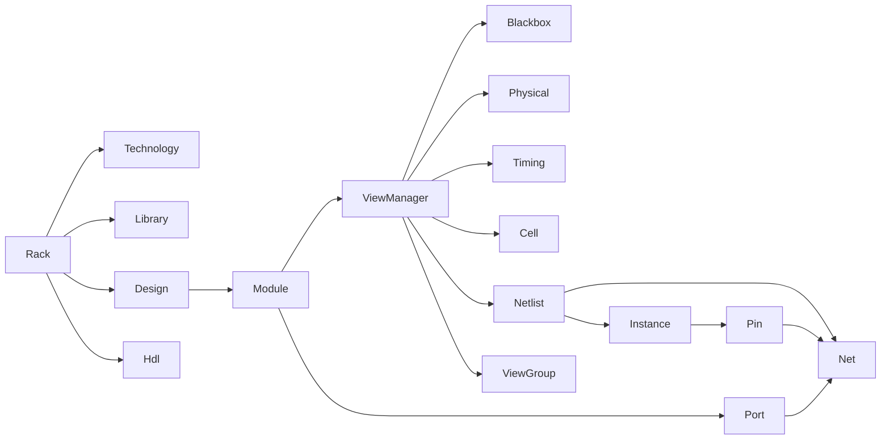
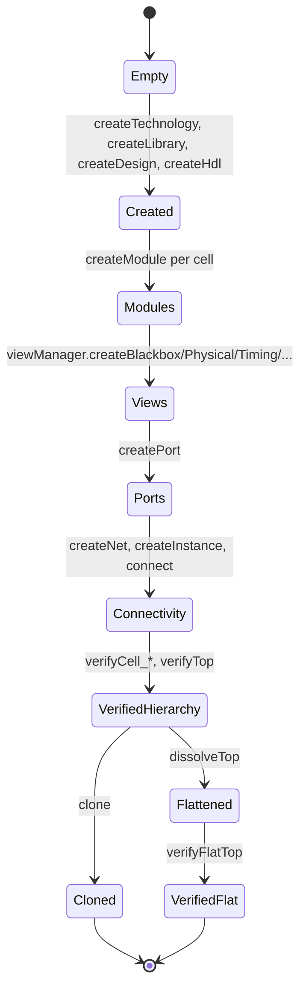

# Rack Model And Verification

## Purpose
Provide a deep walkthrough of the `rack` data model, the lifecycle of a design
inside it, and the verification chain that asserts structural integrity end to
end.

## Audience
Library developers extending the rack model, integrators authoring transforms
or analyses on top of it, and AI tools maintaining model semantics across
phases.

## In Scope
- Rack model headers under [`rack/include/`](../rack/include).
- The deep verification path implemented in
  [`rack/test/test.cpp`](../rack/test/test.cpp).
- The Python parity in [`rack/swig/test.py`](../rack/swig/test.py).

## Out of Scope
- AI tooling.
- Performance benchmarking (see
  [`performance/cpp23-and-parallel-runtime.md`](performance/cpp23-and-parallel-runtime.md)).

## Cross References
- [`mission.md`](mission.md) (the rack model is the concrete
  realization of the "STL for EDA" charter; the verification chain
  enforces the charter's required capabilities).
- [`glossary.md`](glossary.md)
- [`repository-map.md`](repository-map.md)
- [`build-test-ci.md`](build-test-ci.md)
- [`extensibility-contract.md`](extensibility-contract.md)
- [`binding-architecture.md`](binding-architecture.md)
- [`library-catalog.md`](library-catalog.md)
- [`implementation/implementation-phases.md`](implementation/implementation-phases.md)

## Data Structure Overview

- The `Rack` aggregate is the entry point
  ([`rack/include/rack.h`](../rack/include/rack.h)).
- Modules expose ports and are augmented with multiple views via
  `ViewManager` ([`rack/include/viewmanager.h`](../rack/include/viewmanager.h)).
- `Netlist` carries `Instance` and `Net` collections; each `Instance`
  references a `ViewGroup` from the instantiated module.

## Lifecycle Diagram

## Construction Walkthrough
- Containers are created via `createTechnology`, `createLibrary`,
  `createDesign`, `createHdl` ([`rack/include/rack.h`](../rack/include/rack.h)).
- Cells (`cell_1`, `cell_2`, `cell_3`) are added under `design`, with views
  registered through their `ViewManager`
  ([`rack/test/test.cpp`](../rack/test/test.cpp)).
- The deepest cell, `cell_3`, builds its own internal netlist (`inst_1`,
  `inst_2`, nets `n1`-`n5`) and connects ports `A`, `B`, `C`, `Z`.
- The top module `RACK` instantiates `cell_3` three times (`inst_3`,
  `inst_4`, `inst_5`) and wires top-level nets `n1top`-`n8top` through ports
  `top_a`-`top_e`, `top_y`, `top_z`.

## Verification Walkthrough
- `verifyCell_1`, `verifyCell_2`, `verifyCell_3`, `verifyTop` confirm names,
  view existence, port presence, instance and net membership, plus
  bidirectional pin/net cross-lookups
  ([`rack/test/test.cpp`](../rack/test/test.cpp)).
- Multi-pin nets are validated using `findPins` iterator pairs to ensure
  duplicate-key collections expose all participants in a deterministic
  order.
- Clone tests (`cloneCell_*`, `cloneTop`) duplicate modules under new names
  and re-run their verification routines, exercising structural copy
  semantics.

## Dissolve And Flat Verification
- `dissolveTop` flattens the top module by dissolving each top-level
  instance and deleting it
  ([`rack/test/test.cpp`](../rack/test/test.cpp)).
- `verifyFlatTop` then asserts that the resulting flat netlist contains
  hierarchically named instances (`inst_3.inst_1`, etc.) and nets
  (`inst_3.n1`, etc.) reachable through `findInstance` and `findNet`
  using `utl::multistring` keys.
- Cross-find checks confirm that previously hierarchical pins now resolve
  through the flattened naming scheme.

## Python Parity
- [`rack/swig/test.py`](../rack/swig/test.py) reproduces the C++
  construction (`createCell_*`, `buildNetlistCell_3`, `createTop`,
  `buildNetlistTop`) using `pyrack` and validates structural lookups via
  `assertIsInstance` for every returned object.
- `test_defaultTechnology` is a placeholder pass; clone, dissolve, and
  multi-pin iteration coverage are partial relative to C++.

## Verification Strength Assessment
- Strong: deep hierarchy build, port/net connectivity, view registration,
  duplicate-key handling, clone of nontrivial modules, flatten + flat
  verification through hierarchical names.
- Partial: Python clone/dissolve coverage; SWIG-side multi-pin iteration.
- Weak: dump-format coverage (XML/JSON/Verilog dump tests are wrapped in
  `#if 0` blocks in [`rack/test/test.cpp`](../rack/test/test.cpp)); see
  [`technical-debt-register.md`](technical-debt-register.md).

## Acceptance Criteria For This Document
- Lifecycle diagram present.
- Data-structure diagram present.
- Construction, verification, dissolve, and flat verification each have
  named, cited explanations.
- Python parity assessed with explicit gaps.
- Cross-references to related docs present.

## Implementation Phase Mapping
- Phase 1 removes dead `#if 0` blocks discovered in this code.
- Phase 4 raises Python parity coverage and adds dump-format regression
  tests.
- Phase 5 introduces parallel scenario benchmarks built around this
  hierarchy.
