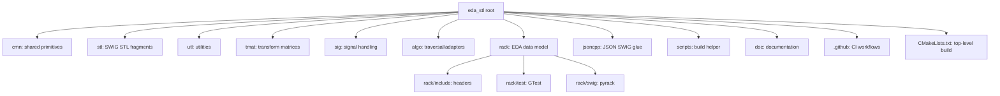
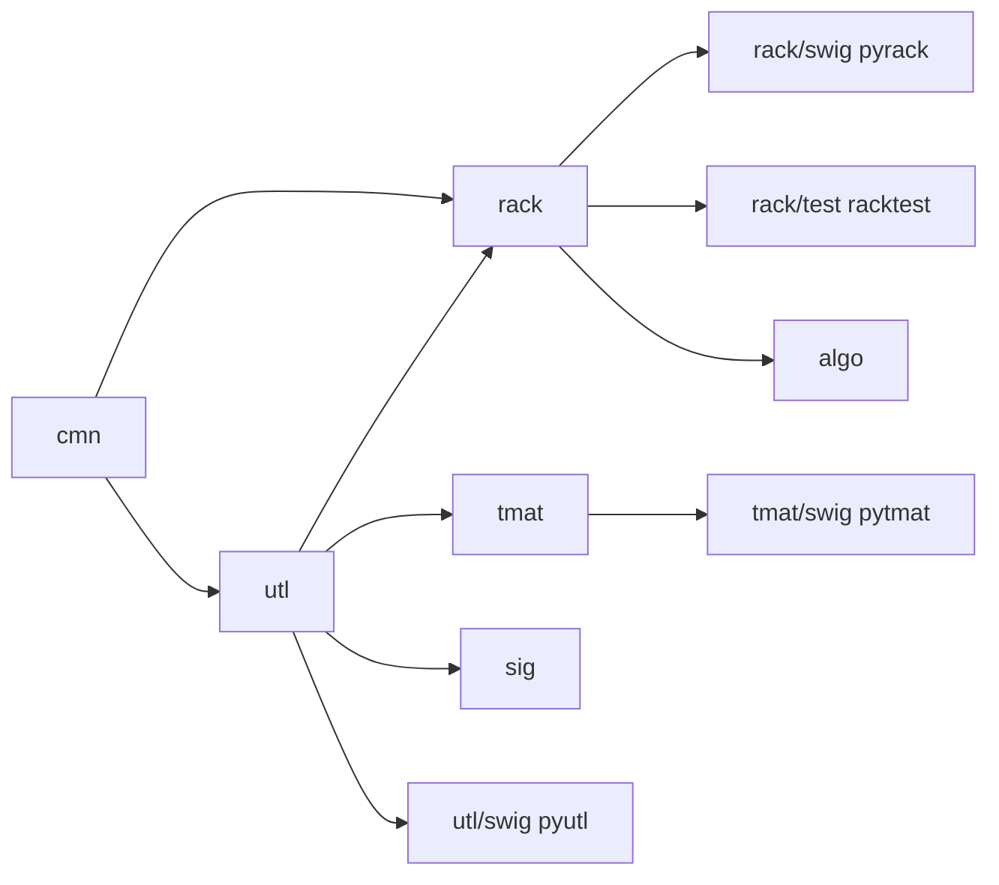

# Repository Map

## Purpose
Document every top-level directory of `eda_stl`, describe what each owns, and
identify the primary entry points used by builds, tests, and bindings.

## Audience
New contributors, integrators, and AI tools that must reason about the
repository structure before making changes.

## In Scope
- Top-level layout under `/home/rohit/src/eda_stl/`.
- Logical roles of each module and how they compose.
- Build/test/bindings entry points.

## Out of Scope
- Detailed runtime semantics of the rack model (see
  [`rack-model-and-verification.md`](rack-model-and-verification.md)).
- AI tooling (relocated outside this repository).

## Cross References
- [`glossary.md`](glossary.md)
- [`build-test-ci.md`](build-test-ci.md)
- [`rack-model-and-verification.md`](rack-model-and-verification.md)
- [`code-quality-standards.md`](code-quality-standards.md)
- [`extensibility-contract.md`](extensibility-contract.md)

## Top-Level Directories

## Module Catalog

| Directory | Role | Key Path |
|---|---|---|
| `cmn/` | Shared primitives, ID/mask types | [`cmn/include/common.h`](../cmn/include/common.h) |
| `stl/` | SWIG `.i` fragments for STL containers | [`stl/interface/`](../stl/interface) |
| `utl/` | Utility headers (multistring, dictionary, etc.) | [`utl/include/`](../utl/include) |
| `tmat/` | Transform-matrix library | [`tmat/include/trm.h`](../tmat/include/trm.h) |
| `sig/` | Signal/exception handling helpers | [`sig/include/sighand.h`](../sig/include/sighand.h) |
| `algo/` | Traversal and func-adapter scaffolding | [`algo/include/`](../algo/include) |
| `rack/` | EDA hierarchical data model | [`rack/include/rack.h`](../rack/include/rack.h) |
| `jsoncpp/` | JSON SWIG interface plumbing | [`jsoncpp/interface/`](../jsoncpp/interface) |
| `scripts/` | Build helper | [`scripts/build.sh`](../scripts/build.sh) |
| `doc/` | Documentation root | [`doc/`](.) |
| `.github/workflows/` | CI configuration | [`.github/workflows/cmake-single-platform.yml`](../.github/workflows/cmake-single-platform.yml) |

## Build And Test Entry Points

| Entry Point | Purpose |
|---|---|
| [`CMakeLists.txt`](../CMakeLists.txt) | Top-level project, FetchContent deps, test registration |
| [`rack/CMakeLists.txt`](../rack/CMakeLists.txt) | Rack module (header-first) |
| [`rack/test/CMakeLists.txt`](../rack/test/CMakeLists.txt) | C++ GTest binary `racktest` |
| [`rack/swig/CMakeLists.txt`](../rack/swig/CMakeLists.txt) | Builds `pyrack` and registers `run_pyrackpytest` |
| [`utl/CMakeLists.txt`](../utl/CMakeLists.txt) | Utility module |
| [`tmat/CMakeLists.txt`](../tmat/CMakeLists.txt) | Transform matrix module |
| [`sig/CMakeLists.txt`](../sig/CMakeLists.txt) | Signal helpers |
| [`algo/CMakeLists.txt`](../algo/CMakeLists.txt) | Algorithm scaffolding |
| [`scripts/build.sh`](../scripts/build.sh) | Manual build driver (legacy `linux/` paths) |

## Logical Composition

## Acceptance Criteria For This Document
- Every top-level directory listed in the table.
- Every directory has a documented purpose.
- Every primary build/test/binding entry point cited with absolute paths.
- At least one mermaid diagram present.
- Cross-references to related documents present.

## Implementation Phase Mapping
- Repository hygiene work that touches this layout is tracked in Phase 0 of
  [`implementation/implementation-phases.md`](implementation/implementation-phases.md).
- API tiering of the listed modules is governed by
  [`extensibility-contract.md`](extensibility-contract.md).
