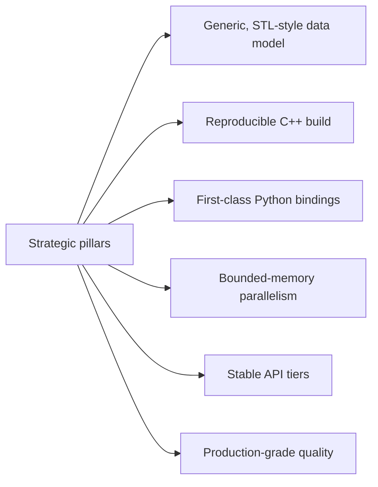
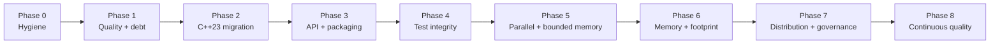

# EDA STL Library Roadmap

## Purpose
Define the value proposition of `eda_stl` as a Standard Template Library style
foundation for Electronic Design Automation tooling, and provide a productization
roadmap mapped to the implementation phases.

## Audience
Maintainers, integrators evaluating adoption, and AI tools generating
phase-aligned work plans.

## In Scope
- Library positioning and target adopters.
- API stabilization and packaging strategy.
- Adoption path and ecosystem hooks.

## Out of Scope
- AI tooling.
- Detailed performance plan (see
  [`../performance/cpp23-and-parallel-runtime.md`](../performance/cpp23-and-parallel-runtime.md)).

## Cross References
- [`../glossary.md`](../glossary.md)
- [`../repository-map.md`](../repository-map.md)
- [`../rack-model-and-verification.md`](../rack-model-and-verification.md)
- [`../extensibility-contract.md`](../extensibility-contract.md)
- [`../code-quality-standards.md`](../code-quality-standards.md)
- [`../performance/cpp23-and-parallel-runtime.md`](../performance/cpp23-and-parallel-runtime.md)
- [`../implementation/implementation-phases.md`](../implementation/implementation-phases.md)

## Value Proposition
An STL-inspired, reusable EDA design data-model library with C++ and Python
access, built to standardize hierarchy, connectivity, and view operations
across CAD tools and automation flows.

The product appeals to:
- EDA tool teams that would otherwise rebuild proprietary internal graph
  models.
- Flow automation teams needing a consistent C++/Python representation of
  hierarchy and connectivity.
- Researchers and tool authors evaluating algorithms over hierarchical
  netlists with deterministic semantics.

## Strategic Pillars

- Generic, STL-style data model: templated `Basic*` types in
  [`../../rack/include/rack.h`](../../rack/include/rack.h) align with the
  std::basic_string family in spirit.
- Reproducible C++ build: pinned dependencies, install/export targets, and a
  CI matrix.
- First-class Python bindings: full parity for `pyrack`, `pyutl`, `pytmat`.
- Bounded-memory parallelism: throughput-first scaling under explicit memory
  budgets (see [`../performance/cpp23-and-parallel-runtime.md`](../performance/cpp23-and-parallel-runtime.md)).
- Stable API tiers: explicit `public-stable`, `public-evolving`, `internal`
  classification per [`../extensibility-contract.md`](../extensibility-contract.md).
- Production-grade quality: format/lint/sanitizer/coverage CI gates per
  [`../code-quality-standards.md`](../code-quality-standards.md).

## Productization Roadmap

## CMake Export Interface (Required)
- Export targets: `eda::cmn`, `eda::utl`, `eda::tmat`, `eda::sig`, `eda::algo`,
  `eda::rack`.
- Consumer pattern: `find_package(eda CONFIG REQUIRED)` followed by
  `target_link_libraries(my_app PRIVATE eda::rack)`.
- Versioning: SemVer over the `public-stable` tier; the package config must
  reject incompatible major versions.
- ABI policy: ABI changes are gated on a major-version bump after Phase 7.

## Distribution Strategy
- Source release: tagged GitHub releases with reproducible archives.
- System packages: provide CMake config files; downstream may add Conan or
  vcpkg recipes.
- Python wheels: build `pyrack`, `pyutl`, `pytmat` against pinned core
  versions; publish only after Phase 3 packaging.

## Adoption Path For Consumers
- Read the [`../glossary.md`](../glossary.md) to align on terms.
- Use [`../repository-map.md`](../repository-map.md) and
  [`../rack-model-and-verification.md`](../rack-model-and-verification.md) to
  understand the data model.
- Follow the CMake export interface above to integrate.
- Use the implementation phases to plan internal upgrades or contribute
  upstream.

## Ecosystem Hooks
- Documented extension points in
  [`../extensibility-contract.md`](../extensibility-contract.md) (template
  policies, allocators, traits).
- Stable telemetry-friendly observation hooks declared during Phase 7 to
  allow downstream profilers and dashboards.

## Acceptance Criteria For This Document
- Value proposition explicit.
- Strategic pillars enumerated.
- Productization roadmap mapped to phases with a mermaid diagram.
- CMake export interface specified with target names, consumer pattern,
  versioning, ABI policy.
- Distribution and adoption paths documented.
- Cross-references present.
