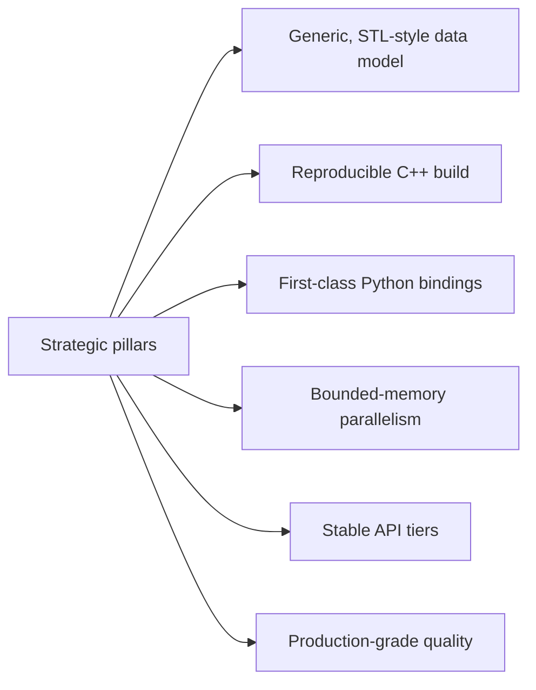
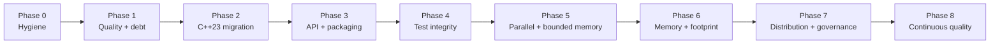

# EDA STL Library Roadmap

## Purpose
Define the value proposition of `eda_stl` as a Standard Template Library style
foundation for Electronic Design Automation tooling, and provide a productization
roadmap mapped to the implementation phases.

## Audience
Maintainers, integrators evaluating adoption, and AI tools generating
phase-aligned work plans.

## In Scope
- Library positioning and target adopters.
- API stabilization and packaging strategy.
- Adoption path and ecosystem hooks.

## Out of Scope
- AI tooling.
- Detailed performance plan (see
  [`../performance/cpp23-and-parallel-runtime.md`](../performance/cpp23-and-parallel-runtime.md)).

## Cross References
- [`../mission.md`](../mission.md)
- [`../glossary.md`](../glossary.md)
- [`../repository-map.md`](../repository-map.md)
- [`../rack-model-and-verification.md`](../rack-model-and-verification.md)
- [`../extensibility-contract.md`](../extensibility-contract.md)
- [`../code-quality-standards.md`](../code-quality-standards.md)
- [`../binding-architecture.md`](../binding-architecture.md)
- [`../library-catalog.md`](../library-catalog.md)
- [`../performance/cpp23-and-parallel-runtime.md`](../performance/cpp23-and-parallel-runtime.md)
- [`../implementation/implementation-phases.md`](../implementation/implementation-phases.md)

## Charter Reference

This roadmap is **subordinate** to the mission charter at
[`../mission.md`](../mission.md). The charter defines what `eda_stl`
must always be (public, MIT-licensed, infrastructure-grade, SSOT-led)
and what it must never become (a tool, a flow, a viewer, a vendor
product). This roadmap is a productization plan that respects those
boundaries.

## Value Proposition

`eda_stl` is **the STL for EDA** ([`../mission.md`](../mission.md)) -
a free, public, best-in-class data-modeling foundation that eliminates
the duplicated work of rebuilding hierarchical netlist, view, and
geometry models across the industry. It ships:

- a generic C++23 data model (`Rack`, `Library`, `Design`, `Module`,
  `Netlist`, `Instance`, `Net`, `Port`, `Pin`, view managers, ...);
- a stable C-ABI plus Arrow Flight, Arrow record-batch, vector-tile,
  and LLM system-card schemas (the SSOT - see
  [`../binding-architecture.md`](../binding-architecture.md));
- best-in-class language wrappers (nanobind for Python, cpptcl for
  Tcl);
- a native C++ MCP server for LLM agents;
- an Arrow Flight service plane (`eda_server`) for distributed and
  off-process consumers;
- a documented tile streaming protocol for chip-class layout viewers
  (downstream).

The product appeals to:

- EDA tool teams that would otherwise rebuild proprietary internal
  graph models;
- Flow automation teams needing a consistent representation across
  C++, Python, and Tcl;
- Researchers and tool authors evaluating algorithms over
  hierarchical netlists with deterministic semantics;
- LLM agent authors who want a vendor-neutral, discoverable surface
  via MCP;
- Web visualization teams that need a tile protocol rather than a
  bespoke per-tool format.

## Strategic Pillars

- Generic, STL-style data model: templated `Basic*` types in
  [`../../rack/include/rack.h`](../../rack/include/rack.h) align with the
  std::basic_string family in spirit.
- Reproducible C++ build: pinned dependencies, install/export targets, and a
  CI matrix.
- First-class Python bindings: full parity for `pyrack`, `pyutl`, `pytmat`.
- Bounded-memory parallelism: throughput-first scaling under explicit memory
  budgets (see [`../performance/cpp23-and-parallel-runtime.md`](../performance/cpp23-and-parallel-runtime.md)).
- Stable API tiers: explicit `public-stable`, `public-evolving`, `internal`
  classification per [`../extensibility-contract.md`](../extensibility-contract.md).
- Production-grade quality: format/lint/sanitizer/coverage CI gates per
  [`../code-quality-standards.md`](../code-quality-standards.md).

## Productization Roadmap

## CMake Export Interface (Required)
- Export targets: `eda::cmn`, `eda::utl`, `eda::tmat`, `eda::sig`, `eda::algo`,
  `eda::rack`.
- Consumer pattern: `find_package(eda CONFIG REQUIRED)` followed by
  `target_link_libraries(my_app PRIVATE eda::rack)`.
- Versioning: SemVer over the `public-stable` tier; the package config must
  reject incompatible major versions.
- ABI policy: ABI changes are gated on a major-version bump after Phase 7.

## Distribution Strategy

### Mission-Aligned Release Lanes
Each lane is independently tagged and SemVer'd. None requires a paid
runtime, a closed binary, or a vendor cloud.

| Lane | Artifact | Source | Tag prefix | Phase |
|---|---|---|---|---|
| `core` | C++23 headers + compiled targets | `rack/`, `utl/`, `algo/`, `tmat/`, `sig/`, `cmn/` | `core-vX.Y.Z` | 3+ |
| `cabi` | C-stable ABI | `binding/cabi/` | `cabi-vX.Y.Z` | 3+ |
| `python` | nanobind wheel | `binding/python/` | `python-vX.Y.Z` | 4+ |
| `tcl` | cpptcl package | `binding/tcl/` | `tcl-vX.Y.Z` | 4+ |
| `mcp_server` | native C++ MCP server image | `binding/llm/` | `mcp-vX.Y.Z` | 4+ |
| `eda_server` | Arrow Flight server image | `binding/server/` | `server-vX.Y.Z` | 5+ |
| `tile_gateway` | tile WebSocket gateway image | `binding/web/` | `tile-vX.Y.Z` | 6+ |
| `webgpu_viewer` | downstream sibling repo (pointer only) | external | n/a | 7+ |

### Distribution Channels
- **Source**: tagged GitHub releases with reproducible archives.
- **CMake**: `find_package(eda CONFIG REQUIRED)` after Phase 3 (see
  Phase 3 task `p3-add-install-exports` and the section below).
- **vcpkg**: `eda_stl` is consumable via vcpkg manifest mode; manifest
  acquisition for our own deps lands in
  Phase 0 (`p0-introduce-vcpkg-manifest`, see
  [`../library-catalog.md`](../library-catalog.md)).
- **Python wheels**: built from `binding/python/` against pinned core
  versions; publish only after Phase 4.
- **Tcl packages**: built from `binding/tcl/`; publish after Phase 4.
- **Container images**: `mcp_server`, `eda_server`, and the tile
  gateway are published as MIT-licensed OCI images.

### Mission Boundaries Reaffirmed
- No proprietary plug-in slot, no closed-source linkage, no paid
  runtime gate.
- The WebGPU viewer is downstream, not in this repository
  ([`../mission.md`](../mission.md) §"Non-Mission").

## Adoption Path For Consumers
- Read the [`../glossary.md`](../glossary.md) to align on terms.
- Use [`../repository-map.md`](../repository-map.md) and
  [`../rack-model-and-verification.md`](../rack-model-and-verification.md) to
  understand the data model.
- Follow the CMake export interface above to integrate.
- Use the implementation phases to plan internal upgrades or contribute
  upstream.

## Ecosystem Hooks
- Documented extension points in
  [`../extensibility-contract.md`](../extensibility-contract.md) (template
  policies, allocators, traits).
- Stable telemetry-friendly observation hooks declared during Phase 7 to
  allow downstream profilers and dashboards.

## Acceptance Criteria For This Document
- Charter reference and mission cross-link present at the top.
- Value proposition explicit and tied to the mission.
- Strategic pillars enumerated.
- Productization roadmap mapped to phases with a mermaid diagram.
- CMake export interface specified with target names, consumer pattern,
  versioning, ABI policy.
- Mission-aligned release lanes table present.
- Distribution and adoption paths documented, including vcpkg, wheels,
  Tcl packages, and container images for the service binaries.
- Mission boundaries reaffirmed.
- Cross-references present.
