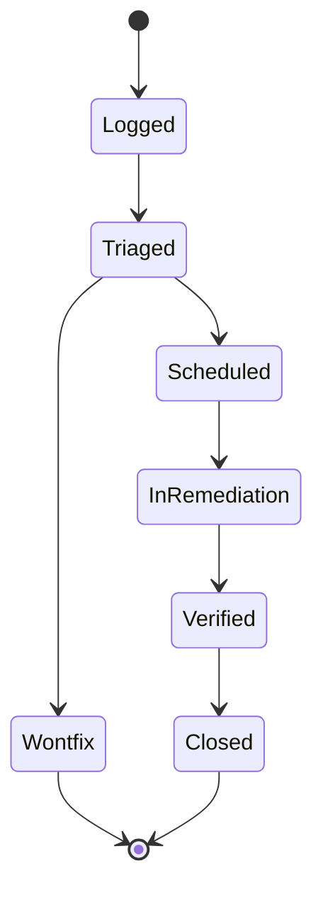

# Technical Debt Register

## Purpose
Maintain the authoritative, classified list of technical debt items in
`eda_stl`, with severity, evidence, owner, and remediation phase mapping.

## Audience
Maintainers prioritizing remediation, reviewers gating new debt, and AI tools
driving phase execution and the `technical-debt-tracker` skill.

## In Scope
- Build, test, code, and documentation debt visible in the repository today.
- Newly introduced debt items as they are logged.

## Out of Scope
- Risks not classified as debt (see
  [`quality-gaps-and-risks.md`](quality-gaps-and-risks.md)).

## Cross References
- [`mission.md`](mission.md)
- [`glossary.md`](glossary.md)
- [`code-quality-standards.md`](code-quality-standards.md)
- [`quality-gaps-and-risks.md`](quality-gaps-and-risks.md)
- [`build-test-ci.md`](build-test-ci.md)
- [`extensibility-contract.md`](extensibility-contract.md)
- [`binding-architecture.md`](binding-architecture.md)
- [`library-catalog.md`](library-catalog.md)
- [`implementation/implementation-phases.md`](implementation/implementation-phases.md)

## Severity Scale
- `critical`: blocks reproducibility, correctness, or release.
- `high`: degrades reliability, security, or maintainability.
- `medium`: notable but contained; remediate when phase-aligned.
- `low`: cosmetic or minor.

## Debt Lifecycle

## Debt Items

### D-01 Floating FetchContent tags
- severity: critical
- evidence: [`/home/rohit/src/eda_stl/CMakeLists.txt`](../CMakeLists.txt)
- description: GoogleTest, JsonCpp, and SWIG declared with `origin/main`
  and `origin/master` tags.
- remediation_phase: Phase 0
- owner: build maintainer

### D-02 linux/ path drift
- severity: critical
- evidence: [`/home/rohit/src/eda_stl/.github/workflows/cmake-single-platform.yml`](../.github/workflows/cmake-single-platform.yml),
  [`/home/rohit/src/eda_stl/README.md`](../README.md),
  [`/home/rohit/src/eda_stl/.gitignore`](../.gitignore)
- description: README, CI, and gitignore reference a `linux/` directory that
  no longer exists at repo root; CMake operates from the root.
- remediation_phase: Phase 0
- owner: build maintainer

### D-03 CTest dispatch via make targets
- severity: high
- evidence: [`/home/rohit/src/eda_stl/CMakeLists.txt`](../CMakeLists.txt)
- description: `add_test(... COMMAND make run_*)` is generator-fragile.
- remediation_phase: Phase 0
- owner: build maintainer

### D-04 GCC 9.2 hard floor
- severity: high
- evidence: [`/home/rohit/src/eda_stl/CMakeLists.txt`](../CMakeLists.txt)
- description: `FATAL_ERROR` for GCC `< 9.2.0` blocks viable consumers; the
  C++23 migration must establish an updated, documented matrix.
- remediation_phase: Phase 2
- owner: compiler matrix owner

### D-05 Python 3.12 hard floor
- severity: high
- evidence: [`/home/rohit/src/eda_stl/CMakeLists.txt`](../CMakeLists.txt)
- description: `find_package(Python3 3.12 REQUIRED ...)` constrains
  bindings consumers.
- remediation_phase: Phase 2
- owner: bindings maintainer

### D-06 Empty algo test
- severity: high
- evidence: [`/home/rohit/src/eda_stl/algo/test/test.cpp`](../algo/test/test.cpp)
- description: `main` returns immediately; no GTest cases.
- remediation_phase: Phase 4
- owner: algo maintainer

### D-07 Sig test signal-only
- severity: medium
- evidence: [`/home/rohit/src/eda_stl/sig/test/test.cpp`](../sig/test/test.cpp)
- description: Custom `main` exercises signal handling; no GTest cases
  despite linking GTest.
- remediation_phase: Phase 4
- owner: sig maintainer

### D-08 Dead #if 0 blocks in rack tests
- severity: medium
- evidence: [`/home/rohit/src/eda_stl/rack/test/test.cpp`](../rack/test/test.cpp)
- description: Large dead blocks containing legacy hierarchy and dump tests.
- remediation_phase: Phase 1
- owner: rack maintainer

### D-09 Dead #if 0 in rack public headers
- severity: medium
- evidence: [`/home/rohit/src/eda_stl/rack/include/rackinc.h`](../rack/include/rackinc.h)
- description: Commented-out includes that obscure the header surface.
- remediation_phase: Phase 1
- owner: rack maintainer

### D-10 SWIG parity gaps
- severity: medium
- evidence: [`/home/rohit/src/eda_stl/rack/swig/test.py`](../rack/swig/test.py),
  [`/home/rohit/src/eda_stl/rack/swig/rack_int.i`](../rack/swig/rack_int.i)
- description: Python tests omit clone/dissolve/multi-pin iteration;
  several `%include`s are commented out.
- remediation_phase: Phase 4
- owner: bindings maintainer

### D-11 No install/export targets
- severity: high
- evidence: [`/home/rohit/src/eda_stl/CMakeLists.txt`](../CMakeLists.txt)
- description: No `install()`, `EXPORT`, or package config files; consumers
  cannot do `find_package(eda)`.
- remediation_phase: Phase 3
- owner: packaging maintainer

### D-12 Stub navigator dfs
- severity: medium
- evidence: [`/home/rohit/src/eda_stl/algo/include/navigatorbase.h`](../algo/include/navigatorbase.h)
- description: `BasicNavigatorBase::dfs` returns false unconditionally.
- remediation_phase: Phase 4
- owner: algo maintainer

### D-13 SWIG symlink post-build steps
- severity: low
- evidence: [`/home/rohit/src/eda_stl/rack/swig/CMakeLists.txt`](../rack/swig/CMakeLists.txt)
- description: `create_symlink` post-build commands assume POSIX FS.
- remediation_phase: Phase 3
- owner: packaging maintainer

### D-14 scripts/build.sh defects
- severity: medium
- evidence: [`/home/rohit/src/eda_stl/scripts/build.sh`](../scripts/build.sh)
- description: `PARALLEL` validated before initialization; destructive
  `libs/` removal during `getdep`; help text mismatches accepted targets.
- remediation_phase: Phase 0
- owner: build maintainer

### D-15 No clang-format/clang-tidy/cppcheck baseline
- severity: high
- evidence: repository-wide
- description: No formatter or linter configuration exists.
- remediation_phase: Phase 1
- owner: code quality owner

### D-16 No sanitizer or coverage gates in CI
- severity: high
- evidence: [`/home/rohit/src/eda_stl/.github/workflows/cmake-single-platform.yml`](../.github/workflows/cmake-single-platform.yml)
- description: CI builds and tests only; no ASan/UBSan/TSan/coverage.
- remediation_phase: Phase 1
- owner: CI owner

### D-17 No ABI/API tier policy
- severity: high
- evidence: repository-wide
- description: No declared API tiers, deprecation policy, or ABI checks.
- remediation_phase: Phase 3
- owner: API governance owner

### D-18 No throughput/memory regression baselines
- severity: high
- evidence: repository-wide
- description: No benchmarks, baselines, or regression gates exist.
- remediation_phase: Phase 5
- owner: performance owner

### D-19 JsonCpp obsolescence
- severity: high
- evidence: [`/home/rohit/src/eda_stl/CMakeLists.txt`](../CMakeLists.txt),
  [`/home/rohit/src/eda_stl/rack/swig/rack_int.i`](../rack/swig/rack_int.i)
- description: JsonCpp is slow, non-SIMD, non-Arrow-friendly, and not
  in the canonical [`library-catalog.md`](library-catalog.md). Replace
  with simdjson (ingest) and glaze (typed serde) in Phase 0
  (`p0-jsoncpp-to-simdjson-glaze`).
- remediation_phase: Phase 0
- owner: build maintainer

### D-20 SWIG fragility
- severity: high
- evidence: [`/home/rohit/src/eda_stl/rack/swig/rack_int.i`](../rack/swig/rack_int.i)
- description: 18 commented-out `%include`s (lines 129-148), several
  `%warnfilter`/`%ignore` directives (lines 64-73), and parity gaps in
  [`/home/rohit/src/eda_stl/rack/swig/test.py`](../rack/swig/test.py)
  vs the C++ test
  ([`/home/rohit/src/eda_stl/rack/test/test.cpp`](../rack/test/test.cpp)).
  Replaced for Python by nanobind in Phase 4; SWIG decommission in
  Phase 7 (`p7-swig-decommission`).
- remediation_phase: Phase 4 / 7
- owner: bindings maintainer

### D-21 No C-stable ABI / SSOT
- severity: critical
- evidence: repository-wide; no `binding/cabi/` directory
- description: There is no C-stable ABI, no Flight or Arrow schema, no
  tile schema, and no LLM system card. Without the SSOT, every wrapper
  must redefine the model. Lands in Phase 3 (`p3-cabi-define`,
  `p3-cabi-lint`, `p3-binding-export-targets`,
  `p3-schema-skeletons`, `p3-system-card-generator`).
- remediation_phase: Phase 3
- owner: API governance owner

### D-22 No mmap path for chip-class data
- severity: medium
- evidence: repository-wide
- description: Hand-rolled `<fstream>` will not scale to chip-class
  layouts. Adopt mio mmap in Phase 6 (`p6-mio-mmap`).
- remediation_phase: Phase 6
- owner: performance owner

### D-23 Hot-path `std::unordered_map` usage
- severity: medium
- evidence: hot lookups in `rack/`, `utl/`
- description: Replace with `absl::flat_hash_map` on identified hot
  paths in Phase 6 (`p6-abseil-flat-hash`).
- remediation_phase: Phase 6
- owner: performance owner

### D-24 Ad-hoc logging and stringification
- severity: medium
- evidence: repository-wide use of `std::cout` / `std::cerr` and raw
  `printf`-style formatting
- description: Adopt spdlog and fmt in Phase 1
  (`p1-adopt-spdlog-fmt-cli11`); promote `fmt` to `std::format` in
  Phase 2 (`p2-promote-fmt-to-stdformat`).
- remediation_phase: Phase 1 / 2
- owner: code quality owner

### D-25 Mutex-only concurrency
- severity: medium
- evidence: ad-hoc `std::mutex` use without a parallel runtime
- description: Adopt `std::jthread` + oneTBB in Phase 5
  (`p5-onetbb-jthread`).
- remediation_phase: Phase 5
- owner: performance owner

### D-26 Default allocator on hot containers
- severity: medium
- evidence: rack/, utl/ container declarations using `std::allocator`
- description: Adopt mimalloc system-wide and arena allocators per
  category in Phase 6 (`p6-allocator-categories`).
- remediation_phase: Phase 6
- owner: performance owner

### D-27 Missing service plane and LLM/web deliverables
- severity: high
- evidence: repository-wide; no `binding/server/`, `binding/llm/`,
  `binding/web/`
- description: Phase 4 lands `mcp_server`; Phase 5 lands
  `eda_server` (Arrow Flight + Plasma); Phase 6 lands the tile
  protocol and gateway; Phase 7 references the downstream WebGPU
  client.
- remediation_phase: Phase 4 / 5 / 6 / 7
- owner: bindings maintainer

## Acceptance Criteria For This Document
- Severity scale defined.
- Every debt item has id, severity, evidence path, description, remediation
  phase, and owner.
- Lifecycle diagram present.
- Cross-references present.
